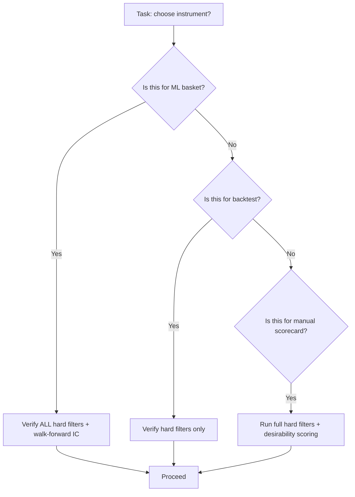

# Stock Selection Criteria — Master Reference

**Last updated:** 2026-05-27

**Cross-references:**
- `.kilo/skills/ticker-screener/SKILL.md` — operational implementation
- `.kilo/agent/ml-trainer.md` — basket assembly rules
- `.kilo/agent/backtest-runner.md` — pre-backtest ticker verification
- `scripts/screen_tickers.py` — automated screening pipeline

⚠️ **ALL agents tasked with choosing tickers or instruments MUST consult this document.**

---

## 1. Overview

This document consolidates four layers of stock/instrument selection criteria into a single canonical reference. The layers are:

1. **Hard filters** (F1-F11) — binary pass/fail gates derived from the efficiency framework
2. **Magic Formula quality/value gates** (F9-F11) — return on capital, earnings yield, sector exclusions
3. **Desirability scorecard** (D1-D9) — multi-dimensional ranking of survivors
4. **Context-specific override rules** — relaxed/stricter thresholds for operational screening vs alpha targets vs ETFs

```
docs/stock_selection_criteria.md ← THIS DOCUMENT (canonical)
├── .kilo/agent/ml-trainer.md (agent instruction — MUST read)
├── .kilo/agent/backtest-runner.md (agent instruction — verify tickers)
├── .kilo/skills/ticker-screener/SKILL.md (operational implementation)
└── scripts/screen_tickers.py (automated pipeline)
```

---

## 2. Quick Decision Tree



---

## 3. Hard Filters (Must Pass All — 11 Gates)

A ticker that fails **any** hard filter must be rejected. No exceptions without explicit override documented in the context rules below.

| # | Attribute | Reject If | Source | Data Source |
|---|-----------|-----------|--------|-------------|
| F1 | Avg Daily Dollar Volume | < $10M | Efficiency framework | yfinance |
| F2 | Market Cap | < $300M (efficiency) / < $200M (operational) | Both | yfinance |
| F3 | Price (stocks) | < $5 | Efficiency | yfinance |
| F4 | Price (ETFs/crypto/futures) | < $10 | Efficiency | yfinance |
| F5 | Data History | < 3 years (efficiency) / < 5 years (operational) | Both | yfinance download |
| F6 | Exchange | NOT NYSE/NASDAQ | Both | yfinance info |
| F7 | ETF AUM | < $100M | Efficiency | yfinance info |
| F8 | Leveraged/Inverse Products | Yes (unless deliberate) | Efficiency | yfinance info |
| **F9** | **Return on Capital** | **< 5th percentile or negative** | **NEW — Magic Formula quality gate** | **yfinance financials** |
| **F10** | **Sector: Financials** | **Exclude** | **NEW — Magic Formula accounting incompatibility** | **yfinance info** |
| **F11** | **Sector: Utilities** | **Exclude** | **NEW — Magic Formula regulated returns** | **yfinance info** |

### Context-Specific Override Rules

```yaml
# Overrides for specific contexts
operational_screener:        # scripts/screen_tickers.py
  F2_min_mc: 200e6          # relaxed from 300e6
  F5_min_years: 5           # stricter than 3 years
  F1_min_addv: 5e6          # relaxed from 10e6
alpha_targets:               # individual stock picks for basket
  F2_min_mc: 500e6          # stricter: avoid micro-cap death zone
  F2_max_mc: 5e9            # max cap for alpha targets
  F1_min_addv: 10e6         # stricter liquidity
  analyst_max: 5            # DeMiguel 2024 — low coverage = alpha potential
etfs:                        # ETFs skip stock-specific filters
  F9_skip: true             # ROCE not applicable
  F10_skip: true            # sector exclusion not applicable
  F11_skip: true            # sector exclusion not applicable
  F3_skip: true             # price filter relaxed for ETFs
```

---

## 4. Desirability Scorecard (Rank Survivors)

After surviving all 11 hard filters, candidates are ranked on 9 dimensions. The total score determines priority for basket inclusion.

| # | Dimension | Score Range | Source |
|---|-----------|-------------|--------|
| D1 | Liquidity (ADV) | +3 to 0 | Efficiency framework |
| D2 | Market Cap | +3 to -1 | Efficiency framework |
| D3 | Analyst Coverage (stocks only) | +4 to -1 | DeMiguel 2024 + efficiency |
| D4 | Institutional Ownership | +3 to 0 | Efficiency framework |
| D5 | Bid-Ask Spread | +3 to -1 | Efficiency framework |
| D6 | Sector / Category Bonus | +2 to -1 | Efficiency framework |
| D7 | Volatility Profile | +2 to -1 | Efficiency framework |
| **D8** | **Earnings Yield** | **+2 to -1** | **NEW — Magic Formula value tilt** |
| **D9** | **Return on Capital (supplementary)** | **Pass/Fail** | **NEW — Magic Formula quality gate** |

### D8: Earnings Yield (Magic Formula — value tilt)

| Score | EBIT / Enterprise Value | Interpretation |
|-------|------------------------|----------------|
| +2 | > 10% | Deep value. Market pricing in distress — possibly correctly, possibly not. |
| +1 | 5% – 10% | Reasonable value. |
| 0  | 0% – 5% | Fair to expensive. |
| -1 | < 0% (negative EBIT) | No earnings. Speculative. Stock moves driven by narrative, not fundamentals. |

### D9: Return on Capital (Magic Formula — quality gate)

NOT a scorecard dimension — it's supplementary to the F9 hard filter. After passing F9 (ROCE ≥ 5%), ROCE does not contribute additional points. The filter ensures all scored candidates are capital-efficient businesses. This is documented here for traceability so agents understand that ROCE is checked at the gate level, not the ranking level.

### Total Score Range

| Dimensions | Min | Max |
|------------|-----|-----|
| D1-D7 (original efficiency) | 0 | 17 |
| D8 (earnings yield) | -1 | +2 |
| **Total** | **-1** | **19** |

---

## 5. Magic Formula: What We Adopted vs. Rejected

The Magic Formula (Greenblatt, 2005) ranks stocks by combined ROC and earnings yield rank. We adopt the underlying quality/value concepts as filters and scorecard dimensions, but reject the full ranking methodology.

| Concept | Adopted? | How |
|---------|----------|-----|
| Return on Capital (ROCE) | ✅ F9 hard filter + D9 pass/fail | Quality gate — reject capital destroyers |
| Earnings Yield | ✅ D8 scorecard (+2 to -1) | Value tilt — prefer cheap among equals |
| Exclude Financials | ✅ F10 hard filter | Non-comparable accounting |
| Exclude Utilities | ✅ F11 hard filter | Regulated returns break ROC logic |
| Full ranking formula (sum ROC rank + EY rank) | ❌ Not adopted | Known alpha decay (published 2005). Sector concentration. No regime awareness. Our ML handles these better. |
| Annual December rebalance | ❌ Not adopted | Mismatch with our daily/weekly ML timeframe |
| Top 25 equal-weight portfolio | ❌ Not adopted | Conflicts with position sizing from risk module |
| Tax optimization (sell losers <1yr, winners >1yr) | ❌ Not adopted | Implementation detail, not selection criterion |

---

## 6. Quick Reference Card

```python
# === Hard Filters (MUST PASS ALL) ===
MIN_MC              = 300e6       # $300M minimum (framework)
MIN_ADDV            = 10e6        # $10M/day notional
MIN_PRICE           = 5.0         # stocks
MIN_YEARS           = 3           # framework baseline
MIN_INST            = 0.25        # 25% institutional ownership
VOL_RANGE           = (0.12, 0.55)
EXCLUDE_SECTORS     = ['Financial Services', 'Utilities']  # F10, F11
EXCLUDE_LEVERAGED   = True        # F8

# === Alpha target criteria (individual stocks) ===
TARGET_MC_RANGE     = (500e6, 5e9)
TARGET_MAX_ANALYSTS = 5

# === Magic Formula Quality Gates (NEW) ===
MIN_ROCE            = 0.05        # 5% — reject capital destroyers
# For stocks only; skip for ETFs/crypto/futures
```

---

## 7. Worked Examples

### Example 1: SPY (ETF)

| Filter | Value | Pass? |
|--------|-------|-------|
| F1: ADV | > $10B | ✅ |
| F2: Market Cap | > $300M | ✅ |
| F3: Price | > $10 (ETF threshold) | ✅ |
| F5: History | > 3 years | ✅ |
| F6: Exchange | NYSE ARCA | ✅ |
| F7: AUM | > $100M | ✅ |
| F8: Leveraged | No | ✅ |
| F9: ROCE | SKIP (ETF) | ✅ |
| F10: Financials | SKIP (ETF) | ✅ |
| F11: Utilities | SKIP (ETF) | ✅ |

**Verdict:** Pass. SPY clears all applicable hard filters.

### Example 2: IWM (ETF)

| Filter | Value | Pass? |
|--------|-------|-------|
| F1: ADV | > $5B | ✅ |
| F2: Market Cap | N/A (ETF) | ✅ |
| F3: Price | > $10 | ✅ |
| F5: History | > 3 years | ✅ |
| F6: Exchange | NYSE ARCA | ✅ |
| F7: AUM | > $100M | ✅ |
| F8: Leveraged | No | ✅ |
| F9-F11 | SKIP (ETF) | ✅ |

**Verdict:** Pass.

### Example 3: XBI (Biotech ETF)

| Filter | Value | Pass? |
|--------|-------|-------|
| F1: ADV | ~$300M | ✅ |
| F2-F11 | ETF rules apply | ✅ |

**Verdict:** Pass. Note: XBI's high volatility and sector concentration make it a diversification candidate, not a core holding.

### Example 4: FCX (Freeport-McMoRan — mid-cap commodity stock)

| Filter | Value | Pass? |
|--------|-------|-------|
| F1: ADV | ~$800M | ✅ |
| F2: Market Cap | ~$55B | ✅ |
| F3: Price | ~$38 | ✅ |
| F5: History | > 3 years | ✅ |
| F6: Exchange | NYSE | ✅ |
| F7: ETF AUM | SKIP (stock) | ✅ |
| F8: Leveraged | No | ✅ |
| F9: ROCE | ~12% | ✅ |
| F10: Financials | No (Materials) | ✅ |
| F11: Utilities | No (Materials) | ✅ |

**Scorecard:**
| Dimension | Score |
|-----------|-------|
| D1: Liquidity | +3 |
| D2: Market Cap | +2 |
| D3: Analyst Coverage | +2 |
| D4: Institutional Ownership | +3 |
| D5: Bid-Ask Spread | +1 |
| D6: Sector (Materials) | +1 |
| D7: Volatility Profile | +1 |
| D8: Earnings Yield (~8%) | +1 |
| **Total** | **14/19** |

**Verdict:** Strong candidate. Passes all 11 hard filters and scores well on desirability.

---

## 8. Data Sources

| Source | Fields Used | Notes |
|--------|------------|-------|
| `yfinance.Ticker(t).info` | marketCap, averageVolume, currentPrice, heldPercentInstitutions, sector, exchange, shortName, totalAssets (ETF AUM) | Primary data source |
| `yfinance.download(t)` | OHLCV history for data range check, volatility calc, notional volume calc | 252 trading days/year |
| `yfinance.Ticker(t).financials` | EBIT, total assets, current liabilities | ROCE and earnings yield computation |
| `yfinance.Ticker(t).balance_sheet` | Total assets, current liabilities, long-term debt | Enterprise value computation |
| `yfinance.Ticker(t).info['enterpriseValue']` | Enterprise value | Direct source for earnings yield (EBIT / EV) |

### ROCE Calculation

```python
def calc_roce(ticker: str) -> float:
    """Return on Capital Employed = EBIT / (Total Assets - Current Liabilities)."""
    t = yf.Ticker(ticker)
    ebit = t.financials.loc['EBIT'].iloc[0] if 'EBIT' in t.financials.index else None
    total_assets = t.balance_sheet.loc['Total Assets'].iloc[0]
    current_liab = t.balance_sheet.loc['Current Liabilities'].iloc[0]
    if ebit and total_assets and current_liab:
        return ebit / (total_assets - current_liab)
    return None
```

### Earnings Yield Calculation

```python
def calc_earnings_yield(ticker: str) -> float:
    """Earnings Yield = EBIT / Enterprise Value."""
    t = yf.Ticker(ticker)
    ebit = t.financials.loc['EBIT'].iloc[0] if 'EBIT' in t.financials.index else None
    ev = t.info.get('enterpriseValue')
    if ebit and ev and ev > 0:
        return ebit / ev
    return None
```
