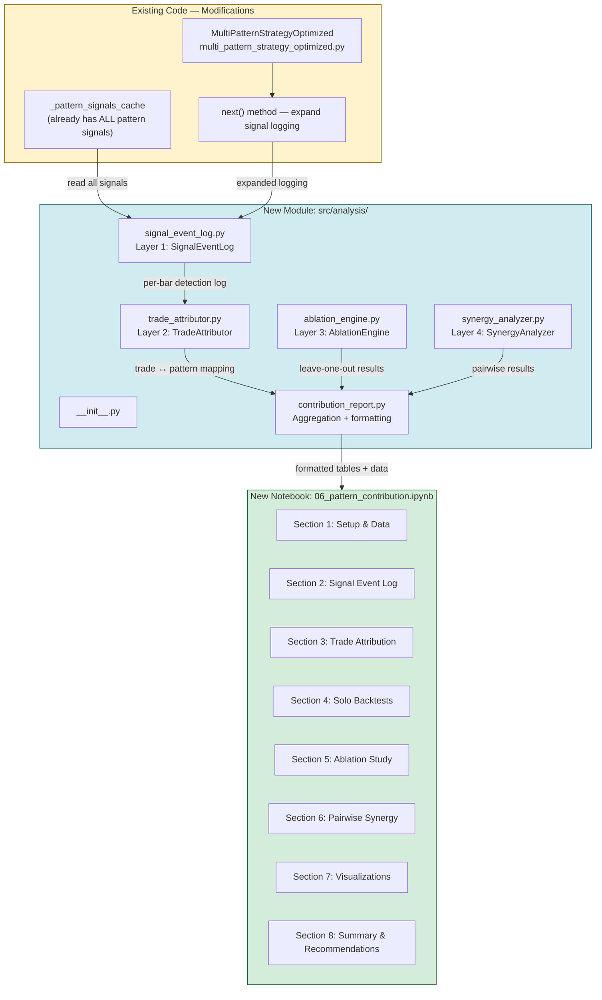
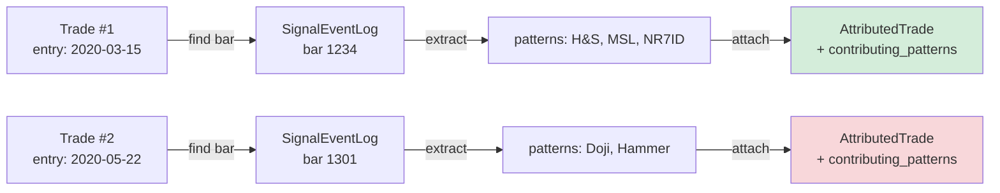
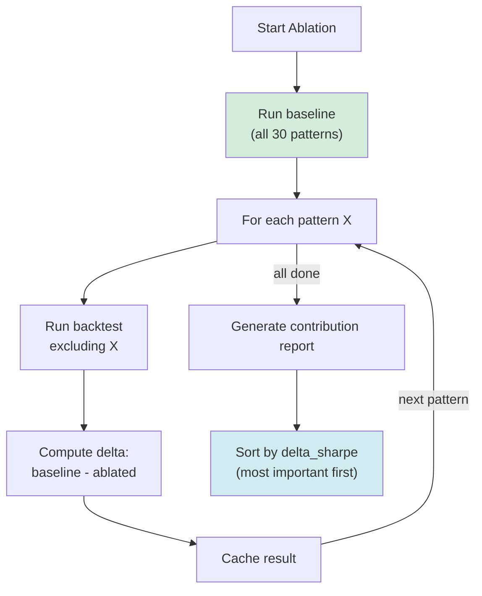

# Strategy Contribution Analysis System — Implementation Plan

## Executive Summary

Build a **Pattern Contribution Analysis** system that answers four key questions about the 30+ pattern detectors:

1. **Solo Edge** — Can pattern X trade profitably alone?
2. **Marginal Contribution** — Does the system get worse without X? (ablation)
3. **Pairwise Synergy** — Do patterns X and Y complement or conflict?
4. **Trade Attribution** — Which patterns were in each trade, and what was their "recipe"?

The system is organized into 4 layers of increasing computational cost, with Layers 1-2 being nearly free (they read from already-computed caches) and Layers 3-4 requiring backtest re-runs.

---

## Architecture Overview



---

## Layer 1: Signal Event Log

### Purpose
Record **every pattern detection event** across every bar — not just the ones that passed the confluence threshold. This is the foundation for all subsequent analysis.

### Key Insight
[`_pattern_signals_cache`](src/strategies/backtest_py/multi_pattern_strategy_optimized.py:160) already contains pre-computed signals for all patterns across all bars. We just need to read it out. Zero additional computation.

### File: `src/analysis/signal_event_log.py`

```python
@dataclass
class SignalEvent:
    """A single pattern detection event on a single bar."""
    bar_index: int
    timestamp: pd.Timestamp
    pattern_name: str
    pattern_category: str        # basic, harmonic, complex, classic, continuation, breakout, candlestick
    direction: str               # "Long", "Short"
    confidence: float
    entry_price: float
    stop_loss: float
    take_profit_1: float
    pattern_type: str            # Reversal, Continuation, Breakout, etc.
    # Post-backtest fields (filled later by TradeAttributor)
    led_to_trade: bool = False
    trade_pnl: Optional[float] = None
    trade_pnl_pct: Optional[float] = None

class SignalEventLog:
    """Comprehensive log of ALL pattern detection events."""
    
    def __init__(self):
        self.events: List[SignalEvent] = []
        self._bar_timestamps: Optional[pd.DatetimeIndex] = None
    
    def record_bar_detections(
        self,
        bar_index: int,
        timestamp: pd.Timestamp,
        all_detections: List[Dict[str, Any]],
        active_patterns: Optional[List[str]] = None,
        confluence_count: int = 0,
        passed_threshold: bool = False,
    ) -> None:
        """Record all pattern detections for a single bar."""
        ...
    
    def to_dataframe(self) -> pd.DataFrame:
        """Convert to DataFrame for analysis."""
        ...
    
    def get_detections_for_bar(self, bar_index: int) -> List[SignalEvent]:
        """Get all detections at a specific bar."""
        ...
    
    def get_detections_for_pattern(self, pattern_name: str) -> List[SignalEvent]:
        """Get all detections for a specific pattern."""
        ...
    
    def get_detection_frequency(self) -> pd.DataFrame:
        """How often each pattern fires (as % of bars)."""
        ...
    
    def get_co_occurrence_matrix(self) -> pd.DataFrame:
        """NxN matrix: how often patterns fire on the same bar."""
        ...
```

### Modification: `src/strategies/backtest_py/multi_pattern_strategy_optimized.py`

Expand [`next()`](src/strategies/backtest_py/multi_pattern_strategy_optimized.py:401) to log ALL detections, not just threshold-passing ones.

**Current code** (line 420-427):
```python
signals = self._detect_patterns_sequential(self._df, current_idx, window_start)

# Check if we have enough confluence
if len(signals) < self.min_confluence_count:
    return  # ← ALL sub-threshold signals are silently discarded
```

**Proposed change**:
```python
signals = self._detect_patterns_sequential(self._df, current_idx, window_start)

# LOG ALL detections (even sub-threshold) for contribution analysis
if hasattr(self, '_signal_event_log') and self._signal_event_log is not None:
    self._signal_event_log.record_bar_detections(
        bar_index=current_idx,
        timestamp=self.data.index[current_idx],
        all_detections=signals,
        active_patterns=None,  # filled below if threshold passes
        confluence_count=len(signals),
        passed_threshold=False,  # updated below
    )

# Check if we have enough confluence
if len(signals) < self.min_confluence_count:
    return
```

And after the trade executes (around line 500-511), update the log:
```python
if hasattr(self, '_signal_event_log') and self._signal_event_log is not None:
    self._signal_event_log.update_bar_passed_threshold(
        bar_index=current_idx,
        active_patterns=[s["pattern_name"] for s in active_signals],
        confluence_count=len(active_signals),
    )
```

**New strategy parameter**:
```python
class MultiPatternStrategyOptimized(Strategy):
    # ... existing params ...
    enable_signal_log: bool = False  # Opt-in to avoid perf impact when not needed
```

**Performance impact**: When `enable_signal_log=False` (default), zero overhead — the `hasattr` check is a single attribute lookup. When enabled, the cost is ~1μs per bar for list append + dict creation, which is negligible compared to pattern detection (~100μs-1ms per bar).

---

## Layer 2: Trade Attributor

### Purpose
After a backtest completes, match each backtesting.py trade back to the signal log to determine which patterns contributed to each trade.

### Challenge
backtesting.py manages trades internally. We get trade objects via `self.results._trades` with `entry_time`, `exit_time`, `entry_price`, `exit_price`, `size`, `pl`, `pl_pct`. We need to match these to our signal log entries by timestamp.

### File: `src/analysis/trade_attributor.py`

```python
@dataclass
class AttributedTrade:
    """A trade with full pattern attribution."""
    trade_id: int
    entry_time: pd.Timestamp
    exit_time: pd.Timestamp
    entry_price: float
    exit_price: float
    size: float
    pnl: float
    pnl_pct: float
    duration: str
    direction: str                    # "LONG" or "SHORT"
    contributing_patterns: List[str]   # patterns that fired at entry
    confluence_count: int              # how many patterns agreed
    avg_confidence: float              # average confidence of contributing patterns
    pattern_categories: List[str]      # categories of contributing patterns
    all_detections_at_entry: int       # total detections at entry bar (including sub-threshold)
    # Computed fields
    is_winner: bool = False
    holding_days: int = 0

class TradeAttributor:
    """Matches backtesting.py trades to signal event logs."""
    
    def __init__(
        self,
        signal_log: SignalEventLog,
        trades_df: pd.DataFrame,
        tolerance_bars: int = 1,
    ):
        """
        Args:
            signal_log: SignalEventLog from the backtest
            trades_df: DataFrame from BacktestPyRunner.get_trades()
            tolerance_bars: Max bars between signal and trade entry for matching
        """
        ...
    
    def attribute_trades(self) -> List[AttributedTrade]:
        """Match trades to signal events by entry timestamp."""
        ...
    
    def get_pattern_trade_stats(self) -> pd.DataFrame:
        """
        For each pattern: number of trades it participated in,
        win rate when present, avg P&L when present.
        """
        ...
    
    def get_pattern_combination_stats(self) -> pd.DataFrame:
        """
        For each unique combination of patterns: how many trades,
        win rate, avg P&L. Sorted by frequency.
        """
        ...
    
    def get_best_trade_recipes(self, n: int = 10) -> pd.DataFrame:
        """Top N trades by P&L with their pattern recipes."""
        ...
    
    def get_worst_trade_recipes(self, n: int = 10) -> pd.DataFrame:
        """Bottom N trades by P&L with their pattern recipes."""
        ...
    
    def get_confluence_vs_performance(self) -> pd.DataFrame:
        """
        Group trades by confluence_count (1, 2, 3, 4, 5+).
        For each group: count, win rate, avg P&L, avg confidence.
        """
        ...
    
    def get_pattern_participation_rate(self) -> pd.DataFrame:
        """
        For each pattern: what % of all trades included it?
        What % of winning trades included it?
        What % of losing trades included it?
        """
        ...
```

### Matching Logic



**Matching algorithm**:
1. For each trade in `trades_df`, get `entry_time`
2. Find the closest bar in `signal_log` by timestamp (within `tolerance_bars`)
3. If found, get all detections that `passed_threshold=True` at that bar
4. Attach pattern names to the trade

**Edge cases**:
- Trade opens on a bar with no signal log entry → mark as "unattributed"
- Multiple signals within tolerance → use the closest one
- `exclusive_orders=True` means a new trade always follows a close → the signal should be on the entry bar or 1 bar before

---

## Layer 3: Ablation Engine

### Purpose
Quantify each pattern's **marginal contribution** to the system by running leave-one-out ablation.

### File: `src/analysis/ablation_engine.py`

```python
@dataclass
class AblationResult:
    """Result of a single ablation run."""
    excluded_pattern: str
    total_trades: int
    win_rate: float
    total_return_pct: float
    sharpe_ratio: float
    sortino_ratio: float
    max_drawdown_pct: float
    profit_factor: float
    equity_final: float
    duration_seconds: float

class AblationEngine:
    """Leave-one-out ablation analysis for pattern contribution."""
    
    def __init__(
        self,
        data: pd.DataFrame,
        strategy_class: Type = MultiPatternStrategyOptimized,
        cash: float = 100000,
        commission: float = 0.001,
        base_params: Optional[Dict[str, Any]] = None,
        output_dir: str = "reports/ablation",
    ):
        ...
    
    def run_baseline(self) -> Dict[str, Any]:
        """Run full system (all patterns) as baseline."""
        ...
    
    def run_ablation(self, exclude_pattern: str) -> AblationResult:
        """Run system with one pattern excluded."""
        ...
    
    def run_full_ablation(
        self,
        progress_callback: Optional[Callable[[int, int], None]] = None,
    ) -> pd.DataFrame:
        """
        Run leave-one-out for ALL patterns.
        Returns DataFrame sorted by marginal contribution.
        """
        ...
    
    def get_contribution_report(self) -> pd.DataFrame:
        """
        Compare each ablation to baseline.
        Columns: pattern, delta_return, delta_sharpe, delta_win_rate,
                 delta_trades, contribution_rank
        """
        ...
    
    def save_results(self, path: str) -> None:
        """Cache ablation results to disk (JSON)."""
        ...
    
    def load_results(self, path: str) -> bool:
        """Load cached ablation results."""
        ...
```

### How Pattern Exclusion Works

The current [`_init_patterns()`](src/strategies/backtest_py/multi_pattern_strategy_optimized.py:179) returns a hardcoded list. We need a mechanism to exclude patterns by name.

**Approach**: Add a `exclude_patterns` parameter to `MultiPatternStrategyOptimized`:

```python
class MultiPatternStrategyOptimized(Strategy):
    # ... existing params ...
    exclude_patterns: str = ""  # Comma-separated pattern names to exclude
    
    def _init_patterns(self) -> List:
        patterns = [...]  # existing full list
        
        # Filter out excluded patterns
        if self.exclude_patterns:
            exclude_set = {p.strip() for p in self.exclude_patterns.split(",")}
            patterns = [p for p in patterns if p.name not in exclude_set]
        
        return patterns
```

**Why a string parameter?** backtesting.py's `optimize()` and `run()` only accept simple types (int, float, str, bool). A comma-separated string is the standard pattern used by backtesting.py for list parameters.

### Ablation Flow



### Output Table

| Pattern | Excluded Return | Baseline Return | Delta Return | Delta Sharpe | Delta Trades | Rank |
|---------|----------------|-----------------|--------------|--------------|--------------|------|
| Head & Shoulders | +8.2% | +15.1% | **-6.9%** | -0.42 | -12 | 1 |
| MSL | +11.3% | +15.1% | **-3.8%** | -0.28 | -8 | 2 |
| NR7ID | +12.8% | +15.1% | **-2.3%** | -0.15 | -5 | 3 |
| Double Bottom | +13.9% | +15.1% | **-1.2%** | -0.08 | -3 | 4 |
| Flag | +14.5% | +15.1% | -0.6% | -0.03 | -1 | 5 |
| Doji | +16.8% | +15.1% | **+1.7%** | +0.11 | +4 | 28 |
| Parabolic Arc | +17.2% | +15.1% | **+2.1%** | +0.14 | +3 | 29 |
| Dark Cloud | +17.5% | +15.1% | **+2.4%** | +0.16 | +5 | 30 |

**Interpretation**: Negative delta = pattern helps the system. Positive delta = pattern hurts (removing it improves results).

### Estimated Runtime

- 30 patterns × ~10s per backtest = **~5 minutes** for full ablation
- Baseline run: ~10s
- **Total: ~5-6 minutes** for complete ablation study

---

## Layer 4: Synergy Analyzer

### Purpose
Analyze pairwise (and optionally higher-order) interactions between patterns to identify complementary pairs and conflicting pairs.

### File: `src/analysis/synergy_analyzer.py`

```python
@dataclass
class SynergyResult:
    """Result of a pairwise synergy analysis."""
    pattern_a: str
    pattern_b: str
    solo_a_return: float
    solo_b_return: float
    pair_return: float
    expected_return: float        # solo_a + solo_b (if independent)
    synergy_score: float          # pair_return - expected_return
    solo_a_sharpe: float
    solo_b_sharpe: float
    pair_sharpe: float
    synergy_sharpe: float         # pair_sharpe - max(solo_a, solo_b)
    co_occurrence_count: int      # how many bars both fired
    co_trade_count: int           # how many trades included both
    co_trade_win_rate: float

class SynergyAnalyzer:
    """Analyze pairwise pattern interactions."""
    
    def __init__(
        self,
        data: pd.DataFrame,
        strategy_class: Type = MultiPatternStrategyOptimized,
        cash: float = 100000,
        commission: float = 0.001,
        base_params: Optional[Dict[str, Any]] = None,
        output_dir: str = "reports/synergy",
    ):
        ...
    
    def run_solo(self, pattern_name: str) -> Dict[str, Any]:
        """Run backtest with ONLY this pattern active (threshold=1)."""
        ...
    
    def run_pair(self, pattern_a: str, pattern_b: str) -> Dict[str, Any]:
        """Run backtest with ONLY these two patterns active."""
        ...
    
    def run_full_pairwise(
        self,
        top_n: Optional[int] = None,
        progress_callback: Optional[Callable[[int, int], None]] = None,
    ) -> pd.DataFrame:
        """
        Run pairwise analysis for all pattern pairs.
        
        Args:
            top_n: Only analyze top N patterns by ablation rank (saves time)
            progress_callback: Progress callback (current, total)
        
        Returns:
            DataFrame with synergy scores for all pairs
        """
        ...
    
    def get_synergy_matrix(self) -> pd.DataFrame:
        """NxN matrix of synergy scores."""
        ...
    
    def get_complementary_pairs(self, min_synergy: float = 0.0) -> List[Tuple[str, str]]:
        """Pairs that work better together than expected."""
        ...
    
    def get_conflicting_pairs(self, max_synergy: float = 0.0) -> List[Tuple[str, str]]:
        """Pairs that conflict (combined worse than solo)."""
        ...
    
    def save_results(self, path: str) -> None:
        """Cache synergy results to disk."""
        ...
    
    def load_results(self, path: str) -> bool:
        """Load cached synergy results."""
        ...
```

### How Solo/Pair Runs Work

Uses the same `exclude_patterns` mechanism but in reverse — instead of excluding one pattern, we exclude ALL patterns except the one(s) we want.

**New parameter**: `include_patterns_only` (comma-separated string):

```python
class MultiPatternStrategyOptimized(Strategy):
    exclude_patterns: str = ""
    include_patterns_only: str = ""  # If set, ONLY these patterns are active
    
    def _init_patterns(self) -> List:
        patterns = [...]  # full list
        
        if self.include_patterns_only:
            include_set = {p.strip() for p in self.include_patterns_only.split(",")}
            patterns = [p for p in patterns if p.name in include_set]
        elif self.exclude_patterns:
            exclude_set = {p.strip() for p in self.exclude_patterns.split(",")}
            patterns = [p for p in patterns if p.name not in exclude_set]
        
        return patterns
```

**Important**: Solo runs should use `min_confluence_count=1` (since there's only one pattern, requiring 2+ would produce zero trades).

### Synergy Score Calculation

```
synergy_return = return(A+B) - return(solo_A) - return(solo_B)
```

- **synergy_return > 0**: Complementary — patterns amplify each other
- **synergy_return ≈ 0**: Independent — patterns don't interact
- **synergy_return < 0**: Conflicting — patterns interfere with each other

**Why not just P&L?** We also compute `synergy_sharpe` because two patterns might have similar returns but very different risk profiles. A pair that reduces drawdown while maintaining returns is more valuable than one that just adds raw P&L.

### Estimated Runtime

| Scope | Pairs | Time |
|-------|-------|------|
| Top 10 patterns | C(10,2) = 45 | ~8 minutes |
| Top 15 patterns | C(15,2) = 105 | ~18 minutes |
| All 30 patterns | C(30,2) = 435 | ~75 minutes |
| With caching (incremental) | Only new pairs | ~2-5 minutes |

**Recommendation**: Default to `top_n=15` for interactive use. Provide `--full` flag for overnight batch analysis.

---

## Aggregation & Reporting

### File: `src/analysis/contribution_report.py`

```python
class ContributionReport:
    """Aggregates all analysis layers into a unified report."""
    
    def __init__(
        self,
        signal_log: SignalEventLog,
        attributor: TradeAttributor,
        ablation_results: Optional[pd.DataFrame] = None,
        synergy_results: Optional[pd.DataFrame] = None,
    ):
        ...
    
    def generate_summary(self) -> Dict[str, Any]:
        """Executive summary of pattern contributions."""
        ...
    
    def get_pattern_leaderboard(self) -> pd.DataFrame:
        """
        Combined ranking: solo edge + ablation contribution + synergy.
        Columns: pattern, category, solo_return, solo_sharpe,
                 ablation_delta_sharpe, avg_synergy_score,
                 participation_rate, composite_score, role
        """
        ...
    
    def get_pattern_roles(self) -> Dict[str, str]:
        """
        Classify each pattern into a role:
        - "Primary Signal" — high solo edge, high ablation contribution
        - "Confirmation Filter" — low solo edge, positive ablation contribution
        - "Noise Generator" — negative ablation contribution (should be removed)
        - "Neutral" — no significant impact
        """
        ...
    
    def get_recommendations(self) -> List[str]:
        """
        Actionable recommendations:
        - "Remove Doji — ablation shows +1.7% improvement without it"
        - "Keep H&S — highest marginal contributor (-6.9% delta)"
        - "Investigate H&S+MSL pair — highest synergy score"
        """
        ...
    
    def to_markdown(self) -> str:
        """Generate markdown report."""
        ...
    
    def save(self, output_dir: str) -> Dict[str, str]:
        """Save all results to files."""
        ...
```

---

## Visualization Plan

### File: `src/analysis/contribution_charts.py`

All visualizations use matplotlib/seaborn (already in dependencies). No new dependencies needed.

### Chart 1: Pattern Leaderboard (Horizontal Bar Chart)
```
X-axis: Ablation delta Sharpe ratio
Y-axis: Pattern names (sorted)
Color: Green = positive contributor, Red = negative contributor
```

### Chart 2: Contribution Waterfall
```
X-axis: Cumulative P&L
Y-axis: Steps (baseline → +pattern → +pattern → ...)
Bars: Green for positive contribution, Red for negative
Ordered by contribution magnitude
```

### Chart 3: Co-occurrence Heatmap
```
NxN matrix
Cell color: Average P&L when both patterns fire together
Diagonal: Solo P&L for each pattern
Annotation: Number of co-occurrences
```

### Chart 4: Frequency vs. Quality Scatter
```
X-axis: Detection frequency (% of bars where pattern fires)
Y-axis: Avg P&L when pattern participates in a trade
Bubble size: Number of trades pattern participated in
Color: Pattern category
Quadrant labels:
  Top-Right: "Frequent & Profitable" (ideal)
  Top-Left:  "Rare & Profitable" (specialized)
  Bottom-Right: "Frequent & Unprofitable" (remove?)
  Bottom-Left: "Rare & Unprofitable" (noise)
```

### Chart 5: Confluence Count vs. Performance
```
X-axis: Number of patterns in confluence (1, 2, 3, 4, 5+)
Y-axis (left): Win rate (line)
Y-axis (right): Average P&L (bar)
Annotation: Number of trades per group
```

### Chart 6: Synergy Network Graph
```
Nodes: Patterns (sized by ablation contribution, colored by category)
Edges: Connected if synergy_score is significant
  Green edges: Positive synergy (complementary)
  Red edges: Negative synergy (conflicting)
  Edge thickness: |synergy_score|
Layout: Force-directed (networkx spring layout)
```

### Chart 7: Pattern Category Performance
```
Grouped bar chart:
X-axis: Categories (basic, harmonic, complex, classic, continuation, breakout, candlestick)
Y-axis: Avg contribution metrics
Groups: Solo return, Ablation delta, Avg synergy
```

---

## Notebook Structure

### File: `notebooks/06_pattern_contribution.ipynb`

| Section | Content | Layers Used | Est. Time |
|---------|---------|-------------|-----------|
| 1. Setup & Data | Load SPY daily, import modules, configure | — | instant |
| 2. Run Baseline | Full system backtest with signal logging enabled | L1 | ~10s |
| 3. Signal Event Log | Detection frequency, co-occurrence matrix | L1 | instant |
| 4. Trade Attribution | Per-trade pattern recipes, confluence vs. performance | L1+L2 | instant |
| 5. Solo Backtests | Each pattern alone (threshold=1) | L3 | ~5 min |
| 6. Ablation Study | Leave-one-out for all patterns | L3 | ~5 min |
| 7. Pairwise Synergy | Top 15 patterns pairwise | L4 | ~18 min |
| 8. Visualizations | All 7 charts | All | instant |
| 9. Summary | Leaderboard, roles, recommendations | All | instant |

**Total notebook runtime**: ~30 minutes (mostly Layers 3-4 backtest re-runs)
**With cached results**: ~30 seconds (skip re-runs, load from disk)

---

## File Structure

### New Files to Create

```
src/analysis/
├── __init__.py                          # Module init, exports
├── signal_event_log.py                  # Layer 1: ~120 lines
├── trade_attributor.py                  # Layer 2: ~200 lines
├── ablation_engine.py                   # Layer 3: ~250 lines
├── synergy_analyzer.py                  # Layer 4: ~300 lines
├── contribution_report.py               # Aggregation: ~200 lines
└── contribution_charts.py               # Visualizations: ~400 lines

notebooks/
└── 06_pattern_contribution.ipynb        # Analysis notebook

reports/
├── ablation/                            # Ablation cache files
│   ├── baseline.json
│   └── ablation_results.json
└── synergy/                             # Synergy cache files
    ├── solo_results.json
    └── synergy_results.json
```

### Files to Modify

| File | Change | Lines Affected |
|------|--------|---------------|
| `src/strategies/backtest_py/multi_pattern_strategy_optimized.py` | Add `enable_signal_log`, `exclude_patterns`, `include_patterns_only` params; expand `next()` logging; modify `_init_patterns()` | ~30 lines added/modified |

---

## Implementation Phases

### Phase A: Foundation (Layers 1 + 2) — ~3 hours

| Task | File | Description |
|------|------|-------------|
| A1 | `src/analysis/__init__.py` | Create module with exports |
| A2 | `src/analysis/signal_event_log.py` | Implement `SignalEvent` dataclass + `SignalEventLog` class |
| A3 | `src/strategies/backtest_py/multi_pattern_strategy_optimized.py` | Add `enable_signal_log` param, expand `next()` to log all detections |
| A4 | `src/analysis/trade_attributor.py` | Implement `AttributedTrade` + `TradeAttributor` class |
| A5 | `src/analysis/contribution_charts.py` | Charts 3 (heatmap), 4 (scatter), 5 (confluence bar) — these only need L1+L2 data |
| A6 | `notebooks/06_pattern_contribution.ipynb` | Sections 1-4 of notebook |

**Deliverable**: Can run a backtest and immediately see which patterns contributed to each trade, detection frequencies, and basic visualizations.

### Phase B: Ablation (Layer 3) — ~2 hours

| Task | File | Description |
|------|------|-------------|
| B1 | `src/strategies/backtest_py/multi_pattern_strategy_optimized.py` | Add `exclude_patterns` param, modify `_init_patterns()` |
| B2 | `src/analysis/ablation_engine.py` | Implement `AblationEngine` with caching |
| B3 | `src/analysis/contribution_charts.py` | Charts 1 (leaderboard), 2 (waterfall), 7 (category bars) |
| B4 | `notebooks/06_pattern_contribution.ipynb` | Sections 5-6 of notebook |

**Deliverable**: Full ablation study ranking all patterns by marginal contribution.

### Phase C: Synergy (Layer 4) — ~2 hours

| Task | File | Description |
|------|------|-------------|
| C1 | `src/strategies/backtest_py/multi_pattern_strategy_optimized.py` | Add `include_patterns_only` param |
| C2 | `src/analysis/synergy_analyzer.py` | Implement `SynergyAnalyzer` with caching |
| C3 | `src/analysis/contribution_charts.py` | Chart 6 (network graph) |
| C4 | `notebooks/06_pattern_contribution.ipynb` | Section 7 of notebook |

**Deliverable**: Pairwise synergy analysis with network visualization.

### Phase D: Reporting — ~1.5 hours

| Task | File | Description |
|------|------|-------------|
| D1 | `src/analysis/contribution_report.py` | Implement `ContributionReport` class |
| D2 | `notebooks/06_pattern_contribution.ipynb` | Sections 8-9 (summary + recommendations) |
| D3 | `tests/test_contribution.py` | Unit tests for all analysis classes |

**Deliverable**: Automated recommendations, pattern role classification, full test coverage.

---

## Design Decisions

### DD1: Primary Metric = Ablation Delta Sharpe (not P&L)

**Rationale**: P&L is dominated by a few lucky large trades. Sharpe ratio risk-adjusts and is more stable across time periods. A pattern that adds 1% return but reduces drawdown by 30% is more valuable than one that adds 5% return but increases drawdown by 50%.

### DD2: Caching to Disk (JSON)

**Rationale**: With 30+ patterns and growing, re-running 435 pairwise backtests every time is wasteful. JSON caching allows incremental updates — adding pattern #31 only requires running 30 new pairs, not 465.

**Cache key**: Hash of (data_hash, strategy_params, commission, cash). If data or params change, cache is invalidated.

### DD3: Opt-In Signal Logging

**Rationale**: Signal logging adds minimal overhead (~1μs/bar) but we make it opt-in (`enable_signal_log=False` by default) to guarantee zero impact on existing backtests and notebooks.

### DD4: Separate Analysis Module (not embedded in strategy)

**Rationale**: The strategy class is already 639 lines. Embedding analysis logic would make it unmaintainable. A separate `src/analysis/` module keeps concerns separated and makes the analysis reusable across different strategy classes.

### DD5: Notebook-First, CLI-Second

**Rationale**: Contribution analysis is exploratory — you want to see charts, filter, drill down. A notebook is the right interface. A CLI can be added later for automation/CI if needed.

---

## Testing Strategy

### Unit Tests: `tests/test_contribution.py`

| Test | What It Validates |
|------|-------------------|
| `test_signal_event_log_recording` | All detections logged, not just threshold-passing |
| `test_signal_event_log_to_dataframe` | DataFrame conversion preserves all fields |
| `test_trade_attributor_matching` | Trades matched to correct signal events |
| `test_trade_attributor_unattributed` | Unmatched trades handled gracefully |
| `test_ablation_exclude_patterns` | Pattern exclusion actually removes detections |
| `test_ablation_caching` | Cache save/load round-trips correctly |
| `test_synergy_score_calculation` | Synergy = pair - soloA - soloB |
| `test_contribution_report_roles` | Role classification matches expected rules |

### Integration Test

Run full contribution analysis on a small dataset (100 bars) and validate:
- Signal log has entries for all bars
- All trades are attributed
- Ablation produces N+1 results (baseline + N patterns)
- Synergy produces C(N,2) results for N patterns
- No exceptions or NaN values in outputs

---

## Risk Mitigation

| Risk | Mitigation |
|------|-----------|
| backtesting.py `include_patterns_only` not supported | Use comma-separated string (already works with backtesting.py's constraint system) |
| Pattern names change between runs | Use pattern class names (stable) not display names |
| Cache invalidation bugs | Hash data + params together as cache key |
| Long runtime for full pairwise | Default to top_n=15, provide --full flag |
| Memory pressure from signal log | SignalEventLog for 2,500 bars × 30 patterns = ~75K events ≈ 50MB (fine) |
| backtesting.py trade matching ambiguity | Use tolerance_bars=1 and warn on ambiguous matches |
