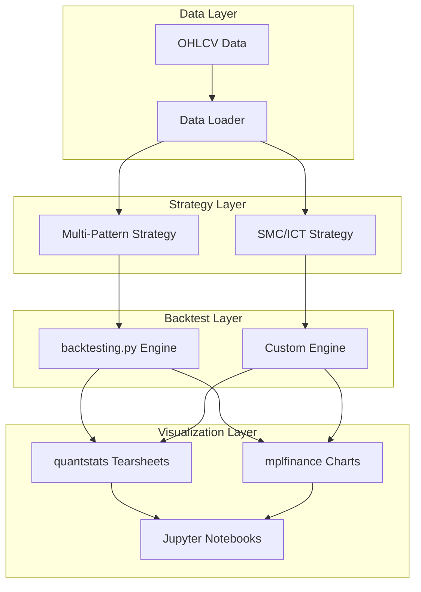
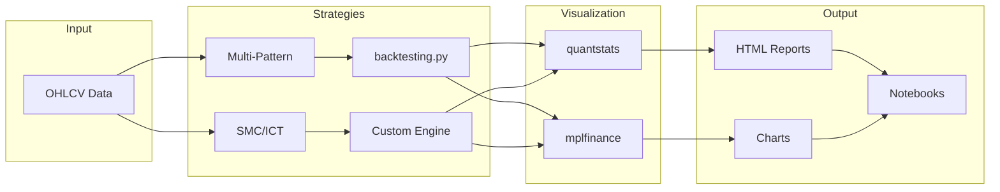

# Hybrid Backtest & Visualization Implementation Plan

## Overview

This plan outlines the migration of the Multi-Pattern Strategy to backtesting.py while keeping the SMC/ICT Strategy in the custom engine, with unified visualization using quantstats and mplfinance.

## Architecture



---

## Phase 1: Setup and Dependencies

### 1.1 Add Required Packages

**File:** `requirements.txt` (create or update)

```
# Existing dependencies
pandas>=2.0.0
numpy>=1.24.0

# New dependencies for backtesting.py
backtesting>=0.3.3

# Visualization dependencies
quantstats>=0.0.62
mplfinance>=0.12.10
plotly>=5.18.0

# Jupyter support
jupyter>=1.0.0
ipykernel>=6.0.0
ipywidgets>=8.0.0

# Optional but recommended
loguru>=0.7.0
yfinance>=0.2.0
```

### 1.2 Create Visualization Module Structure

```
src/
├── visualization/
│   ├── __init__.py
│   ├── tearsheet.py      # quantstats integration
│   ├── charts.py         # mplfinance charts
│   ├── pattern_markers.py # Pattern visualization
│   └── report.py         # HTML report generation
```

### 1.3 Deliverables

| Task | File | Status |
|------|------|--------|
| Update requirements.txt | `requirements.txt` | [ ] |
| Create visualization module | `src/visualization/__init__.py` | [ ] |
| Install dependencies | - | [ ] |

---

## Phase 2: Create Visualization Module

### 2.1 quantstats Tearsheet Integration

**File:** `src/visualization/tearsheet.py`

```python
"""
quantstats Tearsheet Integration

Generates professional performance reports from backtest results.
"""

import quantstats as qs
import pandas as pd
from typing import Optional, Dict, Any

class TearsheetGenerator:
    """
    Generate quantstats tearsheets from backtest results.
    Works with both backtesting.py and custom engine results.
    """
    
    def __init__(self, risk_free_rate: float = 0.02):
        self.risk_free_rate = risk_free_rate
    
    def from_backtest_result(
        self,
        equity_curve: pd.DataFrame,
        trades: list,
        benchmark: Optional[pd.Series] = None,
        title: str = "Strategy Performance"
    ) -> None:
        """Generate tearsheet from custom engine results."""
        # Convert equity curve to returns
        returns = equity_curve['equity'].pct_change().dropna()
        returns.index = pd.to_datetime(equity_curve['timestamp'])
        returns = returns.set_axis(equity_curve.index)
        
        # Generate report
        qs.reports.html(
            returns,
            benchmark=benchmark,
            title=title,
            output=f'{title.lower().replace(" ", "_")}_tearsheet.html'
        )
    
    def from_backtesting_py(
        self,
        stats: Dict[str, Any],
        title: str = "Strategy Performance"
    ) -> None:
        """Generate tearsheet from backtesting.py results."""
        # Extract returns from backtesting.py stats
        returns = stats['_equity_curve']['Equity'].pct_change().dropna()
        
        qs.reports.html(
            returns,
            title=title,
            output=f'{title.lower().replace(" ", "_")}_tearsheet.html'
        )
```

### 2.2 mplfinance Chart Integration

**File:** `src/visualization/charts.py`

```python
"""
mplfinance Chart Integration

Generates candlestick charts with pattern markers and indicators.
"""

import mplfinance as mpf
import pandas as pd
from typing import List, Dict, Any, Optional

class ChartGenerator:
    """
    Generate candlestick charts with pattern overlays.
    """
    
    def plot_with_patterns(
        self,
        df: pd.DataFrame,
        patterns: List[Dict[str, Any]],
        title: str = "Price Chart with Patterns",
        save_path: Optional[str] = None
    ) -> None:
        """Plot candlestick chart with pattern markers."""
        
        # Create markers for patterns
        markers = self._create_pattern_markers(df, patterns)
        
        # Create addplots
        addplots = []
        for name, marker_data in markers.items():
            addplots.append(
                mpf.make_addplot(
                    marker_data['values'],
                    type='scatter',
                    markersize=100,
                    marker=marker_data['marker'],
                    color=marker_data['color']
                )
            )
        
        # Plot
        mpf.plot(
            df,
            type='candle',
            style='charles',
            title=title,
            addplot=addplots if addplots else None,
            savefig=save_path
        )
    
    def _create_pattern_markers(
        self,
        df: pd.DataFrame,
        patterns: List[Dict[str, Any]]
    ) -> Dict[str, Dict]:
        """Create marker data for each pattern type."""
        markers = {}
        
        for pattern in patterns:
            name = pattern['pattern_name']
            direction = pattern['direction']
            idx = pattern['timestamp']
            
            if name not in markers:
                markers[name] = {
                    'values': pd.Series(index=df.index, dtype=float),
                    'marker': '^' if direction == 'LONG' else 'v',
                    'color': 'green' if direction == 'LONG' else 'red'
                }
            
            # Place marker at entry price
            if idx in df.index:
                markers[name]['values'][idx] = pattern['entry_price']
        
        return markers
```

### 2.3 Pattern Markers for Visualization

**File:** `src/visualization/pattern_markers.py`

```python
"""
Pattern Markers for Chart Visualization

Converts pattern detection results to chart markers.
"""

import pandas as pd
from typing import List, Dict, Any
from dataclasses import dataclass

@dataclass
class PatternMarker:
    """Marker for a detected pattern."""
    timestamp: pd.Timestamp
    price: float
    pattern_name: str
    direction: str  # 'LONG' or 'SHORT'
    confidence: float
    marker_type: str  # 'entry', 'stop', 'target1', 'target2', 'target3'

class PatternMarkerGenerator:
    """
    Generate markers for pattern visualization.
    """
    
    MARKER_STYLES = {
        'LONG': {'marker': '^', 'color': 'green', 'offset': -1},
        'SHORT': {'marker': 'v', 'color': 'red', 'offset': 1}
    }
    
    PATTERN_COLORS = {
        'basic': 'blue',
        'harmonic': 'purple',
        'complex': 'orange',
        'classic': 'cyan'
    }
    
    def generate_markers(
        self,
        signals: List[Dict[str, Any]]
    ) -> List[PatternMarker]:
        """Convert signals to chart markers."""
        markers = []
        
        for signal in signals:
            # Entry marker
            markers.append(PatternMarker(
                timestamp=signal['timestamp'],
                price=signal['entry_price'],
                pattern_name=signal['pattern_name'],
                direction=signal['direction'],
                confidence=signal.get('confidence', 0.5),
                marker_type='entry'
            ))
            
            # Stop loss marker
            markers.append(PatternMarker(
                timestamp=signal['timestamp'],
                price=signal['stop_loss'],
                pattern_name=signal['pattern_name'],
                direction=signal['direction'],
                confidence=signal.get('confidence', 0.5),
                marker_type='stop'
            ))
            
            # Take profit markers
            for i, tp in enumerate(['take_profit_1', 'take_profit_2', 'take_profit_3'], 1):
                if signal.get(tp):
                    markers.append(PatternMarker(
                        timestamp=signal['timestamp'],
                        price=signal[tp],
                        pattern_name=signal['pattern_name'],
                        direction=signal['direction'],
                        confidence=signal.get('confidence', 0.5),
                        marker_type=f'target{i}'
                    ))
        
        return markers
```

### 2.4 Deliverables

| Task | File | Status |
|------|------|--------|
| Create tearsheet generator | `src/visualization/tearsheet.py` | [ ] |
| Create chart generator | `src/visualization/charts.py` | [ ] |
| Create pattern markers | `src/visualization/pattern_markers.py` | [ ] |
| Create report generator | `src/visualization/report.py` | [ ] |
| Create module init | `src/visualization/__init__.py` | [ ] |

---

## Phase 3: Migrate Multi-Pattern Strategy to backtesting.py

### 3.1 Create backtesting.py Strategy Wrapper

**File:** `src/strategies/backtest_py/multi_pattern_strategy.py`

```python
"""
Multi-Pattern Strategy for backtesting.py

Wrapper for running multi-pattern confluence strategy in backtesting.py.
"""

from backtesting import Strategy
from typing import List, Optional
import pandas as pd
import numpy as np

# Import pattern detectors
from ..patterns.basic import MSLSupport, MatchingLows, NR7InsideDay, NBarDecline, FloorPivotBreakout
from ..patterns.harmonic import GartleyPattern, ABCPattern, SymmetricTriangle, DonchianChannel, BollingerBands
from ..patterns.complex import CupHandle, HeadShoulders, SpikeLedge, ThreeHills, ParabolicArc
from ..patterns.classic import DoubleTop, DoubleBottom, TraderVic2B, TripleTop, DeadCatBounce
from ..strategies.confluence import ConfluenceScorer
from ..indicators.regime import RegimeDetector


class MultiPatternStrategy(Strategy):
    """
    Multi-Pattern Confluence Strategy for backtesting.py
    
    Uses confluence of multiple pattern detections to generate signals.
    """
    
    # Strategy parameters (can be optimized)
    min_confidence = 0.6
    min_confluence = 2  # Minimum patterns to agree
    risk_per_trade = 0.02
    max_open_positions = 5
    
    def init(self):
        """Initialize indicators and pattern detectors."""
        # Initialize pattern detectors
        self.patterns = self._init_patterns()
        
        # Initialize confluence scorer
        self.confluence_scorer = ConfluenceScorer()
        
        # Initialize regime detector
        self.regime_detector = RegimeDetector()
        
        # Track signals for visualization
        self.signals = []
        
        # Create indicator arrays for patterns
        # Each pattern will be computed as an indicator
        self.pattern_signals = {}
        for pattern in self.patterns:
            self.pattern_signals[pattern.name] = self.I(
                lambda p=pattern: self._detect_pattern(p),
                name=pattern.name
            )
    
    def _init_patterns(self) -> List:
        """Initialize all pattern detectors."""
        patterns = []
        
        # Basic patterns
        patterns.extend([
            MSLSupport(),
            MatchingLows(),
            NR7InsideDay(),
            NBarDecline(),
            FloorPivotBreakout()
        ])
        
        # Harmonic patterns
        patterns.extend([
            GartleyPattern(),
            ABCPattern(),
            SymmetricTriangle(),
            DonchianChannel(),
            BollingerBands()
        ])
        
        # Complex patterns
        patterns.extend([
            CupHandle(),
            HeadShoulders(),
            SpikeLedge(),
            ThreeHills(),
            ParabolicArc()
        ])
        
        # Classic patterns
        patterns.extend([
            DoubleTop(),
            DoubleBottom(),
            TraderVic2B(),
            TripleTop(),
            DeadCatBounce()
        ])
        
        return patterns
    
    def _detect_pattern(self, pattern) -> Optional[dict]:
        """Detect pattern at current bar."""
        # Get data up to current bar
        df = self.data.df.iloc[:len(self.data)]
        
        # Detect pattern
        result = pattern.detect(df)
        
        if result.detected and result.signal:
            return {
                'direction': result.signal.direction.value,
                'entry': result.signal.entry_price,
                'stop': result.signal.stop_loss,
                'tp1': result.signal.take_profit_1,
                'tp2': result.signal.take_profit_2,
                'tp3': result.signal.take_profit_3,
                'confidence': result.signal.confidence
            }
        return None
    
    def next(self):
        """Execute trading logic for current bar."""
        # Skip if we have max positions
        if len(self.trades) >= self.max_open_positions:
            return
        
        # Collect active signals
        active_signals = []
        for name, signal in self.pattern_signals.items():
            if signal is not None and signal[-1]:
                active_signals.append({
                    'pattern_name': name,
                    **signal[-1]
                })
        
        # Calculate confluence
        if len(active_signals) >= self.min_confluence:
            confluence = self.confluence_scorer.calculate_confluence(
                active_signals,
                self.regime_detector.get_regime(self.data.df.iloc[:len(self.data)])
            )
            
            if confluence.score >= self.min_confidence:
                self._execute_trade(confluence)
    
    def _execute_trade(self, confluence):
        """Execute trade based on confluence signal."""
        # Calculate position size
        equity = self.equity
        risk_amount = equity * self.risk_per_trade
        
        if confluence.direction == 'LONG':
            stop_distance = confluence.entry_price - confluence.stop_loss
            size = risk_amount / stop_distance if stop_distance > 0 else 0
            
            self.buy(
                size=size,
                sl=confluence.stop_loss,
                tp=confluence.take_profit_1
            )
        else:
            stop_distance = confluence.stop_loss - confluence.entry_price
            size = risk_amount / stop_distance if stop_distance > 0 else 0
            
            self.sell(
                size=size,
                sl=confluence.stop_loss,
                tp=confluence.take_profit_1
            )
```

### 3.2 Create backtesting.py Runner

**File:** `src/strategies/backtest_py/runner.py`

```python
"""
backtesting.py Runner

Executes multi-pattern strategy using backtesting.py framework.
"""

from backtesting import Backtest
import pandas as pd
from typing import Optional, Dict, Any
from pathlib import Path

from .multi_pattern_strategy import MultiPatternStrategy


class BacktestPyRunner:
    """
    Runner for executing strategies with backtesting.py.
    """
    
    def __init__(
        self,
        data: pd.DataFrame,
        cash: float = 100000,
        commission: float = 0.001,
        exclusive_orders: bool = True
    ):
        """
        Initialize runner.
        
        Args:
            data: OHLCV DataFrame with datetime index
            cash: Initial capital
            commission: Commission rate (default 0.1%)
            exclusive_orders: Close existing position before opening new
        """
        self.data = data
        self.cash = cash
        self.commission = commission
        self.exclusive_orders = exclusive_orders
        self.results = None
        self.bt = None
    
    def run(
        self,
        strategy_class=MultiPatternStrategy,
        **kwargs
    ) -> Dict[str, Any]:
        """
        Run backtest with specified strategy.
        
        Args:
            strategy_class: Strategy class to use
            **kwargs: Strategy parameters to override
            
        Returns:
            Dictionary with backtest results
        """
        # Create backtest instance
        self.bt = Backtest(
            self.data,
            strategy_class,
            cash=self.cash,
            commission=self.commission,
            exclusive_orders=self.exclusive_orders
        )
        
        # Run backtest
        self.results = self.bt.run(**kwargs)
        
        return self.results
    
    def optimize(
        self,
        strategy_class=MultiPatternStrategy,
        max_tries: int = 100,
        **params
    ) -> Dict[str, Any]:
        """
        Optimize strategy parameters.
        
        Args:
            strategy_class: Strategy class to use
            max_tries: Maximum optimization iterations
            **params: Parameter ranges to optimize
            
        Returns:
            Dictionary with optimization results
        """
        self.bt = Backtest(
            self.data,
            strategy_class,
            cash=self.cash,
            commission=self.commission,
            exclusive_orders=self.exclusive_orders
        )
        
        self.results = self.bt.optimize(
            max_tries=max_tries,
            **params
        )
        
        return self.results
    
    def plot(
        self,
        filename: Optional[str] = None,
        open_browser: bool = True
    ) -> None:
        """
        Plot backtest results.
        
        Args:
            filename: Save to file if provided
            open_browser: Open in browser
        """
        if self.bt is None:
            raise ValueError("Run backtest first before plotting")
        
        self.bt.plot(
            filename=filename,
            open_browser=open_browser
        )
    
    def get_stats(self) -> Dict[str, Any]:
        """Get backtest statistics."""
        if self.results is None:
            raise ValueError("Run backtest first")
        
        return dict(self.results)
```

### 3.3 Create Module Structure

```
src/strategies/
├── backtest_py/
│   ├── __init__.py
│   ├── multi_pattern_strategy.py
│   └── runner.py
├── confluence.py          # Existing
└── smc_reversal.py        # Existing
```

### 3.4 Deliverables

| Task | File | Status |
|------|------|--------|
| Create strategy wrapper | `src/strategies/backtest_py/multi_pattern_strategy.py` | [ ] |
| Create runner | `src/strategies/backtest_py/runner.py` | [ ] |
| Create module init | `src/strategies/backtest_py/__init__.py` | [ ] |
| Update strategies init | `src/strategies/__init__.py` | [ ] |

---

## Phase 4: Integrate Visualization with SMC Custom Engine

### 4.1 Update Custom Engine for Visualization

**File:** `src/backtest/engine.py` (modifications)

Add method to export results in visualization-friendly format:

```python
def get_visualization_data(self) -> Dict[str, Any]:
    """
    Get backtest results formatted for visualization.
    
    Returns:
        Dictionary with equity curve, trades, and signals
    """
    return {
        'equity_curve': self.result.equity_curve,
        'trades': self.result.trades,
        'signals': self.result.signals,
        'metrics': self.result.metrics,
        'returns': self.result.equity_curve['equity'].pct_change().dropna()
    }
```

### 4.2 Create Visualization Integration

**File:** `src/visualization/report.py`

```python
"""
Unified Report Generation

Generates reports for both backtesting.py and custom engine results.
"""

import pandas as pd
from typing import Dict, Any, Optional, Union
from pathlib import Path

from .tearsheet import TearsheetGenerator
from .charts import ChartGenerator
from .pattern_markers import PatternMarkerGenerator


class ReportGenerator:
    """
    Generate unified reports from any backtest engine.
    """
    
    def __init__(self, output_dir: str = "reports"):
        self.output_dir = Path(output_dir)
        self.output_dir.mkdir(exist_ok=True)
        
        self.tearsheet_gen = TearsheetGenerator()
        self.chart_gen = ChartGenerator()
        self.marker_gen = PatternMarkerGenerator()
    
    def generate_full_report(
        self,
        results: Union[Dict[str, Any], Any],
        df: pd.DataFrame,
        title: str = "Strategy Report",
        benchmark: Optional[pd.Series] = None
    ) -> Dict[str, Path]:
        """
        Generate complete report with tearsheet and charts.
        
        Args:
            results: Backtest results (from either engine)
            df: OHLCV DataFrame
            title: Report title
            benchmark: Optional benchmark returns
            
        Returns:
            Dictionary with paths to generated files
        """
        files = {}
        
        # Detect result type and extract data
        if isinstance(results, dict):
            # Custom engine results
            equity_curve = results.get('equity_curve')
            trades = results.get('trades', [])
            signals = results.get('signals', [])
        else:
            # backtesting.py results
            equity_curve = results._equity_curve
            trades = results._trades
            signals = []
        
        # Generate tearsheet
        tearsheet_path = self.output_dir / f"{title.lower().replace(' ', '_')}_tearsheet.html"
        self.tearsheet_gen.from_backtest_result(
            equity_curve=equity_curve,
            trades=trades,
            benchmark=benchmark,
            title=title
        )
        files['tearsheet'] = tearsheet_path
        
        # Generate pattern chart
        if signals:
            chart_path = self.output_dir / f"{title.lower().replace(' ', '_')}_patterns.png"
            markers = self.marker_gen.generate_markers(signals)
            self.chart_gen.plot_with_patterns(
                df=df,
                patterns=markers,
                title=f"{title} - Pattern Signals",
                save_path=str(chart_path)
            )
            files['pattern_chart'] = chart_path
        
        return files
    
    def generate_comparison_report(
        self,
        results_list: list,
        names: list,
        title: str = "Strategy Comparison"
    ) -> Path:
        """
        Generate comparison report for multiple strategies.
        
        Args:
            results_list: List of backtest results
            names: Strategy names
            title: Report title
            
        Returns:
            Path to generated report
        """
        # Compare multiple strategies using quantstats
        # Implementation for multi-strategy comparison
        pass
```

### 4.3 Deliverables

| Task | File | Status |
|------|------|--------|
| Update engine for visualization | `src/backtest/engine.py` | [ ] |
| Create unified report generator | `src/visualization/report.py` | [ ] |
| Update visualization init | `src/visualization/__init__.py` | [ ] |

---

## Phase 5: Create Jupyter Notebooks

### 5.1 Notebook Structure

```
notebooks/
├── 01_multi_pattern_backtest.ipynb    # Multi-pattern strategy analysis
├── 02_smc_backtest.ipynb              # SMC strategy analysis
├── 03_strategy_comparison.ipynb       # Compare both strategies
└── 04_pattern_visualization.ipynb     # Pattern detection visualization
```

### 5.2 Multi-Pattern Backtest Notebook

**File:** `notebooks/01_multi_pattern_backtest.ipynb`

```markdown
# Multi-Pattern Strategy Backtest Analysis

## Setup
```python
import sys
sys.path.append('..')

import pandas as pd
from src.strategies.backtest_py import BacktestPyRunner, MultiPatternStrategy
from src.visualization import ReportGenerator
```

## Load Data
```python
df = pd.read_csv('../data/raw/SPY_historical.csv', index_col=0, parse_dates=True)
df = df[['Open', 'High', 'Low', 'Close', 'Volume']]
```

## Run Backtest
```python
runner = BacktestPyRunner(
    data=df,
    cash=100000,
    commission=0.001
)

results = runner.run()
stats = runner.get_stats()
print(stats)
```

## Visualize Results
```python
runner.plot(filename='../reports/multi_pattern_backtest.html')
```

## Generate Tearsheet
```python
report = ReportGenerator(output_dir='../reports')
report.generate_full_report(results, df, title="Multi-Pattern Strategy")
```
```

### 5.3 SMC Backtest Notebook

**File:** `notebooks/02_smc_backtest.ipynb`

```markdown
# SMC/ICT Strategy Backtest Analysis

## Setup
```python
import sys
sys.path.append('..')

import pandas as pd
from src.backtest.engine import BacktestEngine, BacktestConfig
from src.strategies.smc_reversal import SMCReversalStrategy
from src.visualization import ReportGenerator
```

## Load Data (5-minute bars required)
```python
df = pd.read_csv('../data/raw/SPY_5min.csv', index_col=0, parse_dates=True)
```

## Run Backtest
```python
config = BacktestConfig(
    initial_equity=100000,
    commission_pct=0.001,
    risk_per_trade=0.01
)

engine = BacktestEngine(
    patterns=[SMCReversalStrategy()],
    config=config
)

result = engine.run(df)
```

## Visualize Results
```python
report = ReportGenerator(output_dir='../reports')
report.generate_full_report(
    result.get_visualization_data(),
    df,
    title="SMC Strategy"
)
```

## Analyze Trades
```python
trades_df = pd.DataFrame(result.trades)
trades_df.head()
```
```

### 5.4 Deliverables

| Task | File | Status |
|------|------|--------|
| Create multi-pattern notebook | `notebooks/01_multi_pattern_backtest.ipynb` | [ ] |
| Create SMC notebook | `notebooks/02_smc_backtest.ipynb` | [ ] |
| Create comparison notebook | `notebooks/03_strategy_comparison.ipynb` | [ ] |
| Create visualization notebook | `notebooks/04_pattern_visualization.ipynb` | [ ] |

---

## Phase 6: Update CLI and Documentation

### 6.1 Update Main CLI

**File:** `src/main.py` (modifications)

Add visualization commands:

```python
# Add to existing CLI
@click.group()
def cli():
    """Trading Pattern Detection System."""
    pass

@cli.command()
@click.argument('data_file', type=click.Path(exists=True))
@click.option('--strategy', type=click.Choice(['multi-pattern', 'smc', 'both']), default='multi-pattern')
@click.option('--output', type=click.Path(), default='reports')
@click.option('--report/--no-report', default=True)
def backtest(data_file, strategy, output, report):
    """Run backtest with specified strategy."""
    # Implementation
    pass

@cli.command()
@click.argument('data_file', type=click.Path(exists=True))
@click.option('--pattern', type=str, default=None, help='Specific pattern to visualize')
def visualize(data_file, pattern):
    """Visualize patterns on price chart."""
    # Implementation
    pass
```

### 6.2 Update Progress Log

**File:** `plans/progress_log.md`

Add new phase:
```markdown
## Phase 10: Visualization & backtesting.py Integration

### Files Created:
| File | Description | Status |
|------|-------------|--------|
| `src/visualization/__init__.py` | Visualization module init | [ ] |
| `src/visualization/tearsheet.py` | quantstats integration | [ ] |
| `src/visualization/charts.py` | mplfinance charts | [ ] |
| `src/visualization/pattern_markers.py` | Pattern visualization | [ ] |
| `src/visualization/report.py` | Unified report generation | [ ] |
| `src/strategies/backtest_py/__init__.py` | backtesting.py module init | [ ] |
| `src/strategies/backtest_py/multi_pattern_strategy.py` | Multi-pattern wrapper | [ ] |
| `src/strategies/backtest_py/runner.py` | backtesting.py runner | [ ] |
| `notebooks/01_multi_pattern_backtest.ipynb` | Multi-pattern analysis | [ ] |
| `notebooks/02_smc_backtest.ipynb` | SMC analysis | [ ] |
| `notebooks/03_strategy_comparison.ipynb` | Strategy comparison | [ ] |
| `notebooks/04_pattern_visualization.ipynb` | Pattern visualization | [ ] |
```

### 6.3 Deliverables

| Task | File | Status |
|------|------|--------|
| Update CLI with visualization | `src/main.py` | [ ] |
| Update progress log | `plans/progress_log.md` | [ ] |
| Create requirements.txt | `requirements.txt` | [ ] |

---

## Summary

### Architecture Overview



### Migration Summary

| Component | Destination | Effort |
|-----------|-------------|--------|
| Multi-Pattern Strategy | backtesting.py | Medium |
| SMC/ICT Strategy | Custom Engine | None (keep) |
| Visualization | quantstats + mplfinance | Medium |
| CLI | Updated | Low |
| Notebooks | New | Low |

### Estimated Total Effort

| Phase | Tasks |
|-------|-------|
| Phase 1: Setup | 3 tasks |
| Phase 2: Visualization Module | 5 tasks |
| Phase 3: backtesting.py Migration | 4 tasks |
| Phase 4: SMC Integration | 3 tasks |
| Phase 5: Notebooks | 4 tasks |
| Phase 6: CLI & Docs | 3 tasks |
| **Total** | **22 tasks** |
