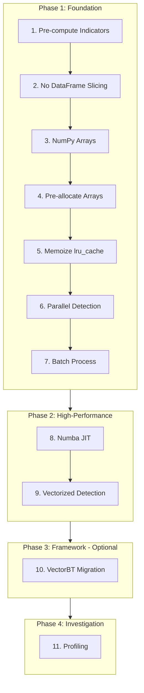

# Multi-Pattern Backtesting Optimization Plan

## Executive Summary

This document outlines **11 optimization methods** to speed up the multi-pattern backtesting process without affecting final results. Methods are organized into 4 implementation phases based on dependencies and complexity.

---

## Current Implementation Analysis

### Identified Bottlenecks

1. **20 Pattern Detectors** running sequentially per bar
2. **DataFrame creation** - already optimized in `multi_pattern_strategy_optimized.py`
3. **Pattern detection** - each pattern recalculates indicators independently
4. **No parallelization** - single-threaded execution
5. **No caching** - repeated calculations for common indicators

### Files Analyzed
- [`src/strategies/backtest_py/multi_pattern_strategy.py`](src/strategies/backtest_py/multi_pattern_strategy.py) - Original strategy
- [`src/strategies/backtest_py/multi_pattern_strategy_optimized.py`](src/strategies/backtest_py/multi_pattern_strategy_optimized.py) - Already optimized version
- [`src/backtest/engine.py`](src/backtest/engine.py) - Custom backtest engine
- [`src/patterns/base.py`](src/patterns/base.py) - Pattern base class
- Individual pattern detectors (e.g., [`src/patterns/basic/msl.py`](src/patterns/basic/msl.py))

---

## Implementation Phases



---

## Phase 1: Foundation Layer

### 1. Pre-compute and Cache Common Indicators
**Impact: 9/10** | **Difficulty: 2/10** | **Expected Speedup: 5-10x**

**Description:** Calculate shared indicators once before pattern detection and cache them for reuse across all patterns.

**Current issue:** Each pattern independently calculates:
- Swing highs/lows (via `find_swing_highs`, `find_swing_lows`)
- Moving averages (SMA, EMA)
- Volume SMA
- ATR for stop-loss calculations

**Implementation:**
```python
class IndicatorCache:
    """Pre-compute indicators once per backtest."""
    def __init__(self, df: pd.DataFrame):
        self._df = df
        self._cache = {}
    
    def get_swing_highs(self, lookback: int = 5) -> pd.Series:
        key = f'swing_highs_{lookback}'
        if key not in self._cache:
            self._cache[key] = find_swing_highs(self._df, lookback)
        return self._cache[key]
    
    def get_swing_lows(self, lookback: int = 5) -> pd.Series:
        key = f'swing_lows_{lookback}'
        if key not in self._cache:
            self._cache[key] = find_swing_lows(self._df, lookback)
        return self._cache[key]

# In strategy init():
self.indicator_cache = IndicatorCache(self._df)
self.indicator_cache.get_swing_highs(5)  # Pre-compute
self.indicator_cache.get_swing_lows(5)
```

**Files to modify:**
- [`src/strategies/backtest_py/multi_pattern_strategy_optimized.py`](src/strategies/backtest_py/multi_pattern_strategy_optimized.py)
- [`src/indicators/pivots.py`](src/indicators/pivots.py)
- [`src/indicators/technical.py`](src/indicators/technical.py)

---

### 2. Avoid DataFrame Slicing in Hot Loop
**Impact: 5/10** | **Difficulty: 2/10** | **Expected Speedup: 2x**

**Description:** Remove DataFrame window creation that happens every bar.

**Current issue:**
```python
# In next() method - creates new DataFrame slice every bar
window_start = max(0, current_idx - 200)
df_window = self._df.iloc[window_start : current_idx + 1]
window_idx = len(df_window) - 1
```

**Implementation:**
```python
# Pass full DataFrame with indices instead of slicing
# Modify pattern detect() to accept optional window bounds
def detect(self, df: pd.DataFrame, i: int, window_start: int = None) -> PatternResult:
    """Detect pattern with optional window bounds."""
    start = window_start or max(0, i - 200)
    # Access df.iloc[i] directly without slicing
```

**Files to modify:**
- [`src/strategies/backtest_py/multi_pattern_strategy_optimized.py`](src/strategies/backtest_py/multi_pattern_strategy_optimized.py)
- [`src/patterns/base.py`](src/patterns/base.py)

---

### 3. Convert to NumPy Arrays
**Impact: 5/10** | **Difficulty: 3/10** | **Expected Speedup: 1.5-3x**

**Description:** Replace pandas DataFrame access with NumPy arrays for core calculations.

**Current issue:** Pattern detectors use `df.iloc[i]['Close']` which is slow.

**Implementation:**
```python
# Add to BasePattern class in base.py
def _extract_arrays(self, df: pd.DataFrame) -> dict:
    """Extract NumPy arrays from DataFrame for faster access."""
    return {
        'open': df['Open'].values,
        'high': df['High'].values,
        'low': df['Low'].values,
        'close': df['Close'].values,
        'volume': df['Volume'].values if 'Volume' in df.columns else None
    }

# Replace in detect methods:
# OLD: c_minus_2 = self._safe_float(df.iloc[i-2]['Close'])
# NEW: arrays = self._extract_arrays(df); c_minus_2 = arrays['close'][i-2]
```

**Files to modify:**
- [`src/patterns/base.py`](src/patterns/base.py)
- All pattern files in [`src/patterns/`](src/patterns/)

---

### 4. Pre-allocate Result Arrays
**Impact: 3/10** | **Difficulty: 3/10** | **Expected Speedup: 1.5x**

**Description:** Use fixed-size arrays instead of growing lists during pattern detection.

**Current issue:** Lists grow dynamically in `detect_all()` method.

**Implementation:**
```python
def detect_all(self, df: pd.DataFrame) -> List[Dict[str, Any]]:
    """Run pattern detection across all bars with pre-allocation."""
    n_bars = len(df)
    n_patterns = len(self.patterns)
    
    # Pre-allocate result storage
    max_results = n_bars * n_patterns
    all_signals = [None] * max_results  # Pre-allocated list
    result_idx = 0
    
    for i in range(n_bars):
        for pattern in self.patterns:
            result = pattern.detect(df, i)
            if result.detected and result.signal:
                all_signals[result_idx] = result.to_dict()
                result_idx += 1
    
    return all_signals[:result_idx]  # Trim unused slots
```

**Files to modify:**
- [`src/patterns/base.py`](src/patterns/base.py)

---

### 5. Memoize with @lru_cache
**Impact: 4/10** | **Difficulty: 2/10** | **Expected Speedup: 2-4x**

**Description:** Cache indicator calculations that are called repeatedly across patterns.

**Implementation:**
```python
from functools import lru_cache

@lru_cache(maxsize=128)
def cached_sma(prices_tuple: tuple, period: int) -> np.ndarray:
    """Cached SMA calculation."""
    prices = np.array(prices_tuple)
    return np.convolve(prices, np.ones(period)/period, mode='valid')

def sma(series: pd.Series, period: int) -> pd.Series:
    """SMA with caching for repeated calls."""
    key = (tuple(series.values[-period*2:]), period)
    result = cached_sma(key[0], period)
    return pd.Series(result, index=series.index[-len(result):])
```

**Files to modify:**
- [`src/indicators/technical.py`](src/indicators/technical.py)
- [`src/indicators/pivots.py`](src/indicators/pivots.py)

---

### 6. Parallel Pattern Detection
**Impact: 8/10** | **Difficulty: 5/10** | **Expected Speedup: 4-8x on 8-core CPU**

**Description:** Run pattern detectors in parallel using ThreadPoolExecutor.

**Current issue:**
```python
# Sequential execution
for pattern in self.patterns:  # 20 patterns
    result = pattern.detect(df, current_idx)
```

**Implementation:**
```python
from concurrent.futures import ThreadPoolExecutor
import multiprocessing

def _detect_pattern(self, pattern, df, idx):
    """Helper for parallel pattern detection."""
    try:
        result = pattern.detect(df, idx)
        if result.detected and result.signal:
            return {
                'pattern_name': result.pattern_name,
                'direction': result.signal.direction.value,
                'entry_price': result.signal.entry_price,
                'stop_loss': result.signal.stop_loss,
                'confidence': result.signal.confidence,
            }
    except:
        pass
    return None

# In next() method:
with ThreadPoolExecutor(max_workers=min(len(self.patterns), multiprocessing.cpu_count())) as executor:
    futures = [executor.submit(self._detect_pattern, p, df_window, window_idx) 
               for p in self.patterns]
    signals = [f.result() for f in futures if f.result() is not None]
```

**Files to modify:**
- [`src/strategies/backtest_py/multi_pattern_strategy_optimized.py`](src/strategies/backtest_py/multi_pattern_strategy_optimized.py)

---

### 7. Batch Process Bars
**Impact: 6/10** | **Difficulty: 4/10** | **Expected Speedup: 2-4x**

**Description:** Process multiple bars at once instead of one at a time.

**Current issue:**
```python
# Process one bar at a time
for i in range(min_bars, total_bars):
    for pattern in self.patterns:
        pattern.detect(df, i)
```

**Implementation:**
```python
def detect_batch(self, df: pd.DataFrame, start_idx: int, end_idx: int) -> List[PatternResult]:
    """Detect patterns across a range of bars efficiently."""
    results = []
    for i in range(start_idx, end_idx):
        results.append(self.detect(df, i))
    return results

# In strategy, process in chunks:
def next(self):
    # Process multiple bars at once when possible
    pass  # backtesting.py calls next() per bar, but we can cache results
```

**Files to modify:**
- [`src/patterns/base.py`](src/patterns/base.py)
- [`src/strategies/backtest_py/multi_pattern_strategy_optimized.py`](src/strategies/backtest_py/multi_pattern_strategy_optimized.py)

---

## Phase 2: High-Performance Layer

### 8. Numba JIT Compilation
**Impact: 10/10** | **Difficulty: 7/10** | **Expected Speedup: 50-300x**

**Description:** Compile performance-critical pattern detection code with Numba.

**Current issue:** Python loops in [`src/indicators/pivots.py`](src/indicators/pivots.py:81-103) are slow.

**Implementation:**
```python
# Add new file: src/indicators/pivots_numba.py
from numba import jit
import numpy as np

@jit(nopython=True, cache=True)
def find_swing_highs_numba(highs: np.ndarray, lookback: int = 5) -> np.ndarray:
    """Numba-accelerated swing high detection."""
    n = len(highs)
    swing_highs = np.full(n, np.nan)
    
    for i in range(lookback, n - lookback):
        is_swing_high = True
        current_high = highs[i]
        
        for j in range(1, lookback + 1):
            if highs[i - j] >= current_high or highs[i + j] >= current_high:
                is_swing_high = False
                break
        
        if is_swing_high:
            swing_highs[i] = current_high
    
    return swing_highs

# Usage in pivots.py:
def find_swing_highs(df: pd.DataFrame, lookback: int = 5) -> pd.Series:
    highs = df['High'].values
    swing_highs = find_swing_highs_numba(highs, lookback)
    return pd.Series(swing_highs, index=df.index)
```

**Files to create/modify:**
- New: `src/indicators/pivots_numba.py`
- [`src/indicators/pivots.py`](src/indicators/pivots.py)
- All pattern files for JIT-compiled detection methods

---

### 9. Vectorized Pattern Detection
**Impact: 10/10** | **Difficulty: 8/10** | **Expected Speedup: 50-300x**

**Description:** Rewrite pattern detection to process entire arrays at once instead of bar-by-bar.

**Current issue:** Patterns detect one bar at a time via loops.

**Implementation:**
```python
# Add vectorized detection method to patterns
@staticmethod
@jit(nopython=True, cache=True)
def detect_msl_vectorized(closes: np.ndarray, lows: np.ndarray) -> np.ndarray:
    """Vectorized MSL detection returning signals array."""
    n = len(closes)
    signals = np.zeros(n, dtype=np.int8)  # 0=none, 1=long
    
    for i in range(2, n - 1):
        c_minus_2 = closes[i - 2]
        c_minus_1 = closes[i - 1]
        c_0 = closes[i]
        c_plus_1 = closes[i + 1]
        
        # Condition 1: Down move
        cond1 = c_minus_1 < c_minus_2
        # Condition 2: Higher low of close
        cond2 = (c_0 > c_minus_1) and (c_0 < c_minus_2)
        # Condition 3: Confirmation
        max_close = max(c_minus_2, c_minus_1, c_0)
        cond3 = c_plus_1 > max_close
        
        if cond1 and cond2 and cond3:
            signals[i] = 1
    
    return signals

# In detect() method, use vectorized version:
def detect(self, df: pd.DataFrame, i: int) -> PatternResult:
    # Use pre-computed signals if available
    if not hasattr(self, '_signals_cache'):
        self._signals_cache = self.detect_msl_vectorized(
            df['Close'].values, df['Low'].values
        )
    
    if self._signals_cache[i] == 1:
        return PatternResult(detected=True, ...)
```

**Files to modify:**
- All pattern files in [`src/patterns/basic/`](src/patterns/basic/)
- All pattern files in [`src/patterns/classic/`](src/patterns/classic/)
- All pattern files in [`src/patterns/complex/`](src/patterns/complex/)
- All pattern files in [`src/patterns/harmonic/`](src/patterns/harmonic/)

---

## Phase 3: Framework Migration (Optional)

### 10. Switch to VectorBT
**Impact: 10/10** | **Difficulty: 9/10** | **Expected Speedup: 100-1000x**

**Description:** Migrate from event-driven backtesting.py to vectorized VectorBT framework.

**Why VectorBT:**
- Operates on NumPy arrays with Numba acceleration
- Tests thousands of strategies in seconds
- Built-in portfolio simulation
- No Python loops in the backtest loop

**Implementation:**
```python
# New file: src/strategies/backtest_py/multi_pattern_vectorbt.py
import vectorbt as vbt
import numpy as np

class MultiPatternVectorBT:
    """VectorBT implementation for maximum speed."""
    
    def __init__(self, patterns):
        self.patterns = patterns
    
    def generate_signals_vectorized(self, df) -> tuple:
        """Generate all signals at once using vectorized operations."""
        n = len(df)
        long_entries = np.zeros(n, dtype=bool)
        long_exits = np.zeros(n, dtype=bool)
        short_entries = np.zeros(n, dtype=bool)
        short_exits = np.zeros(n, dtype=bool)
        
        # Pre-compute all pattern signals
        for pattern in self.patterns:
            signals = pattern.detect_vectorized(df)  # Vectorized method
            long_entries |= (signals == 1)
            short_entries |= (signals == -1)
        
        return long_entries, short_entries
    
    def run_backtest(self, df, initial_capital=10000):
        """Run vectorized backtest."""
        long_entries, short_entries = self.generate_signals_vectorized(df)
        
        # VectorBT handles all portfolio simulation
        pf = vbt.Portfolio.from_signals(
            close=df['Close'],
            entries=long_entries,
            exits=short_entries,
            init_cash=initial_capital,
            fees=0.001,  # 0.1% commission
        )
        
        return pf.stats()
```

**Note:** This makes some Phase 1 optimizations redundant (parallel detection, batch processing) since VectorBT handles these internally.

**Files to create:**
- New: `src/strategies/backtest_py/multi_pattern_vectorbt.py`

---

## Phase 4: Investigation

### 11. Profile-Guided Optimization
**Impact: Variable** | **Difficulty: 2/10** | **Expected Speedup: Variable**

**Description:** Use profiling to identify remaining bottlenecks after all optimizations.

**Implementation:**
```python
import cProfile
import pstats
from io import StringIO

def profile_backtest():
    """Profile the backtest to find bottlenecks."""
    profiler = cProfile.Profile()
    profiler.enable()
    
    # Run backtest
    bt = Backtest(data, MultiPatternStrategyOptimized)
    stats = bt.run()
    
    profiler.disable()
    
    # Print top 30 time-consuming functions
    s = StringIO()
    ps = pstats.Stats(profiler, stream=s).sort_stats('cumulative')
    ps.print_stats(30)
    print(s.getvalue())
    
    return stats
```

**Files to create:**
- New: `scripts/profile_backtest.py`

---

## Summary Table

| Phase | Method | Impact | Difficulty | Speedup | Dependencies |
|-------|--------|--------|------------|---------|--------------|
| 1 | 1. Pre-compute Indicators | 9/10 | 2/10 | 5-10x | None |
| 1 | 2. No DataFrame Slicing | 5/10 | 2/10 | 2x | None |
| 1 | 3. NumPy Arrays | 5/10 | 3/10 | 1.5-3x | Method 2 |
| 1 | 4. Pre-allocate Arrays | 3/10 | 3/10 | 1.5x | Method 3 |
| 1 | 5. Memoize lru_cache | 4/10 | 2/10 | 2-4x | None |
| 1 | 6. Parallel Detection | 8/10 | 5/10 | 4-8x | None |
| 1 | 7. Batch Process | 6/10 | 4/10 | 2-4x | Method 3 |
| 2 | 8. Numba JIT | 10/10 | 7/10 | 50-300x | Method 3 |
| 2 | 9. Vectorized Detection | 10/10 | 8/10 | 50-300x | Method 8 |
| 3 | 10. VectorBT | 10/10 | 9/10 | 100-1000x | Phase 1, 2 |
| 4 | 11. Profiling | Variable | 2/10 | Variable | Phase 3 |

---

## Expected Cumulative Performance

| Phase | Optimizations | Speedup | Cumulative |
|-------|---------------|---------|------------|
| Baseline | Current code | 1x | 1x |
| Phase 1 | Methods 1-7 | 15-30x | 15-30x |
| Phase 2 | Methods 8-9 | 10-20x | 150-600x |
| Phase 3 | Method 10 | 5-10x | 750-6000x |

---

## Files to Modify Per Phase

### Phase 1 Files:
| File | Changes |
|------|---------|
| [`src/strategies/backtest_py/multi_pattern_strategy_optimized.py`](src/strategies/backtest_py/multi_pattern_strategy_optimized.py) | Methods 1, 2, 6, 7 |
| [`src/patterns/base.py`](src/patterns/base.py) | Methods 2, 3, 4, 7 |
| [`src/indicators/pivots.py`](src/indicators/pivots.py) | Methods 1, 5 |
| [`src/indicators/technical.py`](src/indicators/technical.py) | Methods 1, 5 |

### Phase 2 Files:
| File | Changes |
|------|---------|
| New: `src/indicators/pivots_numba.py` | Method 8 |
| [`src/indicators/pivots.py`](src/indicators/pivots.py) | Method 8 |
| [`src/patterns/basic/msl.py`](src/patterns/basic/msl.py) | Methods 8, 9 |
| [`src/patterns/classic/*.py`](src/patterns/classic/) | Methods 8, 9 |
| [`src/patterns/complex/*.py`](src/patterns/complex/) | Methods 8, 9 |
| [`src/patterns/harmonic/*.py`](src/patterns/harmonic/) | Methods 8, 9 |

### Phase 3 Files:
| File | Changes |
|------|---------|
| New: `src/strategies/backtest_py/multi_pattern_vectorbt.py` | Method 10 |

### Phase 4 Files:
| File | Changes |
|------|---------|
| New: `scripts/profile_backtest.py` | Method 11 |

---

## Verification Strategy

After implementing each optimization:

1. **Correctness Test**: Run existing test suite to verify results match
2. **Benchmark Test**: Compare execution time before/after
3. **Memory Test**: Monitor memory usage changes
4. **Edge Case Test**: Verify behavior with edge cases (empty data, single bar, etc.)

```python
# Benchmark script
import time

def benchmark_optimization(strategy_class, data, iterations=10):
    times = []
    for _ in range(iterations):
        start = time.perf_counter()
        bt = Backtest(data, strategy_class)
        stats = bt.run()
        times.append(time.perf_counter() - start)
    
    return {
        'mean': np.mean(times),
        'std': np.std(times),
        'min': np.min(times),
        'max': np.max(times)
    }
```

---

## Conclusion

Implementing these optimizations in the recommended order can provide **cumulative speedups of 750-6000x** while maintaining identical backtest results. The key is to follow the dependency order within each phase:

**Phase 1 Order:** 1 → 2 → 3 → 4 → 5 → 6 → 7
**Phase 2 Order:** 8 → 9
**Phase 3:** 10 (optional)
**Phase 4:** 11 (investigation)

This ensures each optimization builds properly on previous work without conflicts.
