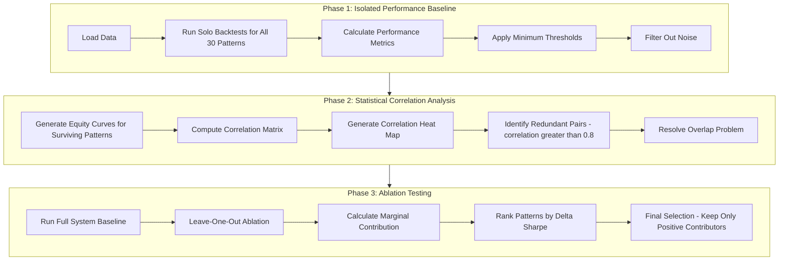
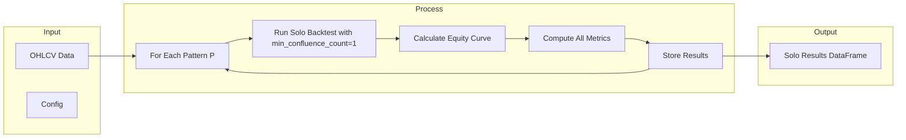
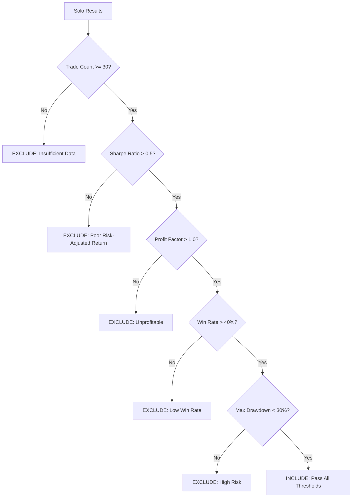
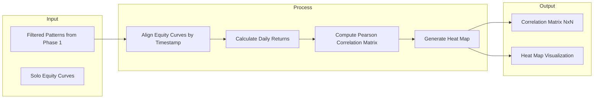
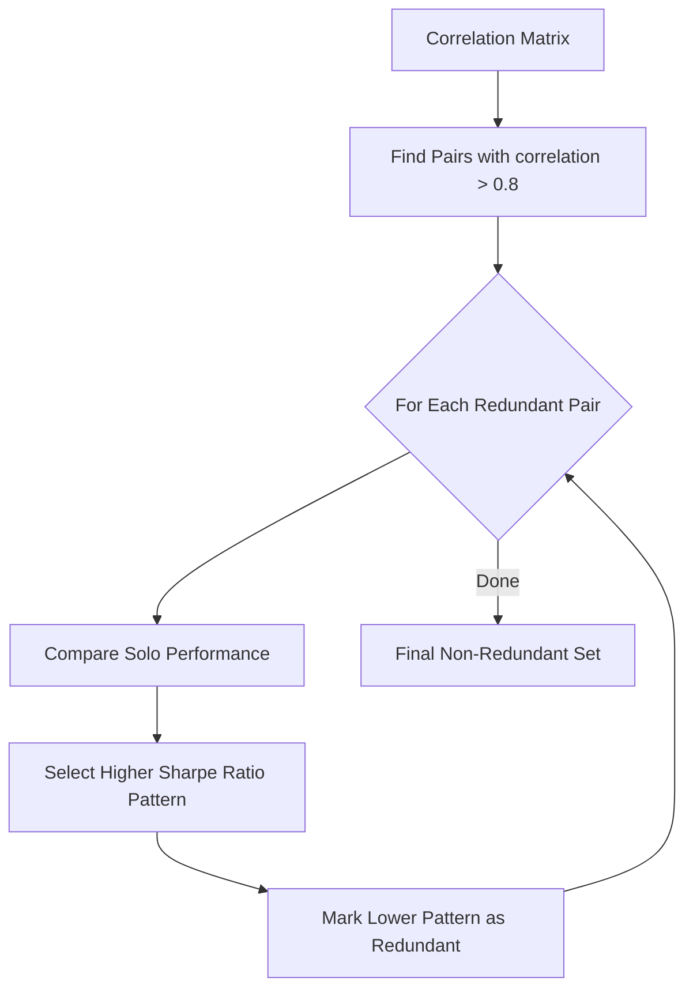
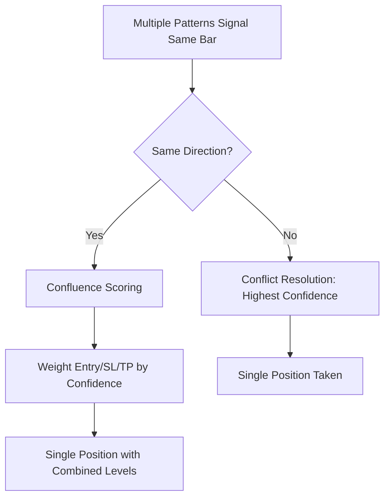
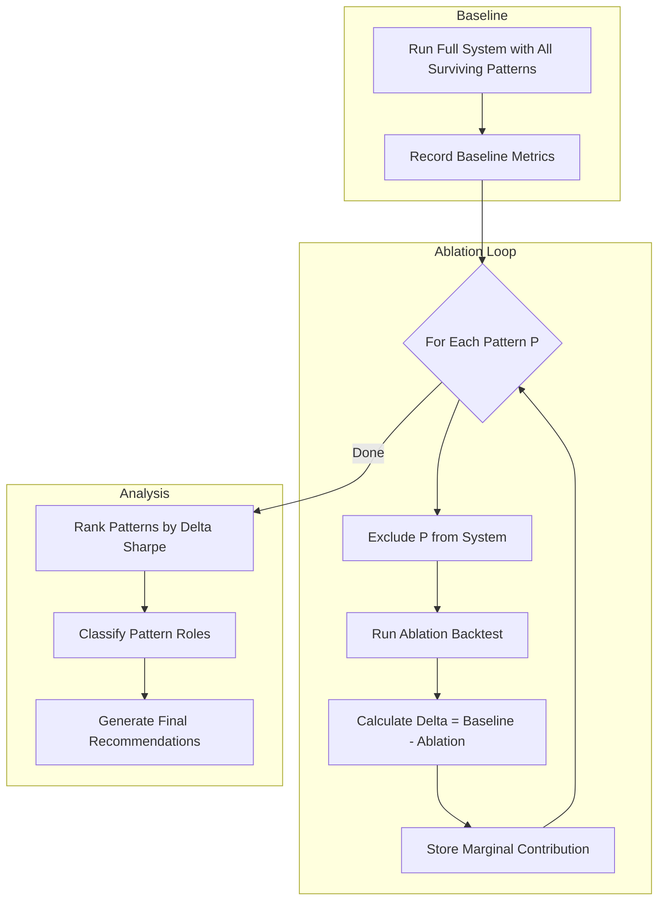
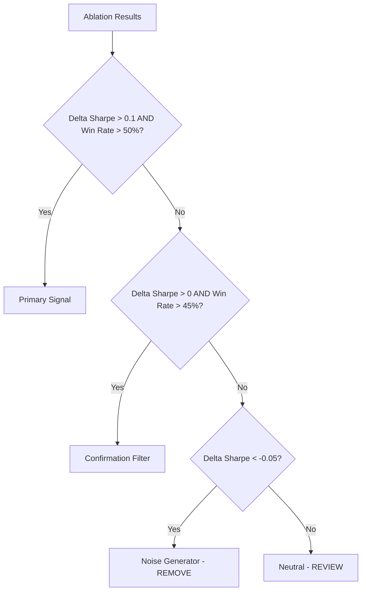

# Technical Execution Plan: Pattern Selection Framework

## Overview

This plan outlines a systematic three-phase approach to evaluate, filter, and select trading patterns for a multi-pattern confluence system. The goal is to identify patterns that provide **unique, positive marginal contribution** to the overall system.

---

## System Architecture



---

## Phase 1: Isolated Performance Baseline

### Objective
Establish individual performance metrics for each pattern under identical market conditions to filter out underperforming patterns.

### 1.1 Performance Metrics Definition

| Metric | Description | Formula | Threshold |
|--------|-------------|---------|-----------|
| **Sharpe Ratio** | Risk-adjusted return | `(annualized_return - risk_free_rate) / annualized_volatility` | `> 0.5` |
| **Profit Factor** | Gross wins / Gross losses | `sum(winning_trades) / sum(losing_trades)` | `> 1.0` |
| **Win Rate** | Percentage of profitable trades | `winning_trades / total_trades` | `> 40%` |
| **Max Drawdown** | Largest peak-to-trough decline | `max(peak - trough) / peak` | `< 30%` |
| **Trade Count** | Minimum trades for statistical significance | `count(trades)` | `>= 30` |

### 1.2 Solo Backtest Process



#### Implementation Details

1. **Data Configuration**:
   - Input: Configurable OHLCV DataFrame
   - Date range: Full available history or configurable window
   - Initial equity: `$100,000` (configurable)
   - Commission: `0.1%` (configurable)

2. **Solo Backtest Execution**:
   ```python
   # Pseudocode
   for pattern in all_patterns:
       runner = BacktestPyRunner(
           strategy_class=MultiPatternStrategyOptimized,
           data=data,
           cash=100000,
           commission=0.001
       )
       results = runner.run(
           include_patterns_only=[pattern.name],
           min_confluence_count=1  # Critical: threshold=1 for solo
       )
       solo_results.append(results)
   ```

3. **Metrics Calculation**:
   - Use existing [`PerformanceMetrics.calculate()`](src/backtest/metrics.py:1) method
   - Store results in standardized DataFrame format

### 1.3 Noise Filtering Logic



#### Threshold Configuration (Configurable)

```python
NOISE_FILTER_CONFIG = {
    "min_trades": 30,           # Statistical significance
    "min_sharpe": 0.5,          # Positive risk-adjusted return
    "min_profit_factor": 1.0,   # Profitable on gross basis
    "min_win_rate": 0.40,       # Reasonable hit rate
    "max_drawdown": 0.30,       # Risk control
}
```

### 1.4 Output Artifacts

| Artifact | Description | Format |
|----------|-------------|--------|
| `solo_results.csv` | All patterns with solo metrics | CSV |
| `solo_equity_curves.pkl` | Equity curves for each pattern | Pickle |
| `filtered_patterns.json` | List of patterns passing thresholds | JSON |
| `noise_report.md` | Summary of excluded patterns | Markdown |

---

## Phase 2: Statistical Correlation Analysis

### Objective
Identify and handle redundant patterns that produce similar equity curves, reducing capital inefficiency from overlapping signals.

### 2.1 Equity Curve Correlation Method



#### Implementation Details

1. **Equity Curve Alignment**:
   - Align all equity curves to common timestamp index
   - Forward-fill missing values
   - Calculate daily returns: `returns = equity.pct_change().dropna()`

2. **Correlation Calculation**:
   ```python
   # Pseudocode
   returns_df = pd.DataFrame({
       pattern.name: equity_curve.pct_change().dropna()
       for pattern in filtered_patterns
   })
   correlation_matrix = returns_df.corr(method='pearson')
   ```

3. **Heat Map Generation**:
   - Use seaborn clustermap for hierarchical clustering
   - Annotate with correlation values
   - Color scale: -1 (red) to +1 (blue)

### 2.2 Redundant Pattern Identification



#### Redundancy Resolution Logic

When `correlation(A, B) > 0.8`:

1. **Compare Solo Metrics**:
   - Sharpe Ratio (primary)
   - Win Rate (secondary)
   - Trade Count (tiebreaker)

2. **Selection Rule**:
   ```python
   def select_best_pattern(pattern_a, pattern_b, solo_results):
       if solo_results[pattern_a]['sharpe_ratio'] > solo_results[pattern_b]['sharpe_ratio']:
           return pattern_a, pattern_b  # Keep A, mark B redundant
       else:
           return pattern_b, pattern_a  # Keep B, mark A redundant
   ```

3. **Transitivity Handling**:
   - If A~B and B~C are redundant pairs, and A is selected over B
   - Check if A~C is also redundant
   - Build connected components of redundant clusters
   - Select best pattern from each cluster

### 2.3 The Overlap Problem

When multiple patterns trigger simultaneously on the same capital:



#### Overlap Resolution Strategies

1. **Same Direction Overlap** (Recommended):
   - Treat as confluence confirmation
   - Weight entry/stop/target by confidence scores
   - Use existing [`ConfluenceScorer`](src/strategies/confluence.py:1) logic

2. **Opposite Direction Overlap**:
   - Conflict resolution: highest confidence wins
   - Or: cancel both signals (require unambiguous direction)

3. **Capital Allocation**:
   - Current: Single position per direction
   - Alternative: Split capital proportionally by confidence

### 2.4 Output Artifacts

| Artifact | Description | Format |
|----------|-------------|--------|
| `correlation_matrix.csv` | NxN correlation values | CSV |
| `correlation_heatmap.png` | Visual correlation matrix | PNG |
| `redundant_pairs.json` | List of redundant pairs with decisions | JSON |
| `non_redundant_patterns.json` | Final list after redundancy removal | JSON |

---

## Phase 3: Ablation Testing (Leave-One-Out Method)

### Objective
Quantify each pattern's marginal contribution to the full system using systematic ablation.

### 3.1 Ablation Process Flow



### 3.2 Ablation Logic

#### Baseline Run
```python
# Pseudocode
baseline = run_backtest(
    include_patterns_only=None,  # All surviving patterns
    min_confluence_count=2
)
baseline_metrics = {
    'sharpe_ratio': baseline['sharpe_ratio'],
    'total_return': baseline['total_return'],
    'win_rate': baseline['win_rate'],
    'max_drawdown': baseline['max_drawdown'],
    'profit_factor': baseline['profit_factor'],
}
```

#### Leave-One-Out Loop
```python
# Pseudocode
ablation_results = []
for pattern in surviving_patterns:
    ablated = run_backtest(
        exclude_patterns=[pattern.name],
        min_confluence_count=2
    )
    delta_sharpe = baseline['sharpe_ratio'] - ablated['sharpe_ratio']
    delta_return = baseline['total_return'] - ablated['total_return']
    
    ablation_results.append({
        'pattern_name': pattern.name,
        'baseline_sharpe': baseline['sharpe_ratio'],
        'ablated_sharpe': ablated['sharpe_ratio'],
        'delta_sharpe': delta_sharpe,
        'delta_return': delta_return,
    })
```

### 3.3 Marginal Contribution Interpretation

| Delta Sharpe | Interpretation | Action |
|--------------|----------------|--------|
| `delta > 0.1` | **Critical Contributor** - Pattern is essential | KEEP |
| `0 < delta <= 0.1` | **Positive Contributor** - Pattern adds value | KEEP |
| `delta = 0` | **Neutral** - No measurable impact | REVIEW |
| `-0.05 < delta < 0` | **Slight Negative** - Minor drag on system | REVIEW |
| `delta <= -0.05` | **Negative Contributor** - Pattern hurts system | REMOVE |

### 3.4 Pattern Role Classification



#### Role Definitions

| Role | Characteristics | Example Patterns |
|------|-----------------|------------------|
| **Primary Signal** | High solo edge, high marginal contribution | Head & Shoulders, Double Bottom |
| **Confirmation Filter** | Low solo edge, positive marginal contribution | NR7ID, Matching Lows |
| **Noise Generator** | Negative marginal contribution | Doji, Harami (potential) |
| **Neutral** | No significant impact | Rare edge cases |

### 3.5 Final Selection Criteria

A pattern is **SELECTED** if and only if:

1. ✅ Passed Phase 1 noise filtering
2. ✅ Not marked redundant in Phase 2
3. ✅ Positive marginal contribution in Phase 3 (`delta_sharpe > 0`)

### 3.6 Output Artifacts

| Artifact | Description | Format |
|----------|-------------|--------|
| `ablation_results.csv` | Full ablation analysis | CSV |
| `contribution_ranking.csv` | Patterns ranked by delta Sharpe | CSV |
| `pattern_roles.json` | Role classification for each pattern | JSON |
| `final_selection.json` | List of selected patterns | JSON |
| `recommendations.md` | Actionable recommendations | Markdown |

---

## Implementation Architecture

### New Modules Required

```
src/analysis/
├── pattern_selector.py          # Main orchestrator
├── solo_backtest_runner.py      # Phase 1 execution
├── correlation_analyzer.py      # Phase 2 correlation analysis
├── ablation_analyzer.py         # Phase 3 ablation (extend existing)
└── selection_report.py          # Final report generation
```

### Configuration Schema

```python
@dataclass
class PatternSelectionConfig:
    # Data configuration
    data_path: str = "data/raw/SPY_daily.csv"
    start_date: Optional[str] = None
    end_date: Optional[str] = None
    
    # Backtest configuration
    initial_equity: float = 100000.0
    commission: float = 0.001
    min_confluence_count: int = 2
    
    # Phase 1 thresholds
    min_trades: int = 30
    min_sharpe: float = 0.5
    min_profit_factor: float = 1.0
    min_win_rate: float = 0.40
    max_drawdown: float = 0.30
    
    # Phase 2 thresholds
    correlation_threshold: float = 0.8
    
    # Phase 3 thresholds
    positive_contribution_threshold: float = 0.0
    noise_threshold: float = -0.05
    
    # Output configuration
    output_dir: str = "reports/pattern_selection"
```

### Main Orchestrator Flow

```python
class PatternSelector:
    def run_full_selection(self, config: PatternSelectionConfig) -> SelectionResult:
        # Phase 1: Isolated Performance Baseline
        solo_results = self.run_solo_backtests(config)
        filtered_patterns = self.apply_noise_filter(solo_results, config)
        
        # Phase 2: Statistical Correlation Analysis
        correlation_matrix = self.compute_correlation(filtered_patterns)
        non_redundant = self.resolve_redundancy(correlation_matrix, solo_results)
        
        # Phase 3: Ablation Testing
        ablation_results = self.run_ablation(non_redundant, config)
        final_selection = self.select_final_patterns(ablation_results, config)
        
        return SelectionResult(
            solo_results=solo_results,
            correlation_matrix=correlation_matrix,
            ablation_results=ablation_results,
            final_patterns=final_selection,
        )
```

---

## Execution Timeline

| Phase | Tasks | Dependencies |
|-------|-------|--------------|
| **Phase 1** | Solo backtest runner, metrics calculation, noise filtering | None |
| **Phase 2** | Correlation matrix, heat map generation, redundancy resolution | Phase 1 output |
| **Phase 3** | Baseline run, ablation loop, contribution ranking | Phase 2 output |
| **Integration** | Main orchestrator, configuration, reporting | All phases |

---

## Success Criteria

1. **Phase 1 Success**: Reduce 30 patterns to ~15-20 surviving patterns
2. **Phase 2 Success**: Identify and resolve 3-5 redundant pairs
3. **Phase 3 Success**: Final selection of 10-15 high-value patterns with documented contribution

---

## Risk Mitigation

| Risk | Mitigation |
|------|------------|
| Overfitting to historical data | Use walk-forward validation for final selection |
| Survivorship bias | Test on multiple assets/timeframes |
| Correlation instability | Monitor correlation decay over time windows |
| Ablation computational cost | Cache results, use parallel execution |

---

## Next Steps

1. Review and approve this technical plan
2. Switch to Code mode for implementation
3. Begin with Phase 1: Solo backtest runner implementation
