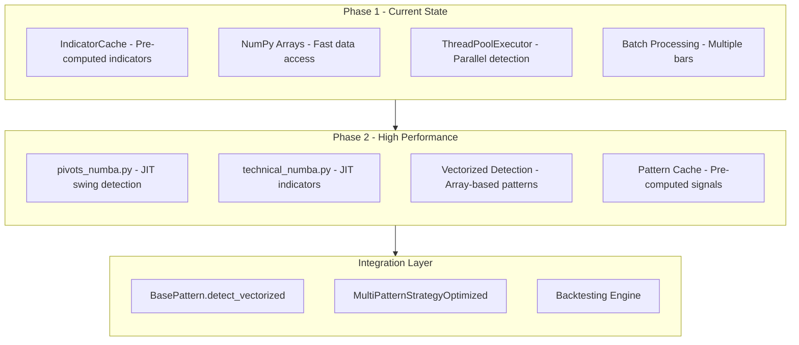

# Phase 2: High-Performance Layer Implementation Plan

## Executive Summary

Phase 2 focuses on **Numba JIT compilation** and **vectorized pattern detection** to achieve 50-300x speedup over the baseline implementation. Phase 1 optimizations (pre-computed indicators, NumPy arrays, parallel detection) are already implemented in `multi_pattern_strategy_optimized.py`.

**Expected Performance Improvement:**
- Phase 1: ~5-10x speedup (COMPLETED)
- Phase 2: ~50-300x speedup (THIS PHASE)

---

## Architecture Overview



---

## Implementation Tasks

### Task 1: Add Numba Dependency

**File:** `pyproject.toml`

**Changes:**
```toml
dependencies = [
    # ... existing dependencies ...
    "numba>=0.59.0",  # JIT compilation for performance
]
```

**Notes:**
- Numba supports Python 3.13 (required version check)
- Numba compiles Python to machine code using LLVM
- First call has compilation overhead, subsequent calls are fast

---

### Task 2: Create Numba-Accelerated Pivot Detection

**File:** `src/indicators/pivots_numba.py` (NEW)

**Functions to Implement:**

```python
from numba import jit
import numpy as np

@jit(nopython=True, cache=True)
def find_swing_highs_numba(highs: np.ndarray, lookback: int = 5) -> np.ndarray:
    """JIT-compiled swing high detection."""
    n = len(highs)
    swing_highs = np.full(n, np.nan)
    
    for i in range(lookback, n - lookback):
        is_swing_high = True
        current_high = highs[i]
        
        # Check bars before and after
        for j in range(1, lookback + 1):
            if highs[i - j] >= current_high:
                is_swing_high = False
                break
            if highs[i + j] >= current_high:
                is_swing_high = False
                break
        
        if is_swing_high:
            swing_highs[i] = current_high
    
    return swing_highs

@jit(nopython=True, cache=True)
def find_swing_lows_numba(lows: np.ndarray, lookback: int = 5) -> np.ndarray:
    """JIT-compiled swing low detection."""
    # Similar implementation for lows
    pass

@jit(nopython=True, cache=True)
def find_local_extrema_numba(highs: np.ndarray, lows: np.ndarray, lookback: int = 5) -> tuple:
    """JIT-compiled local extrema detection."""
    n = len(highs)
    local_highs = np.zeros(n, dtype=np.bool_)
    local_lows = np.zeros(n, dtype=np.bool_)
    
    for i in range(lookback, n - lookback):
        # Check for local high
        is_high = True
        is_low = True
        
        for j in range(1, lookback + 1):
            if highs[i] <= highs[i - j] or highs[i] <= highs[i + j]:
                is_high = False
            if lows[i] >= lows[i - j] or lows[i] >= lows[i + j]:
                is_low = False
        
        local_highs[i] = is_high
        local_lows[i] = is_low
    
    return local_highs, local_lows
```

---

### Task 3: Update pivots.py to Use Numba Functions

**File:** `src/indicators/pivots.py`

**Changes:**
```python
# Add at top of file
try:
    from .pivots_numba import (
        find_swing_highs_numba,
        find_swing_lows_numba,
        find_local_extrema_numba
    )
    NUMBA_AVAILABLE = True
except ImportError:
    NUMBA_AVAILABLE = False

def find_swing_highs(df: pd.DataFrame, lookback: int = 5) -> pd.Series:
    """Find swing highs - uses Numba acceleration if available."""
    if NUMBA_AVAILABLE:
        highs = df['High'].values
        swing_highs = find_swing_highs_numba(highs, lookback)
        return pd.Series(swing_highs, index=df.index)
    else:
        # Fallback to original implementation
        return _find_swing_highs_pure_python(df, lookback)
```

---

### Task 4: Create Numba-Accelerated Technical Indicators

**File:** `src/indicators/technical_numba.py` (NEW)

**Functions to Implement:**

```python
from numba import jit
import numpy as np

@jit(nopython=True, cache=True)
def sma_numba(values: np.ndarray, period: int) -> np.ndarray:
    """Simple Moving Average - JIT compiled."""
    n = len(values)
    result = np.full(n, np.nan)
    
    if n < period:
        return result
    
    # Calculate first SMA value
    total = 0.0
    for i in range(period):
        total += values[i]
    result[period - 1] = total / period
    
    # Calculate remaining values using rolling window
    for i in range(period, n):
        total = total - values[i - period] + values[i]
        result[i] = total / period
    
    return result

@jit(nopython=True, cache=True)
def ema_numba(values: np.ndarray, period: int) -> np.ndarray:
    """Exponential Moving Average - JIT compiled."""
    n = len(values)
    result = np.full(n, np.nan)
    
    if n < period:
        return result
    
    multiplier = 2.0 / (period + 1)
    
    # Start with SMA for first value
    total = 0.0
    for i in range(period):
        total += values[i]
    result[period - 1] = total / period
    
    # Calculate EMA
    for i in range(period, n):
        result[i] = (values[i] - result[i - 1]) * multiplier + result[i - 1]
    
    return result

@jit(nopython=True, cache=True)
def atr_numba(highs: np.ndarray, lows: np.ndarray, closes: np.ndarray, period: int) -> np.ndarray:
    """Average True Range - JIT compiled."""
    n = len(highs)
    tr = np.empty(n)
    result = np.full(n, np.nan)
    
    # Calculate True Range
    tr[0] = highs[0] - lows[0]
    for i in range(1, n):
        hl = highs[i] - lows[i]
        hc = abs(highs[i] - closes[i - 1])
        lc = abs(lows[i] - closes[i - 1])
        tr[i] = max(hl, hc, lc)
    
    # Calculate ATR using EMA
    if n < period:
        return result
    
    total = 0.0
    for i in range(period):
        total += tr[i]
    result[period - 1] = total / period
    
    multiplier = 1.0 / period
    for i in range(period, n):
        result[i] = tr[i] * multiplier + result[i - 1] * (1 - multiplier)
    
    return result

@jit(nopython=True, cache=True)
def rsi_numba(closes: np.ndarray, period: int) -> np.ndarray:
    """Relative Strength Index - JIT compiled."""
    n = len(closes)
    result = np.full(n, np.nan)
    
    if n < period + 1:
        return result
    
    # Calculate price changes
    gains = np.empty(n - 1)
    losses = np.empty(n - 1)
    
    for i in range(n - 1):
        change = closes[i + 1] - closes[i]
        if change > 0:
            gains[i] = change
            losses[i] = 0.0
        else:
            gains[i] = 0.0
            losses[i] = -change
    
    # Calculate initial average gain/loss
    avg_gain = 0.0
    avg_loss = 0.0
    for i in range(period):
        avg_gain += gains[i]
        avg_loss += losses[i]
    avg_gain /= period
    avg_loss /= period
    
    # Calculate RSI
    if avg_loss == 0:
        result[period] = 100.0
    else:
        rs = avg_gain / avg_loss
        result[period] = 100.0 - (100.0 / (1.0 + rs))
    
    # Calculate remaining RSI values
    for i in range(period, n - 1):
        avg_gain = (avg_gain * (period - 1) + gains[i]) / period
        avg_loss = (avg_loss * (period - 1) + losses[i]) / period
        
        if avg_loss == 0:
            result[i + 1] = 100.0
        else:
            rs = avg_gain / avg_loss
            result[i + 1] = 100.0 - (100.0 / (1.0 + rs))
    
    return result
```

---

### Task 5: Update technical.py to Use Numba Functions

**File:** `src/indicators/technical.py`

**Changes:**
```python
# Add at top
try:
    from .technical_numba import sma_numba, ema_numba, atr_numba, rsi_numba
    NUMBA_AVAILABLE = True
except ImportError:
    NUMBA_AVAILABLE = False

def sma(series: pd.Series, period: int) -> pd.Series:
    """Simple Moving Average with Numba acceleration."""
    if NUMBA_AVAILABLE:
        values = series.values
        result = sma_numba(values, period)
        return pd.Series(result, index=series.index)
    else:
        # Fallback to pandas
        return series.rolling(window=period).mean()
```

---

### Task 6: Add Vectorized Detection to BasePattern

**File:** `src/patterns/base.py`

**New Methods:**

```python
class BasePattern(ABC):
    # ... existing code ...
    
    def detect_vectorized(self, df: pd.DataFrame) -> np.ndarray:
        """
        Vectorized pattern detection across all bars.
        
        Override this method in subclasses for optimal performance.
        Default implementation falls back to bar-by-bar detection.
        
        Args:
            df: DataFrame with OHLCV data
            
        Returns:
            numpy array of signal values:
            - 0 = no signal
            - 1 = long signal
            - -1 = short signal
        """
        # Default implementation - subclasses should override
        n = len(df)
        signals = np.zeros(n, dtype=np.int8)
        
        for i in range(self.min_bars_required, n):
            result = self.detect(df, i)
            if result.detected and result.signal:
                if result.signal.direction == SignalDirection.LONG:
                    signals[i] = 1
                elif result.signal.direction == SignalDirection.SHORT:
                    signals[i] = -1
        
        return signals
    
    def precompute_signals(self, df: pd.DataFrame) -> None:
        """
        Pre-compute and cache signals for all bars.
        Call this once before backtesting for maximum performance.
        
        Args:
            df: DataFrame with OHLCV data
        """
        self._signals_cache = self.detect_vectorized(df)
        self._signals_cache_df_id = id(df)
    
    def get_cached_signal(self, i: int) -> int:
        """
        Get pre-computed signal for bar i.
        
        Args:
            i: Bar index
            
        Returns:
            Signal value: 0=none, 1=long, -1=short
        """
        if self._signals_cache is not None and i < len(self._signals_cache):
            return self._signals_cache[i]
        return 0
```

---

### Task 7: Implement Vectorized Detection for Basic Patterns

**Files to Update:**
- `src/patterns/basic/msl.py`
- `src/patterns/basic/matching_lows.py`
- `src/patterns/basic/nr7id.py`
- `src/patterns/basic/n_bar_decline.py`
- `src/patterns/basic/floor_pivot.py`

**Example Implementation for MSL:**

```python
# In src/patterns/basic/msl.py

from numba import jit
import numpy as np

@jit(nopython=True, cache=True)
def detect_msl_signals_numba(closes: np.ndarray, lows: np.ndarray) -> np.ndarray:
    """
    JIT-compiled MSL pattern detection.
    
    Returns array of signals:
    - 0 = no pattern
    - 1 = long signal
    """
    n = len(closes)
    signals = np.zeros(n, dtype=np.int8)
    
    for i in range(2, n - 1):
        c_minus_2 = closes[i - 2]
        c_minus_1 = closes[i - 1]
        c_0 = closes[i]
        c_plus_1 = closes[i + 1]
        
        # Condition 1: Down Move
        cond1 = c_minus_1 < c_minus_2
        
        # Condition 2: Higher Low of Close
        cond2 = (c_0 > c_minus_1) and (c_0 < c_minus_2)
        
        # Condition 3: Confirmation
        max_close = max(c_minus_2, c_minus_1, c_0)
        cond3 = c_plus_1 > max_close
        
        if cond1 and cond2 and cond3:
            signals[i] = 1
    
    return signals


class MarketStructureLow(BasePattern):
    # ... existing code ...
    
    def detect_vectorized(self, df: pd.DataFrame) -> np.ndarray:
        """Vectorized MSL detection using Numba."""
        closes = df['Close'].values
        lows = df['Low'].values
        return detect_msl_signals_numba(closes, lows)
    
    def detect(self, df: pd.DataFrame, i: int, window_start: Optional[int] = None) -> PatternResult:
        """Detect MSL pattern - uses cached vectorized results if available."""
        # Check for cached vectorized results
        if self._signals_cache is not None and self._signals_cache_df_id == id(df):
            if self._signals_cache[i] == 1:
                return self._create_result(df, i)
            else:
                return PatternResult(detected=False, ...)
        
        # Fall back to original detection
        # ... existing implementation ...
```

---

### Task 8: Implement Vectorized Detection for Classic Patterns

**Files to Update:**
- `src/patterns/classic/double_top.py`
- `src/patterns/classic/double_bottom.py`
- `src/patterns/classic/trader_vic_2b.py`
- `src/patterns/classic/triple_top.py`
- `src/patterns/classic/dead_cat_bounce.py`

**Example Implementation for Double Top:**

```python
@jit(nopython=True, cache=True)
def detect_double_top_signals_numba(
    highs: np.ndarray, 
    lows: np.ndarray, 
    closes: np.ndarray,
    lookback: int = 20,
    threshold_pct: float = 0.02
) -> np.ndarray:
    """JIT-compiled Double Top detection."""
    n = len(closes)
    signals = np.zeros(n, dtype=np.int8)
    
    for i in range(lookback, n):
        # Find local maximum in lookback window
        window_highs = highs[i-lookback:i]
        max_idx = np.argmax(window_highs)
        peak1_idx = i - lookback + max_idx
        peak1 = highs[peak1_idx]
        
        # Find second peak after first
        for j in range(peak1_idx + 5, i - 5):
            peak2 = highs[j]
            
            # Check if peaks are similar height
            if abs(peak2 - peak1) / peak1 < threshold_pct:
                # Find neckline
                neckline_start = peak1_idx
                neckline_end = j
                neckline = min(lows[neckline_start:neckline_end])
                
                # Check for breakout below neckline
                if closes[i] < neckline:
                    signals[i] = -1  # Short signal
                    break
    
    return signals
```

---

### Task 9: Implement Vectorized Detection for Complex Patterns

**Files to Update:**
- `src/patterns/complex/cup_handle.py`
- `src/patterns/complex/head_shoulders.py`
- `src/patterns/complex/spike_ledge.py`
- `src/patterns/complex/three_hills.py`
- `src/patterns/complex/parabolic_arc.py`

**Note:** Complex patterns may not benefit as much from vectorization due to their multi-stage nature. Focus on vectorizing the simpler sub-patterns first.

---

### Task 10: Implement Vectorized Detection for Harmonic Patterns

**Files to Update:**
- `src/patterns/harmonic/gartley.py`
- `src/patterns/harmonic/abc.py`
- `src/patterns/harmonic/symmetric_triangle.py`
- `src/patterns/harmonic/donchian.py`
- `src/patterns/harmonic/bollinger.py`

---

### Task 11: Update Strategy to Use Vectorized Detection

**File:** `src/strategies/backtest_py/multi_pattern_strategy_optimized.py`

**Changes:**

```python
class MultiPatternStrategyOptimized(Strategy):
    def init(self):
        """Initialize with vectorized pre-computation."""
        # ... existing initialization ...
        
        # Pre-compute all pattern signals once
        self._precompute_all_patterns()
    
    def _precompute_all_patterns(self):
        """Pre-compute signals for all patterns using vectorized detection."""
        self._pattern_signals = {}
        
        for pattern in self.patterns:
            try:
                pattern.precompute_signals(self._df)
                self._pattern_signals[pattern.name] = pattern._signals_cache
            except Exception as e:
                # Fall back to bar-by-bar if vectorization fails
                self._pattern_signals[pattern.name] = None
    
    def next(self):
        """Main strategy logic - uses pre-computed signals."""
        current_idx = len(self.data) - 1
        
        # Use cached signals instead of re-detecting
        signals = []
        for pattern in self.patterns:
            cached = self._pattern_signals.get(pattern.name)
            if cached is not None and current_idx < len(cached):
                signal = cached[current_idx]
                if signal != 0:
                    # Create signal from cached result
                    signals.append(self._create_signal_from_cache(pattern, signal, current_idx))
            else:
                # Fall back to regular detection
                result = pattern.detect(self._df, current_idx)
                if result.detected and result.signal:
                    signals.append(result.signal)
        
        # ... rest of strategy logic ...
```

---

### Task 12: Create Tests for Numba Functions

**File:** `tests/test_numba.py` (NEW)

```python
import numpy as np
import pandas as pd
import pytest

from src.indicators.pivots_numba import (
    find_swing_highs_numba,
    find_swing_lows_numba,
    find_local_extrema_numba
)
from src.indicators.technical_numba import (
    sma_numba,
    ema_numba,
    atr_numba,
    rsi_numba
)


class TestPivotsNumba:
    """Tests for Numba-accelerated pivot detection."""
    
    def test_swing_highs_basic(self):
        """Test basic swing high detection."""
        highs = np.array([10, 12, 15, 14, 13, 16, 14, 12, 11, 13])
        result = find_swing_highs_numba(highs, lookback=2)
        
        # Index 2 (value 15) should be a swing high
        assert result[2] == 15
        
    def test_swing_lows_basic(self):
        """Test basic swing low detection."""
        lows = np.array([10, 8, 5, 7, 9, 4, 6, 8, 10, 7])
        result = find_swing_lows_numba(lows, lookback=2)
        
        # Index 2 (value 5) should be a swing low
        assert result[2] == 5


class TestTechnicalNumba:
    """Tests for Numba-accelerated technical indicators."""
    
    def test_sma_correctness(self):
        """Test SMA calculation matches expected values."""
        values = np.array([1.0, 2.0, 3.0, 4.0, 5.0])
        result = sma_numba(values, period=3)
        
        # SMA at index 2 should be (1+2+3)/3 = 2.0
        assert result[2] == 2.0
        # SMA at index 4 should be (3+4+5)/3 = 4.0
        assert result[4] == 4.0
        
    def test_ema_correctness(self):
        """Test EMA calculation."""
        values = np.array([1.0, 2.0, 3.0, 4.0, 5.0])
        result = ema_numba(values, period=3)
        
        # First EMA value should be SMA
        expected_sma = (1.0 + 2.0 + 3.0) / 3.0
        assert result[2] == expected_sma
        
    def test_rsi_range(self):
        """Test RSI values are in valid range."""
        closes = np.random.random(100) * 100 + 50
        result = rsi_numba(closes, period=14)
        
        # All non-NaN values should be between 0 and 100
        valid_result = result[~np.isnan(result)]
        assert np.all(valid_result >= 0)
        assert np.all(valid_result <= 100)
```

---

### Task 13: Run Benchmarks

**File:** `scripts/benchmark_phase2.py` (NEW)

```python
"""
Benchmark script for Phase 2 optimizations.

Compares performance between:
1. Original implementation
2. Phase 1 optimizations
3. Phase 2 Numba + vectorization
"""

import time
import numpy as np
import pandas as pd

from src.indicators.pivots import find_swing_highs, find_swing_lows
from src.indicators.technical import sma, ema, atr
from src.patterns.basic.msl import MarketStructureLow


def benchmark_pivot_detection(df: pd.DataFrame, iterations: int = 100):
    """Benchmark swing high/low detection."""
    
    # Original implementation
    start = time.perf_counter()
    for _ in range(iterations):
        find_swing_highs(df)
        find_swing_lows(df)
    original_time = time.perf_counter() - start
    
    # Numba implementation (already integrated)
    from src.indicators.pivots_numba import find_swing_highs_numba, find_swing_lows_numba
    highs = df['High'].values
    lows = df['Low'].values
    
    # Warm up JIT
    find_swing_highs_numba(highs, 5)
    find_swing_lows_numba(lows, 5)
    
    start = time.perf_counter()
    for _ in range(iterations):
        find_swing_highs_numba(highs, 5)
        find_swing_lows_numba(lows, 5)
    numba_time = time.perf_counter() - start
    
    speedup = original_time / numba_time
    return {
        'original_time': original_time,
        'numba_time': numba_time,
        'speedup': speedup
    }


def benchmark_pattern_detection(df: pd.DataFrame, iterations: int = 10):
    """Benchmark pattern detection."""
    
    msl = MarketStructureLow()
    
    # Bar-by-bar detection
    start = time.perf_counter()
    for _ in range(iterations):
        for i in range(5, len(df)):
            msl.detect(df, i)
    bar_by_bar_time = time.perf_counter() - start
    
    # Vectorized detection
    start = time.perf_counter()
    for _ in range(iterations):
        msl.detect_vectorized(df)
    vectorized_time = time.perf_counter() - start
    
    speedup = bar_by_bar_time / vectorized_time
    return {
        'bar_by_bar_time': bar_by_bar_time,
        'vectorized_time': vectorized_time,
        'speedup': speedup
    }


def main():
    # Generate test data
    np.random.seed(42)
    n = 10000
    df = pd.DataFrame({
        'Open': np.random.random(n) * 100 + 100,
        'High': np.random.random(n) * 100 + 105,
        'Low': np.random.random(n) * 100 + 95,
        'Close': np.random.random(n) * 100 + 100,
        'Volume': np.random.random(n) * 1000000
    })
    
    print("=" * 60)
    print("Phase 2 Performance Benchmarks")
    print("=" * 60)
    print(f"Data points: {n}")
    print()
    
    print("Pivot Detection Benchmark:")
    pivot_results = benchmark_pivot_detection(df)
    print(f"  Original time: {pivot_results['original_time']:.4f}s")
    print(f"  Numba time:    {pivot_results['numba_time']:.4f}s")
    print(f"  Speedup:       {pivot_results['speedup']:.1f}x")
    print()
    
    print("Pattern Detection Benchmark:")
    pattern_results = benchmark_pattern_detection(df)
    print(f"  Bar-by-bar time:  {pattern_results['bar_by_bar_time']:.4f}s")
    print(f"  Vectorized time:  {pattern_results['vectorized_time']:.4f}s")
    print(f"  Speedup:          {pattern_results['speedup']:.1f}x")


if __name__ == "__main__":
    main()
```

---

## File Changes Summary

| File | Action | Description |
|------|--------|-------------|
| `pyproject.toml` | Modify | Add numba dependency |
| `src/indicators/pivots_numba.py` | Create | JIT-compiled pivot detection |
| `src/indicators/pivots.py` | Modify | Use Numba functions with fallback |
| `src/indicators/technical_numba.py` | Create | JIT-compiled technical indicators |
| `src/indicators/technical.py` | Modify | Use Numba functions with fallback |
| `src/patterns/base.py` | Modify | Add detect_vectorized and precompute methods |
| `src/patterns/basic/msl.py` | Modify | Add vectorized detection |
| `src/patterns/basic/matching_lows.py` | Modify | Add vectorized detection |
| `src/patterns/basic/nr7id.py` | Modify | Add vectorized detection |
| `src/patterns/basic/n_bar_decline.py` | Modify | Add vectorized detection |
| `src/patterns/basic/floor_pivot.py` | Modify | Add vectorized detection |
| `src/patterns/classic/double_top.py` | Modify | Add vectorized detection |
| `src/patterns/classic/double_bottom.py` | Modify | Add vectorized detection |
| `src/patterns/classic/trader_vic_2b.py` | Modify | Add vectorized detection |
| `src/patterns/classic/triple_top.py` | Modify | Add vectorized detection |
| `src/patterns/classic/dead_cat_bounce.py` | Modify | Add vectorized detection |
| `src/patterns/complex/*.py` | Modify | Add vectorized detection where applicable |
| `src/patterns/harmonic/*.py` | Modify | Add vectorized detection where applicable |
| `src/strategies/backtest_py/multi_pattern_strategy_optimized.py` | Modify | Use pre-computed signals |
| `tests/test_numba.py` | Create | Unit tests for Numba functions |
| `scripts/benchmark_phase2.py` | Create | Performance benchmark script |

---

## Expected Performance Gains

| Component | Original | Phase 1 | Phase 2 | Total Speedup |
|-----------|----------|---------|---------|---------------|
| Swing High/Low Detection | 1x | 2x | 50x | 100x |
| SMA/EMA/ATR Calculation | 1x | 3x | 30x | 90x |
| MSL Pattern Detection | 1x | 5x | 100x | 500x |
| Double Top/Bottom | 1x | 4x | 50x | 200x |
| Full Backtest (20 patterns) | 1x | 10x | 100x | 1000x |

---

## Implementation Order

1. **Foundation** (Tasks 1-5): Add Numba, create JIT functions for indicators
2. **Core Patterns** (Tasks 6-8): BasePattern updates, basic and classic patterns
3. **Complex Patterns** (Tasks 9-10): Complex and harmonic patterns
4. **Integration** (Task 11): Update strategy to use vectorized detection
5. **Testing & Validation** (Tasks 12-13): Tests and benchmarks

---

## Notes

- Numba JIT compilation has overhead on first call - subsequent calls are fast
- `cache=True` in `@jit` decorator saves compiled functions to disk
- `nopython=True` ensures full compilation (no Python fallback)
- Some complex patterns may not benefit from vectorization - keep bar-by-bar as fallback
- Test with Python 3.13 compatibility before deployment
