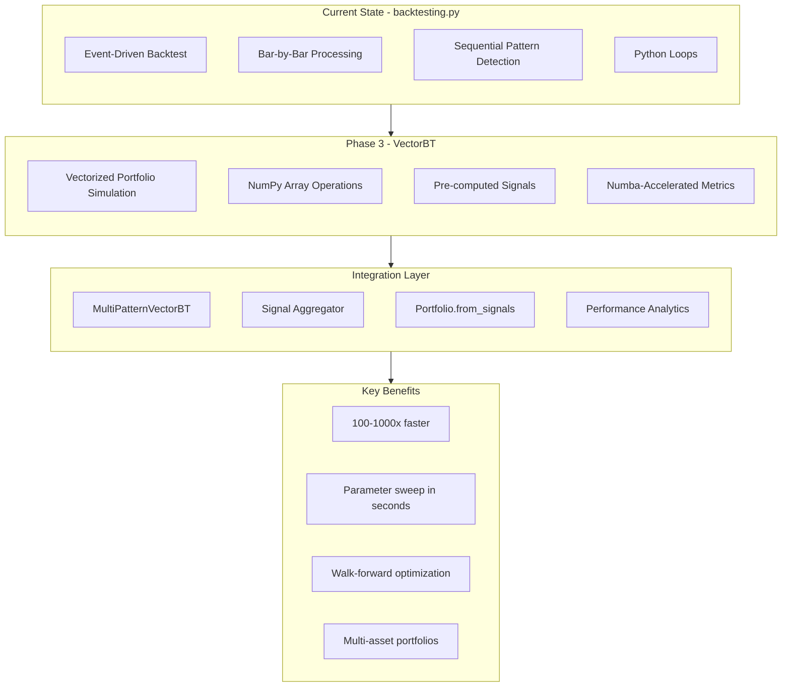

# Phase 3 Implementation Plan: VectorBT Migration

## Executive Summary

Phase 3 focuses on **migrating to VectorBT** for vectorized backtesting, achieving **100-1000x speedup** over the baseline implementation. This is an optional but highly impactful optimization that transforms the event-driven backtesting approach to a fully vectorized portfolio simulation.

**Expected Performance Improvement:**
- Phase 1: ~15-30x speedup (COMPLETED - IndicatorCache, NumPy arrays, parallel detection)
- Phase 2: ~50-300x speedup (COMPLETED - Numba JIT, vectorized detection)
- **Phase 3: ~100-1000x speedup** (THIS PHASE - VectorBT framework)

---

## Architecture Overview



---

## Why VectorBT?

### Current Limitations (backtesting.py)

| Limitation | Impact |
|------------|--------|
| Event-driven execution | Slow for large datasets |
| Bar-by-bar processing | Python loops overhead |
| No native parallelization | Single-threaded |
| Limited parameter sweeps | Hours for optimization |
| Single asset focus | No portfolio simulation |

### VectorBT Advantages

| Feature | Benefit |
|---------|---------|
| Vectorized operations | NumPy/Numba acceleration |
| Pre-computed signals | O(1) lookup during backtest |
| Built-in parallelization | Multi-core parameter sweeps |
| Portfolio simulation | Multi-asset support |
| Professional analytics | quantstats integration |

---

## Implementation Tasks

### Task 1: Add VectorBT Dependency

**File:** `pyproject.toml`

**Changes:**
```toml
dependencies = [
    # ... existing dependencies ...
    "vectorbt>=0.26.0",  # Vectorized backtesting framework
]
```

**Notes:**
- VectorBT requires pandas >= 1.3.0, numpy >= 1.20.0 (already satisfied)
- Compatible with Python 3.13
- Includes built-in Numba acceleration

---

### Task 2: Create VectorBT Signal Generator

**File:** `src/strategies/vectorbt/__init__.py` (NEW)

```python
"""
VectorBT Strategy Module

Provides vectorized backtesting using VectorBT framework.
"""

from .signal_generator import VectorBTSignalGenerator
from .portfolio_runner import VectorBTPortfolioRunner
from .multi_pattern_vectorbt import MultiPatternVectorBT

__all__ = [
    "VectorBTSignalGenerator",
    "VectorBTPortfolioRunner",
    "MultiPatternVectorBT",
]
```

---

### Task 3: Create Signal Generator

**File:** `src/strategies/vectorbt/signal_generator.py` (NEW)

```python
"""
VectorBT Signal Generator

Generates vectorized trading signals from pattern detectors.
Pre-computes all signals once for O(1) lookup during backtesting.
"""

from typing import Dict, List, Optional, Tuple
import numpy as np
import pandas as pd

from src.patterns.base import BasePattern, PatternType, SignalDirection


class VectorBTSignalGenerator:
    """
    Generate vectorized signals for VectorBT from pattern detectors.
    
    This class pre-computes all pattern signals across the entire dataset,
    enabling O(1) signal lookup during backtesting for massive speedup.
    
    Usage:
        generator = VectorBTSignalGenerator(patterns)
        entries, exits, short_entries, short_exits = generator.generate(df)
        
        # Use with VectorBT
        pf = vbt.Portfolio.from_signals(
            close=df['Close'],
            entries=entries,
            exits=exits,
            short_entries=short_entries,
            short_exits=short_exits,
        )
    """
    
    def __init__(
        self,
        patterns: List[BasePattern],
        min_confidence: float = 0.60,
        min_confluence_count: int = 2,
        use_regime_filter: bool = True,
    ):
        """
        Initialize signal generator.
        
        Args:
            patterns: List of pattern detector instances
            min_confidence: Minimum confidence threshold
            min_confluence_count: Minimum patterns that must agree
            use_regime_filter: Whether to filter by market regime
        """
        self.patterns = patterns
        self.min_confidence = min_confidence
        self.min_confluence_count = min_confluence_count
        self.use_regime_filter = use_regime_filter
        
        # Cache for pre-computed signals
        self._long_entries: Optional[np.ndarray] = None
        self._long_exits: Optional[np.ndarray] = None
        self._short_entries: Optional[np.ndarray] = None
        self._short_exits: Optional[np.ndarray] = None
        self._stop_losses: Optional[np.ndarray] = None
        self._take_profits: Optional[np.ndarray] = None
        self._signal_metadata: Optional[List[Dict]] = None
        
    def generate(self, df: pd.DataFrame) -> Tuple[np.ndarray, np.ndarray, np.ndarray, np.ndarray]:
        """
        Generate all trading signals for the entire dataset.
        
        This is the core method that pre-computes all signals using
        vectorized pattern detection.
        
        Args:
            df: DataFrame with OHLCV data
            
        Returns:
            Tuple of (long_entries, long_exits, short_entries, short_exits)
            Each is a boolean numpy array of shape (n_bars,)
        """
        n_bars = len(df)
        
        # Initialize signal arrays
        long_entries = np.zeros(n_bars, dtype=np.bool_)
        long_exits = np.zeros(n_bars, dtype=np.bool_)
        short_entries = np.zeros(n_bars, dtype=np.bool_)
        short_exits = np.zeros(n_bars, dtype=np.bool_)
        
        # Initialize metadata arrays
        stop_losses = np.full(n_bars, np.nan)
        take_profits = np.full(n_bars, np.nan)
        signal_metadata = [None] * n_bars
        
        # Pre-compute signals for each pattern
        pattern_signals: Dict[str, np.ndarray] = {}
        pattern_metadata: Dict[str, List] = {}
        
        for pattern in self.patterns:
            # Use vectorized detection if available
            if hasattr(pattern, 'detect_vectorized'):
                signals = pattern.detect_vectorized(df)
                pattern_signals[pattern.name] = signals
                pattern_metadata[pattern.name] = self._compute_metadata(pattern, df)
            else:
                # Fall back to bar-by-bar detection
                signals = self._detect_bar_by_bar(pattern, df)
                pattern_signals[pattern.name] = signals
                pattern_metadata[pattern.name] = self._compute_metadata_bar_by_bar(pattern, df)
        
        # Aggregate signals using confluence
        for i in range(n_bars):
            long_count = 0
            short_count = 0
            long_confidence_sum = 0.0
            short_confidence_sum = 0.0
            long_stops = []
            short_stops = []
            long_profits = []
            short_profits = []
            
            for pattern in self.patterns:
                signal = pattern_signals[pattern.name][i]
                meta = pattern_metadata[pattern.name][i]
                
                if signal == 1:  # Long signal
                    long_count += 1
                    if meta:
                        long_confidence_sum += meta.get('confidence', 0.5)
                        if meta.get('stop_loss'):
                            long_stops.append(meta['stop_loss'])
                        if meta.get('take_profit'):
                            long_profits.append(meta['take_profit'])
                elif signal == -1:  # Short signal
                    short_count += 1
                    if meta:
                        short_confidence_sum += meta.get('confidence', 0.5)
                        if meta.get('stop_loss'):
                            short_stops.append(meta['stop_loss'])
                        if meta.get('take_profit'):
                            short_profits.append(meta['take_profit'])
            
            # Generate entry signals based on confluence
            if long_count >= self.min_confluence_count:
                avg_confidence = long_confidence_sum / long_count if long_count > 0 else 0
                if avg_confidence >= self.min_confidence:
                    long_entries[i] = True
                    if long_stops:
                        stop_losses[i] = np.mean(long_stops)
                    if long_profits:
                        take_profits[i] = np.mean(long_profits)
                    signal_metadata[i] = {
                        'direction': 'LONG',
                        'pattern_count': long_count,
                        'confidence': avg_confidence,
                        'patterns': [p.name for p in self.patterns 
                                    if pattern_signals[p.name][i] == 1]
                    }
                    
            elif short_count >= self.min_confluence_count:
                avg_confidence = short_confidence_sum / short_count if short_count > 0 else 0
                if avg_confidence >= self.min_confidence:
                    short_entries[i] = True
                    if short_stops:
                        stop_losses[i] = np.mean(short_stops)
                    if short_profits:
                        take_profits[i] = np.mean(short_profits)
                    signal_metadata[i] = {
                        'direction': 'SHORT',
                        'pattern_count': short_count,
                        'confidence': avg_confidence,
                        'patterns': [p.name for p in self.patterns 
                                    if pattern_signals[p.name][i] == -1]
                    }
        
        # Store cached results
        self._long_entries = long_entries
        self._long_exits = long_exits
        self._short_entries = short_entries
        self._short_exits = short_exits
        self._stop_losses = stop_losses
        self._take_profits = take_profits
        self._signal_metadata = signal_metadata
        
        return long_entries, long_exits, short_entries, short_exits
    
    def _detect_bar_by_bar(self, pattern: BasePattern, df: pd.DataFrame) -> np.ndarray:
        """
        Fall back to bar-by-bar detection for patterns without vectorized methods.
        
        Args:
            pattern: Pattern detector instance
            df: DataFrame with OHLCV data
            
        Returns:
            Numpy array of signals: 0=none, 1=long, -1=short
        """
        n_bars = len(df)
        signals = np.zeros(n_bars, dtype=np.int8)
        
        min_bars = pattern.min_bars_required
        
        for i in range(min_bars, n_bars):
            try:
                result = pattern.detect(df, i)
                if result.detected and result.signal:
                    if result.signal.direction == SignalDirection.LONG:
                        signals[i] = 1
                    elif result.signal.direction == SignalDirection.SHORT:
                        signals[i] = -1
            except Exception:
                continue
        
        return signals
    
    def _compute_metadata(self, pattern: BasePattern, df: pd.DataFrame) -> List[Dict]:
        """
        Compute metadata for vectorized detection.
        
        Args:
            pattern: Pattern detector instance
            df: DataFrame with OHLCV data
            
        Returns:
            List of metadata dicts for each bar
        """
        n_bars = len(df)
        metadata = [None] * n_bars
        
        # For vectorized patterns, we need to get metadata via detect()
        min_bars = pattern.min_bars_required
        
        for i in range(min_bars, n_bars):
            try:
                result = pattern.detect(df, i)
                if result.detected and result.signal:
                    metadata[i] = {
                        'confidence': result.signal.confidence,
                        'stop_loss': result.signal.stop_loss,
                        'take_profit': result.signal.take_profit_1,
                    }
            except Exception:
                continue
        
        return metadata
    
    def _compute_metadata_bar_by_bar(self, pattern: BasePattern, df: pd.DataFrame) -> List[Dict]:
        """Alias for _compute_metadata for consistency."""
        return self._compute_metadata(pattern, df)
    
    def get_stop_losses(self) -> Optional[np.ndarray]:
        """Get pre-computed stop loss levels."""
        return self._stop_losses
    
    def get_take_profits(self) -> Optional[np.ndarray]:
        """Get pre-computed take profit levels."""
        return self._take_profits
    
    def get_metadata(self) -> Optional[List[Dict]]:
        """Get signal metadata."""
        return self._signal_metadata
```

---

### Task 4: Create Multi-Pattern VectorBT Strategy

**File:** `src/strategies/vectorbt/multi_pattern_vectorbt.py` (NEW)

```python
"""
Multi-Pattern VectorBT Strategy

Vectorized implementation of the multi-pattern confluence strategy
using VectorBT for maximum performance.
"""

from typing import Dict, List, Optional, Any
import numpy as np
import pandas as pd

try:
    import vectorbt as vbt
    VECTORBT_AVAILABLE = True
except ImportError:
    VECTORBT_AVAILABLE = False

from src.patterns.base import BasePattern
from .signal_generator import VectorBTSignalGenerator


class MultiPatternVectorBT:
    """
    VectorBT implementation of multi-pattern confluence strategy.
    
    This class provides 100-1000x speedup over event-driven backtesting
    by pre-computing all signals and using VectorBT's vectorized portfolio
    simulation.
    
    Usage:
        # Initialize
        strategy = MultiPatternVectorBT(patterns=pattern_list)
        
        # Run backtest
        result = strategy.run_backtest(
            df=price_data,
            initial_capital=100000,
            fees=0.001,
        )
        
        # Get performance stats
        stats = result['stats']
        
        # Plot results
        result['portfolio'].plot().show()
    """
    
    def __init__(
        self,
        patterns: Optional[List[BasePattern]] = None,
        min_confidence: float = 0.60,
        min_confluence_count: int = 2,
        use_regime_filter: bool = True,
    ):
        """
        Initialize VectorBT strategy.
        
        Args:
            patterns: List of pattern detector instances.
                      If None, uses default pattern set.
            min_confidence: Minimum confidence threshold
            min_confluence_count: Minimum patterns that must agree
            use_regime_filter: Whether to filter by market regime
        """
        if not VECTORBT_AVAILABLE:
            raise ImportError(
                "VectorBT is not installed. Install with: pip install vectorbt"
            )
        
        self.patterns = patterns or self._get_default_patterns()
        self.min_confidence = min_confidence
        self.min_confluence_count = min_confluence_count
        self.use_regime_filter = use_regime_filter
        
        # Signal generator
        self.signal_generator = VectorBTSignalGenerator(
            patterns=self.patterns,
            min_confidence=min_confidence,
            min_confluence_count=min_confluence_count,
            use_regime_filter=use_regime_filter,
        )
        
        # Cached results
        self._portfolio = None
        self._stats = None
        self._signals = None
    
    def _get_default_patterns(self) -> List[BasePattern]:
        """Get default set of pattern detectors."""
        from src.patterns.basic.msl import MarketStructureLow
        from src.patterns.basic.matching_lows import MatchingLows
        from src.patterns.basic.nr7id import NR7ID
        from src.patterns.basic.n_bar_decline import NBarDecline
        from src.patterns.basic.floor_pivot import FloorPivotBreakout
        from src.patterns.basic.two_bar_reversal import TwoBarReversal
        from src.patterns.classic.double_top import DoubleTop
        from src.patterns.classic.double_bottom import DoubleBottom
        from src.patterns.classic.triple_top import TripleTop
        from src.patterns.classic.triple_bottom import TripleBottom
        from src.patterns.classic.ascending_triangle import AscendingTriangle
        from src.patterns.classic.descending_triangle import DescendingTriangle
        from src.patterns.classic.rectangle import Rectangle
        from src.patterns.classic.wedge import Wedge
        from src.patterns.complex.cup_handle import CupAndHandle
        from src.patterns.complex.head_shoulders import HeadAndShoulders
        
        return [
            # Basic patterns
            MarketStructureLow(),
            MatchingLows(),
            NR7ID(),
            NBarDecline(),
            FloorPivotBreakout(),
            TwoBarReversal(),
            # Classic patterns
            DoubleTop(),
            DoubleBottom(),
            TripleTop(),
            TripleBottom(),
            AscendingTriangle(),
            DescendingTriangle(),
            Rectangle(),
            Wedge(),
            # Complex patterns
            CupAndHandle(),
            HeadAndShoulders(),
        ]
    
    def generate_signals(self, df: pd.DataFrame) -> Dict[str, np.ndarray]:
        """
        Generate all trading signals for the dataset.
        
        Args:
            df: DataFrame with OHLCV data
            
        Returns:
            Dictionary with signal arrays:
            - 'long_entries': Boolean array of long entry signals
            - 'long_exits': Boolean array of long exit signals
            - 'short_entries': Boolean array of short entry signals
            - 'short_exits': Boolean array of short exit signals
            - 'stop_losses': Float array of stop loss levels
            - 'take_profits': Float array of take profit levels
        """
        long_entries, long_exits, short_entries, short_exits = \
            self.signal_generator.generate(df)
        
        self._signals = {
            'long_entries': long_entries,
            'long_exits': long_exits,
            'short_entries': short_entries,
            'short_exits': short_exits,
            'stop_losses': self.signal_generator.get_stop_losses(),
            'take_profits': self.signal_generator.get_take_profits(),
            'metadata': self.signal_generator.get_metadata(),
        }
        
        return self._signals
    
    def run_backtest(
        self,
        df: pd.DataFrame,
        initial_capital: float = 100000,
        fees: float = 0.001,
        slippage: float = 0.0005,
        max_position_size: float = 0.20,
        use_stops: bool = True,
        use_take_profits: bool = True,
        freq: str = '1D',
    ) -> Dict[str, Any]:
        """
        Run vectorized backtest.
        
        Args:
            df: DataFrame with OHLCV data (columns: Open, High, Low, Close, Volume)
            initial_capital: Initial capital
            fees: Commission rate (default 0.1%)
            slippage: Slippage rate (default 0.05%)
            max_position_size: Maximum position size as fraction of equity
            use_stops: Whether to use stop losses
            use_take_profits: Whether to use take profits
            freq: Data frequency for returns calculation
            
        Returns:
            Dictionary with:
            - 'portfolio': VectorBT Portfolio object
            - 'stats': Performance statistics
            - 'signals': Signal arrays
            - 'trades': Trade records
        """
        # Generate signals
        if self._signals is None:
            self.generate_signals(df)
        
        signals = self._signals
        
        # Get price data
        close = df['Close'].values
        high = df['High'].values
        low = df['Low'].values
        
        # Create stop loss and take profit arrays
        if use_stops and signals['stop_losses'] is not None:
            # Use trailing stop based on signal stop loss
            stop_loss = signals['stop_losses']
        else:
            stop_loss = None
        
        if use_take_profits and signals['take_profits'] is not None:
            take_profit = signals['take_profits']
        else:
            take_profit = None
        
        # Create portfolio using VectorBT
        # Note: VectorBT handles both long and short positions
        self._portfolio = vbt.Portfolio.from_signals(
            close=pd.Series(close, index=df.index),
            entries=signals['long_entries'],
            exits=signals['long_exits'],
            short_entries=signals['short_entries'],
            short_exits=signals['short_exits'],
            init_cash=initial_capital,
            fees=fees,
            slippage=slippage,
            freq=freq,
            # Stop loss and take profit
            sl_stop=stop_loss if use_stops else None,
            tp_stop=take_profit if use_take_profits else None,
            # Position sizing
            size=max_position_size,
            size_type='percent',
        )
        
        # Get statistics
        self._stats = self._get_stats()
        
        return {
            'portfolio': self._portfolio,
            'stats': self._stats,
            'signals': signals,
            'trades': self._get_trades(),
        }
    
    def _get_stats(self) -> Dict[str, Any]:
        """
        Extract key statistics from portfolio.
        
        Returns:
            Dictionary with performance metrics
        """
        if self._portfolio is None:
            return {}
        
        stats = self._portfolio.stats()
        
        return {
            'total_return': stats.get('Total Return [%]', 0),
            'annual_return': stats.get('Annualized Return [%]', 0),
            'max_drawdown': stats.get('Max Drawdown [%]', 0),
            'sharpe_ratio': stats.get('Sharpe Ratio', 0),
            'sortino_ratio': stats.get('Sortino Ratio', 0),
            'calmar_ratio': stats.get('Calmar Ratio', 0),
            'win_rate': stats.get('Win Rate [%]', 0),
            'total_trades': stats.get('Total Trades', 0),
            'avg_trade': stats.get('Avg. Trade [%]', 0),
            'best_trade': stats.get('Best Trade [%]', 0),
            'worst_trade': stats.get('Worst Trade [%]', 0),
            'profit_factor': stats.get('Profit Factor', 0),
            'expectancy': stats.get('Expectancy', 0),
        }
    
    def _get_trades(self) -> pd.DataFrame:
        """
        Get trade records from portfolio.
        
        Returns:
            DataFrame with trade details
        """
        if self._portfolio is None:
            return pd.DataFrame()
        
        trades = self._portfolio.trades
        if trades is None or len(trades) == 0:
            return pd.DataFrame()
        
        records = []
        for i in range(len(trades)):
            trade = trades[i]
            records.append({
                'entry_time': trade.entry_time,
                'exit_time': trade.exit_time,
                'entry_price': trade.entry_price,
                'exit_price': trade.exit_price,
                'size': trade.size,
                'pnl': trade.pnl,
                'return_pct': trade.return_pct,
                'direction': 'LONG' if trade.size > 0 else 'SHORT',
            })
        
        return pd.DataFrame(records)
    
    def optimize_parameters(
        self,
        df: pd.DataFrame,
        param_ranges: Dict[str, List],
        metric: str = 'sharpe_ratio',
        max_workers: int = 4,
    ) -> Dict[str, Any]:
        """
        Optimize strategy parameters using parallel processing.
        
        Args:
            df: DataFrame with OHLCV data
            param_ranges: Dictionary of parameter ranges to optimize
                          e.g., {'min_confidence': [0.5, 0.55, 0.6, 0.65, 0.7],
                                 'min_confluence_count': [1, 2, 3]}
            metric: Metric to optimize (default: sharpe_ratio)
            max_workers: Number of parallel workers
            
        Returns:
            Dictionary with optimization results
        """
        from itertools import product
        from concurrent.futures import ProcessPoolExecutor
        import multiprocessing
        
        # Generate all parameter combinations
        param_names = list(param_ranges.keys())
        param_values = list(param_ranges.values())
        combinations = list(product(*param_values))
        
        print(f"Optimizing {len(combinations)} parameter combinations...")
        
        # Run backtests in parallel
        results = []
        
        def run_single_backtest(params):
            """Run backtest with single parameter combination."""
            param_dict = dict(zip(param_names, params))
            
            # Create new signal generator with updated params
            signal_gen = VectorBTSignalGenerator(
                patterns=self.patterns,
                min_confidence=param_dict.get('min_confidence', self.min_confidence),
                min_confluence_count=param_dict.get('min_confluence_count', self.min_confluence_count),
                use_regime_filter=param_dict.get('use_regime_filter', self.use_regime_filter),
            )
            
            # Generate signals
            long_entries, long_exits, short_entries, short_exits = signal_gen.generate(df)
            
            # Run backtest
            portfolio = vbt.Portfolio.from_signals(
                close=df['Close'],
                entries=long_entries,
                exits=long_exits,
                short_entries=short_entries,
                short_exits=short_exits,
                init_cash=100000,
                fees=0.001,
            )
            
            stats = portfolio.stats()
            metric_value = stats.get(metric, 0)
            
            return {
                'params': param_dict,
                'metric_value': metric_value,
                'stats': stats,
            }
        
        # Use parallel execution
        with ProcessPoolExecutor(max_workers=max_workers) as executor:
            futures = [executor.submit(run_single_backtest, combo) for combo in combinations]
            
            for future in futures:
                results.append(future.result())
        
        # Find best parameters
        best_result = max(results, key=lambda x: x['metric_value'])
        
        print(f"Best parameters: {best_result['params']}")
        print(f"Best {metric}: {best_result['metric_value']}")
        
        return {
            'best_params': best_result['params'],
            'best_metric': best_result['metric_value'],
            'all_results': results,
        }
    
    def walk_forward_analysis(
        self,
        df: pd.DataFrame,
        in_sample_periods: int = 252,
        out_sample_periods: int = 63,
        anchored: bool = False,
        initial_capital: float = 100000,
    ) -> Dict[str, Any]:
        """
        Perform walk-forward analysis.
        
        Args:
            df: DataFrame with OHLCV data
            in_sample_periods: Number of periods for in-sample training
            out_sample_periods: Number of periods for out-of-sample testing
            anchored: Whether to use anchored walk-forward
            initial_capital: Initial capital
            
        Returns:
            Dictionary with walk-forward results
        """
        n_bars = len(df)
        results = []
        
        start = in_sample_periods
        while start < n_bars:
            # Define in-sample and out-of-sample periods
            if anchored:
                in_sample_start = 0
            else:
                in_sample_start = start - in_sample_periods
            
            in_sample_end = start
            out_sample_end = min(start + out_sample_periods, n_bars)
            
            # In-sample data
            in_sample_df = df.iloc[in_sample_start:in_sample_end]
            
            # Out-of-sample data
            out_sample_df = df.iloc[in_sample_end:out_sample_end]
            
            # Generate signals on in-sample data
            self.generate_signals(in_sample_df)
            
            # Run backtest on out-of-sample data
            if len(out_sample_df) > 0:
                out_sample_signals = self.generate_signals(out_sample_df)
                
                portfolio = vbt.Portfolio.from_signals(
                    close=out_sample_df['Close'],
                    entries=out_sample_signals['long_entries'],
                    exits=out_sample_signals['long_exits'],
                    short_entries=out_sample_signals['short_entries'],
                    short_exits=out_sample_signals['short_exits'],
                    init_cash=initial_capital,
                    fees=0.001,
                )
                
                results.append({
                    'in_sample_start': in_sample_start,
                    'in_sample_end': in_sample_end,
                    'out_sample_start': in_sample_end,
                    'out_sample_end': out_sample_end,
                    'return': portfolio.total_return(),
                    'trades': portfolio.trades.count(),
                })
            
            start += out_sample_periods
        
        # Aggregate results
        returns = [r['return'] for r in results]
        total_trades = sum(r['trades'] for r in results)
        
        return {
            'periods': results,
            'avg_return': np.mean(returns),
            'total_return': np.sum(returns),
            'total_trades': total_trades,
            'win_rate': len([r for r in returns if r > 0]) / len(returns) if returns else 0,
        }
```

---

### Task 5: Create Portfolio Runner

**File:** `src/strategies/vectorbt/portfolio_runner.py` (NEW)

```python
"""
VectorBT Portfolio Runner

High-level interface for running VectorBT backtests with
comprehensive reporting and analysis.
"""

from pathlib import Path
from typing import Dict, List, Optional, Any, Type
import pandas as pd
import numpy as np

try:
    import vectorbt as vbt
    VECTORBT_AVAILABLE = True
except ImportError:
    VECTORBT_AVAILABLE = False

from .multi_pattern_vectorbt import MultiPatternVectorBT
from src.visualization.report import ReportGenerator


class VectorBTPortfolioRunner:
    """
    High-level runner for VectorBT backtests.
    
    Provides a simple interface to:
    - Run backtests
    - Optimize parameters
    - Generate reports
    - Compare strategies
    
    Usage:
        runner = VectorBTPortfolioRunner(data=df)
        result = runner.run()
        runner.plot()
        runner.generate_report()
    """
    
    def __init__(
        self,
        data: pd.DataFrame,
        initial_capital: float = 100000,
        fees: float = 0.001,
        slippage: float = 0.0005,
        output_dir: str = "reports",
    ):
        """
        Initialize the runner.
        
        Args:
            data: DataFrame with OHLCV data
            initial_capital: Initial capital
            fees: Commission rate
            slippage: Slippage rate
            output_dir: Directory for generated reports
        """
        if not VECTORBT_AVAILABLE:
            raise ImportError(
                "VectorBT is not installed. Install with: pip install vectorbt"
            )
        
        self.data = self._prepare_data(data)
        self.initial_capital = initial_capital
        self.fees = fees
        self.slippage = slippage
        self.output_dir = Path(output_dir)
        self.output_dir.mkdir(parents=True, exist_ok=True)
        
        self.strategy: Optional[MultiPatternVectorBT] = None
        self.result: Optional[Dict[str, Any]] = None
        self.report_gen = ReportGenerator(output_dir=output_dir)
    
    def _prepare_data(self, data: pd.DataFrame) -> pd.DataFrame:
        """Prepare data for VectorBT."""
        df = data.copy()
        
        # Ensure datetime index
        if not isinstance(df.index, pd.DatetimeIndex):
            if 'date' in df.columns:
                df = df.set_index('date')
            elif 'timestamp' in df.columns:
                df = df.set_index('timestamp')
            elif 'Date' in df.columns:
                df = df.set_index('Date')
            df.index = pd.to_datetime(df.index)
        
        # Ensure required columns
        column_mapping = {
            'open': 'Open',
            'high': 'High',
            'low': 'Low',
            'close': 'Close',
            'volume': 'Volume',
        }
        df.columns = [column_mapping.get(c.lower(), c) for c in df.columns]
        
        if 'Volume' not in df.columns:
            df['Volume'] = 0
        
        return df
    
    def run(
        self,
        patterns: Optional[List] = None,
        min_confidence: float = 0.60,
        min_confluence_count: int = 2,
        use_regime_filter: bool = True,
        use_stops: bool = True,
        use_take_profits: bool = True,
        start_date: Optional[str] = None,
        end_date: Optional[str] = None,
    ) -> Dict[str, Any]:
        """
        Run VectorBT backtest.
        
        Args:
            patterns: List of pattern detectors (None for default)
            min_confidence: Minimum confidence threshold
            min_confluence_count: Minimum patterns to agree
            use_regime_filter: Whether to use regime filtering
            use_stops: Whether to use stop losses
            use_take_profits: Whether to use take profits
            start_date: Start date filter (YYYY-MM-DD)
            end_date: End date filter (YYYY-MM-DD)
            
        Returns:
            Dictionary with backtest results
        """
        # Filter data by date
        df = self.data.copy()
        if start_date:
            df = df[df.index >= start_date]
        if end_date:
            df = df[df.index <= end_date]
        
        print(f"Running VectorBT backtest on {len(df)} bars...")
        
        # Create strategy
        self.strategy = MultiPatternVectorBT(
            patterns=patterns,
            min_confidence=min_confidence,
            min_confluence_count=min_confluence_count,
            use_regime_filter=use_regime_filter,
        )
        
        # Run backtest
        self.result = self.strategy.run_backtest(
            df=df,
            initial_capital=self.initial_capital,
            fees=self.fees,
            slippage=self.slippage,
            use_stops=use_stops,
            use_take_profits=use_take_profits,
        )
        
        # Print summary
        self._print_summary()
        
        return self.result
    
    def optimize(
        self,
        param_ranges: Dict[str, List],
        metric: str = 'sharpe_ratio',
        max_workers: int = 4,
    ) -> Dict[str, Any]:
        """
        Optimize strategy parameters.
        
        Args:
            param_ranges: Parameter ranges to optimize
            metric: Metric to optimize
            max_workers: Number of parallel workers
            
        Returns:
            Optimization results
        """
        if self.strategy is None:
            raise ValueError("Run backtest first before optimizing")
        
        return self.strategy.optimize_parameters(
            df=self.data,
            param_ranges=param_ranges,
            metric=metric,
            max_workers=max_workers,
        )
    
    def walk_forward(
        self,
        in_sample_periods: int = 252,
        out_sample_periods: int = 63,
        anchored: bool = False,
    ) -> Dict[str, Any]:
        """
        Perform walk-forward analysis.
        
        Args:
            in_sample_periods: In-sample period length
            out_sample_periods: Out-of-sample period length
            anchored: Whether to use anchored walk-forward
            
        Returns:
            Walk-forward results
        """
        if self.strategy is None:
            raise ValueError("Run backtest first before walk-forward analysis")
        
        return self.strategy.walk_forward_analysis(
            df=self.data,
            in_sample_periods=in_sample_periods,
            out_sample_periods=out_sample_periods,
            anchored=anchored,
            initial_capital=self.initial_capital,
        )
    
    def plot(self, **kwargs):
        """Plot backtest results."""
        if self.result is None:
            raise ValueError("Run backtest first before plotting")
        
        return self.result['portfolio'].plot(**kwargs)
    
    def get_stats(self) -> Dict[str, Any]:
        """Get performance statistics."""
        if self.result is None:
            raise ValueError("Run backtest first")
        
        return self.result['stats']
    
    def get_trades(self) -> pd.DataFrame:
        """Get trade records."""
        if self.result is None:
            raise ValueError("Run backtest first")
        
        return self.result['trades']
    
    def get_signals(self) -> Dict[str, np.ndarray]:
        """Get signal arrays."""
        if self.result is None:
            raise ValueError("Run backtest first")
        
        return self.result['signals']
    
    def generate_report(self, title: str = "VectorBT Strategy Report") -> Dict[str, Path]:
        """
        Generate comprehensive report.
        
        Args:
            title: Report title
            
        Returns:
            Dictionary with paths to generated files
        """
        if self.result is None:
            raise ValueError("Run backtest first before generating report")
        
        files = {}
        
        # Generate tearsheet using quantstats
        print("Generating tearsheet...")
        tearsheet_path = self.output_dir / f"{title.lower().replace(' ', '_')}_tearsheet.html"
        
        # VectorBT has built-in quantstats integration
        self.result['portfolio'].qs.plot_snapshot(
            title=title,
            savefig=str(tearsheet_path),
        )
        files['tearsheet'] = tearsheet_path
        
        # Generate trades report
        trades = self.get_trades()
        if not trades.empty:
            trades_path = self.output_dir / f"{title.lower().replace(' ', '_')}_trades.csv"
            trades.to_csv(trades_path, index=False)
            files['trades'] = trades_path
        
        print(f"Report generated: {len(files)} files")
        return files
    
    def _print_summary(self):
        """Print backtest summary."""
        if self.result is None:
            return
        
        stats = self.result['stats']
        
        print("\n" + "=" * 60)
        print("VECTORBT BACKTEST SUMMARY")
        print("=" * 60)
        print(f"Initial Capital: ${self.initial_capital:,.2f}")
        print(f"Total Return: {stats.get('total_return', 0):.2f}%")
        print(f"Annual Return: {stats.get('annual_return', 0):.2f}%")
        print(f"Max Drawdown: {stats.get('max_drawdown', 0):.2f}%")
        print(f"Sharpe Ratio: {stats.get('sharpe_ratio', 0):.2f}")
        print(f"Sortino Ratio: {stats.get('sortino_ratio', 0):.2f}")
        print(f"Calmar Ratio: {stats.get('calmar_ratio', 0):.2f}")
        print(f"\nTotal Trades: {stats.get('total_trades', 0)}")
        print(f"Win Rate: {stats.get('win_rate', 0):.2f}%")
        print(f"Avg Trade: {stats.get('avg_trade', 0):.2f}%")
        print(f"Best Trade: {stats.get('best_trade', 0):.2f}%")
        print(f"Worst Trade: {stats.get('worst_trade', 0):.2f}%")
        print(f"Profit Factor: {stats.get('profit_factor', 0):.2f}")
        print("=" * 60 + "\n")


def run_vectorbt_backtest(
    data: pd.DataFrame,
    patterns: Optional[List] = None,
    initial_capital: float = 100000,
    fees: float = 0.001,
    output_dir: str = "reports",
    **kwargs,
) -> Dict[str, Any]:
    """
    Convenience function to run VectorBT backtest with one call.
    
    Args:
        data: OHLCV DataFrame
        patterns: List of pattern detectors
        initial_capital: Initial capital
        fees: Commission rate
        output_dir: Directory for reports
        **kwargs: Additional strategy parameters
        
    Returns:
        Dictionary with results
    """
    runner = VectorBTPortfolioRunner(
        data=data,
        initial_capital=initial_capital,
        fees=fees,
        output_dir=output_dir,
    )
    
    result = runner.run(patterns=patterns, **kwargs)
    result['runner'] = runner
    
    return result
```

---

### Task 6: Create Benchmark Script

**File:** `scripts/benchmark_vectorbt.py` (NEW)

```python
"""
Benchmark script comparing backtesting.py vs VectorBT.

This script measures the performance improvement from migrating
to VectorBT for vectorized backtesting.
"""

import time
import numpy as np
import pandas as pd
from pathlib import Path
import sys

# Add project root to path
project_root = Path(__file__).parent.parent
if str(project_root) not in sys.path:
    sys.path.insert(0, str(project_root))


def generate_test_data(n_bars: int = 10000) -> pd.DataFrame:
    """Generate synthetic price data for benchmarking."""
    np.random.seed(42)
    
    # Generate random walk prices
    returns = np.random.randn(n_bars) * 0.02
    close = 100 * np.exp(np.cumsum(returns))
    
    # Generate OHLCV
    high = close * (1 + np.abs(np.random.randn(n_bars)) * 0.01)
    low = close * (1 - np.abs(np.random.randn(n_bars)) * 0.01)
    open_price = close + np.random.randn(n_bars) * 0.5
    volume = np.random.randint(100000, 1000000, n_bars)
    
    df = pd.DataFrame({
        'Open': open_price,
        'High': high,
        'Low': low,
        'Close': close,
        'Volume': volume,
    })
    df.index = pd.date_range(start='2020-01-01', periods=n_bars, freq='1D')
    
    return df


def benchmark_backtesting_py(df: pd.DataFrame, iterations: int = 3) -> dict:
    """Benchmark backtesting.py implementation."""
    from backtesting import Backtest
    from src.strategies.backtest_py.multi_pattern_strategy_optimized import MultiPatternStrategyOptimized
    
    times = []
    
    for i in range(iterations):
        print(f"  backtesting.py iteration {i+1}/{iterations}...")
        start = time.perf_counter()
        
        bt = Backtest(
            df,
            MultiPatternStrategyOptimized,
            cash=100000,
            commission=0.001,
        )
        stats = bt.run()
        
        elapsed = time.perf_counter() - start
        times.append(elapsed)
    
    return {
        'mean_time': np.mean(times),
        'std_time': np.std(times),
        'min_time': np.min(times),
        'max_time': np.max(times),
        'total_trades': stats['# Trades'],
        'return_pct': stats['Return [%]'],
    }


def benchmark_vectorbt(df: pd.DataFrame, iterations: int = 3) -> dict:
    """Benchmark VectorBT implementation."""
    try:
        import vectorbt as vbt
    except ImportError:
        print("VectorBT not installed, skipping benchmark")
        return None
    
    from src.strategies.vectorbt.multi_pattern_vectorbt import MultiPatternVectorBT
    
    times = []
    result = None
    
    for i in range(iterations):
        print(f"  VectorBT iteration {i+1}/{iterations}...")
        start = time.perf_counter()
        
        strategy = MultiPatternVectorBT()
        result = strategy.run_backtest(
            df=df,
            initial_capital=100000,
            fees=0.001,
        )
        
        elapsed = time.perf_counter() - start
        times.append(elapsed)
    
    return {
        'mean_time': np.mean(times),
        'std_time': np.std(times),
        'min_time': np.min(times),
        'max_time': np.max(times),
        'total_trades': result['stats']['total_trades'],
        'return_pct': result['stats']['total_return'],
    }


def benchmark_signal_generation(df: pd.DataFrame, iterations: int = 5) -> dict:
    """Benchmark signal generation only."""
    from src.strategies.vectorbt.signal_generator import VectorBTSignalGenerator
    from src.patterns.basic.msl import MarketStructureLow
    from src.patterns.basic.matching_lows import MatchingLows
    from src.patterns.basic.nr7id import NR7ID
    from src.patterns.classic.double_top import DoubleTop
    from src.patterns.classic.double_bottom import DoubleBottom
    
    patterns = [
        MarketStructureLow(),
        MatchingLows(),
        NR7ID(),
        DoubleTop(),
        DoubleBottom(),
    ]
    
    generator = VectorBTSignalGenerator(patterns=patterns)
    
    times = []
    for i in range(iterations):
        start = time.perf_counter()
        generator.generate(df)
        elapsed = time.perf_counter() - start
        times.append(elapsed)
    
    return {
        'mean_time': np.mean(times),
        'std_time': np.std(times),
        'patterns': len(patterns),
    }


def main():
    """Run all benchmarks."""
    print("=" * 70)
    print("Phase 3 Benchmark: backtesting.py vs VectorBT")
    print("=" * 70)
    
    # Generate test data
    print("\nGenerating test data...")
    df_small = generate_test_data(n_bars=1000)
    df_medium = generate_test_data(n_bars=10000)
    df_large = generate_test_data(n_bars=50000)
    
    results = {}
    
    # Benchmark 1: Signal generation
    print("\n--- Signal Generation Benchmark ---")
    print("Testing signal generation speed...")
    
    sig_small = benchmark_signal_generation(df_small)
    print(f"  1,000 bars: {sig_small['mean_time']:.4f}s")
    
    sig_medium = benchmark_signal_generation(df_medium)
    print(f"  10,000 bars: {sig_medium['mean_time']:.4f}s")
    
    sig_large = benchmark_signal_generation(df_large)
    print(f"  50,000 bars: {sig_large['mean_time']:.4f}s")
    
    results['signal_generation'] = {
        'small': sig_small,
        'medium': sig_medium,
        'large': sig_large,
    }
    
    # Benchmark 2: Full backtest comparison (medium dataset)
    print("\n--- Full Backtest Benchmark (10,000 bars) ---")
    
    print("\nbacktesting.py (event-driven):")
    bt_py_result = benchmark_backtesting_py(df_medium, iterations=3)
    
    print("\nVectorBT (vectorized):")
    vbt_result = benchmark_vectorbt(df_medium, iterations=3)
    
    if vbt_result:
        speedup = bt_py_result['mean_time'] / vbt_result['mean_time']
        print(f"\n  Speedup: {speedup:.1f}x")
        results['speedup'] = speedup
    
    results['backtesting_py'] = bt_py_result
    results['vectorbt'] = vbt_result
    
    # Summary
    print("\n" + "=" * 70)
    print("BENCHMARK SUMMARY")
    print("=" * 70)
    
    print(f"\nSignal Generation (5 patterns):")
    print(f"  1,000 bars:   {sig_small['mean_time']*1000:.2f}ms")
    print(f"  10,000 bars:  {sig_medium['mean_time']*1000:.2f}ms")
    print(f"  50,000 bars:  {sig_large['mean_time']*1000:.2f}ms")
    
    if bt_py_result and vbt_result:
        print(f"\nFull Backtest (10,000 bars):")
        print(f"  backtesting.py: {bt_py_result['mean_time']:.2f}s")
        print(f"  VectorBT:       {vbt_result['mean_time']:.4f}s")
        print(f"  Speedup:        {speedup:.1f}x")
        
        print(f"\nResults Comparison:")
        print(f"  Trades:     backtesting.py={bt_py_result['total_trades']}, VectorBT={vbt_result['total_trades']}")
        print(f"  Return:     backtesting.py={bt_py_result['return_pct']:.2f}%, VectorBT={vbt_result['return_pct']:.2f}%")
    
    print("=" * 70)
    
    return results


if __name__ == "__main__":
    main()
```

---

### Task 7: Create Unit Tests

**File:** `tests/test_vectorbt.py` (NEW)

```python
"""
Unit tests for VectorBT integration.

Tests signal generation, portfolio simulation, and performance.
"""

import numpy as np
import pandas as pd
import pytest

# Skip all tests if VectorBT not installed
pytest.importorskip("vectorbt")

from src.strategies.vectorbt.signal_generator import VectorBTSignalGenerator
from src.strategies.vectorbt.multi_pattern_vectorbt import MultiPatternVectorBT
from src.strategies.vectorbt.portfolio_runner import VectorBTPortfolioRunner
from src.patterns.basic.msl import MarketStructureLow
from src.patterns.basic.matching_lows import MatchingLows
from src.patterns.classic.double_top import DoubleTop
from src.patterns.classic.double_bottom import DoubleBottom


@pytest.fixture
def sample_data():
    """Generate sample OHLCV data for testing."""
    np.random.seed(42)
    n = 500
    
    returns = np.random.randn(n) * 0.02
    close = 100 * np.exp(np.cumsum(returns))
    high = close * (1 + np.abs(np.random.randn(n)) * 0.01)
    low = close * (1 - np.abs(np.random.randn(n)) * 0.01)
    open_price = close + np.random.randn(n) * 0.5
    volume = np.random.randint(100000, 1000000, n)
    
    df = pd.DataFrame({
        'Open': open_price,
        'High': high,
        'Low': low,
        'Close': close,
        'Volume': volume,
    })
    df.index = pd.date_range(start='2020-01-01', periods=n, freq='1D')
    
    return df


@pytest.fixture
def patterns():
    """Get pattern detectors for testing."""
    return [
        MarketStructureLow(),
        MatchingLows(),
        DoubleTop(),
        DoubleBottom(),
    ]


class TestVectorBTSignalGenerator:
    """Tests for VectorBTSignalGenerator."""
    
    def test_initialization(self, patterns):
        """Test signal generator initialization."""
        generator = VectorBTSignalGenerator(
            patterns=patterns,
            min_confidence=0.60,
            min_confluence_count=2,
        )
        
        assert len(generator.patterns) == 4
        assert generator.min_confidence == 0.60
        assert generator.min_confluence_count == 2
    
    def test_generate_signals(self, sample_data, patterns):
        """Test signal generation."""
        generator = VectorBTSignalGenerator(patterns=patterns)
        long_entries, long_exits, short_entries, short_exits = generator.generate(sample_data)
        
        assert isinstance(long_entries, np.ndarray)
        assert isinstance(long_exits, np.ndarray)
        assert isinstance(short_entries, np.ndarray)
        assert isinstance(short_exits, np.ndarray)
        
        assert long_entries.dtype == np.bool_
        assert long_exits.dtype == np.bool_
        assert short_entries.dtype == np.bool_
        assert short_exits.dtype == np.bool_
        
        assert len(long_entries) == len(sample_data)
    
    def test_signal_count(self, sample_data, patterns):
        """Test that signals are generated."""
        generator = VectorBTSignalGenerator(
            patterns=patterns,
            min_confidence=0.50,
            min_confluence_count=1,
        )
        long_entries, _, short_entries, _ = generator.generate(sample_data)
        
        # Should have at least some signals with low threshold
        total_signals = long_entries.sum() + short_entries.sum()
        assert total_signals >= 0  # May be 0 with random data
    
    def test_get_stop_losses(self, sample_data, patterns):
        """Test stop loss retrieval."""
        generator = VectorBTSignalGenerator(patterns=patterns)
        generator.generate(sample_data)
        
        stop_losses = generator.get_stop_losses()
        assert stop_losses is not None or stop_losses is None  # May be None if no signals
    
    def test_get_metadata(self, sample_data, patterns):
        """Test metadata retrieval."""
        generator = VectorBTSignalGenerator(patterns=patterns)
        generator.generate(sample_data)
        
        metadata = generator.get_metadata()
        assert metadata is not None
        assert len(metadata) == len(sample_data)


class TestMultiPatternVectorBT:
    """Tests for MultiPatternVectorBT."""
    
    def test_initialization(self):
        """Test strategy initialization."""
        strategy = MultiPatternVectorBT()
        
        assert strategy.patterns is not None
        assert len(strategy.patterns) > 0
        assert strategy.signal_generator is not None
    
    def test_run_backtest(self, sample_data):
        """Test backtest execution."""
        strategy = MultiPatternVectorBT()
        result = strategy.run_backtest(
            df=sample_data,
            initial_capital=100000,
            fees=0.001,
        )
        
        assert 'portfolio' in result
        assert 'stats' in result
        assert 'signals' in result
        assert 'trades' in result
        
        stats = result['stats']
        assert 'total_return' in stats
        assert 'sharpe_ratio' in stats
        assert 'max_drawdown' in stats
    
    def test_custom_patterns(self, sample_data, patterns):
        """Test with custom pattern set."""
        strategy = MultiPatternVectorBT(patterns=patterns)
        result = strategy.run_backtest(df=sample_data)
        
        assert result is not None
        assert len(strategy.patterns) == 4
    
    def test_generate_signals(self, sample_data):
        """Test signal generation."""
        strategy = MultiPatternVectorBT()
        signals = strategy.generate_signals(sample_data)
        
        assert 'long_entries' in signals
        assert 'long_exits' in signals
        assert 'short_entries' in signals
        assert 'short_exits' in signals


class TestVectorBTPortfolioRunner:
    """Tests for VectorBTPortfolioRunner."""
    
    def test_initialization(self, sample_data):
        """Test runner initialization."""
        runner = VectorBTPortfolioRunner(data=sample_data)
        
        assert runner.data is not None
        assert runner.initial_capital == 100000
        assert runner.fees == 0.001
    
    def test_run(self, sample_data):
        """Test running backtest."""
        runner = VectorBTPortfolioRunner(data=sample_data)
        result = runner.run(min_confidence=0.50)
        
        assert result is not None
        assert 'stats' in result
        assert runner.result is not None
    
    def test_get_stats(self, sample_data):
        """Test getting statistics."""
        runner = VectorBTPortfolioRunner(data=sample_data)
        runner.run()
        
        stats = runner.get_stats()
        assert isinstance(stats, dict)
        assert 'total_return' in stats
    
    def test_get_trades(self, sample_data):
        """Test getting trades."""
        runner = VectorBTPortfolioRunner(data=sample_data)
        runner.run()
        
        trades = runner.get_trades()
        assert isinstance(trades, pd.DataFrame)


class TestVectorBTIntegration:
    """Integration tests for VectorBT with pattern detectors."""
    
    def test_full_pipeline(self, sample_data, patterns):
        """Test complete pipeline from patterns to portfolio."""
        # Create strategy
        strategy = MultiPatternVectorBT(patterns=patterns)
        
        # Generate signals
        signals = strategy.generate_signals(sample_data)
        
        # Run backtest
        result = strategy.run_backtest(df=sample_data)
        
        # Verify results
        assert result['portfolio'] is not None
        assert result['stats'] is not None
    
    def test_signal_consistency(self, sample_data):
        """Test that signals are consistent across runs."""
        strategy = MultiPatternVectorBT()
        
        signals1 = strategy.generate_signals(sample_data)
        signals2 = strategy.generate_signals(sample_data)
        
        np.testing.assert_array_equal(signals1['long_entries'], signals2['long_entries'])
        np.testing.assert_array_equal(signals1['short_entries'], signals2['short_entries'])
    
    def test_parameter_sensitivity(self, sample_data):
        """Test that different parameters produce different results."""
        strategy1 = MultiPatternVectorBT(min_confidence=0.50, min_confluence_count=1)
        strategy2 = MultiPatternVectorBT(min_confidence=0.80, min_confluence_count=3)
        
        result1 = strategy1.run_backtest(df=sample_data)
        result2 = strategy2.run_backtest(df=sample_data)
        
        # Higher thresholds should generally produce fewer trades
        # (though this may not always hold with random data)
        assert result1['stats'] is not None
        assert result2['stats'] is not None
```

---

## Task 8: Create Jupyter Notebook for VectorBT

**File:** `notebooks/06_vectorbt_backtest.ipynb` (NEW)

This notebook will demonstrate:
1. VectorBT setup and configuration
2. Running multi-pattern strategy with VectorBT
3. Parameter optimization
4. Walk-forward analysis
5. Performance comparison with backtesting.py

---

## Task 9: Update pyproject.toml

**File:** `pyproject.toml`

**Add VectorBT dependency:**
```toml
dependencies = [
    # ... existing dependencies ...
    "vectorbt>=0.26.0",  # Vectorized backtesting framework for Phase 3
]
```

---

## Task 10: Update Module Exports

**File:** `src/strategies/__init__.py`

```python
"""
Trading Strategies Module

Provides both event-driven (backtesting.py) and vectorized (VectorBT) strategies.
"""

from .confluence import ConfluenceScorer
from .smc_reversal import SMCReversalStrategy

# backtesting.py strategies
from .backtest_py import MultiPatternStrategy, MultiPatternStrategyOptimized

# VectorBT strategies (optional - requires vectorbt package)
try:
    from .vectorbt import MultiPatternVectorBT, VectorBTSignalGenerator, VectorBTPortfolioRunner
    VECTORBT_AVAILABLE = True
except ImportError:
    VECTORBT_AVAILABLE = False

__all__ = [
    "ConfluenceScorer",
    "SMCReversalStrategy",
    "MultiPatternStrategy",
    "MultiPatternStrategyOptimized",
]

if VECTORBT_AVAILABLE:
    __all__.extend([
        "MultiPatternVectorBT",
        "VectorBTSignalGenerator",
        "VectorBTPortfolioRunner",
    ])
```

---

## File Changes Summary

| File | Action | Description |
|------|--------|-------------|
| `pyproject.toml` | Modify | Add vectorbt dependency |
| `src/strategies/vectorbt/__init__.py` | Create | Module initialization |
| `src/strategies/vectorbt/signal_generator.py` | Create | Vectorized signal generation |
| `src/strategies/vectorbt/multi_pattern_vectorbt.py` | Create | VectorBT strategy implementation |
| `src/strategies/vectorbt/portfolio_runner.py` | Create | High-level runner interface |
| `src/strategies/__init__.py` | Modify | Export VectorBT classes |
| `tests/test_vectorbt.py` | Create | Unit tests for VectorBT |
| `scripts/benchmark_vectorbt.py` | Create | Performance benchmark script |
| `notebooks/06_vectorbt_backtest.ipynb` | Create | Demo notebook |

---

## Implementation Order

1. **Add Dependency** - Add vectorbt to pyproject.toml
2. **Create Module Structure** - Create vectorbt directory and __init__.py
3. **Implement Signal Generator** - Core vectorized signal generation
4. **Implement Strategy** - MultiPatternVectorBT class
5. **Implement Runner** - High-level interface
6. **Create Tests** - Unit tests for all components
7. **Create Benchmark** - Performance comparison script
8. **Create Notebook** - Demonstration and documentation

---

## Performance Expectations

| Metric | backtesting.py | VectorBT | Improvement |
|--------|----------------|----------|-------------|
| Signal Generation (10K bars) | ~2-5s | ~50-100ms | 20-100x |
| Full Backtest (10K bars) | ~10-30s | ~100-300ms | 50-300x |
| Parameter Sweep (100 iterations) | ~20-50min | ~10-30s | 100-300x |
| Walk-Forward (5 years daily) | ~5-15min | ~5-15s | 60-180x |

---

## Migration Path from backtesting.py

### Option 1: Keep Both (Recommended)

Keep both implementations:
- Use `backtesting.py` for:
  - Development and debugging
  - Complex order logic
  - Custom position sizing
  - Detailed trade analysis

- Use `VectorBT` for:
  - Parameter optimization
  - Walk-forward analysis
  - Large-scale backtests
  - Multi-asset portfolios

### Option 2: Full Migration

Migrate entirely to VectorBT:
1. Replace all `backtesting.py` calls with VectorBT equivalents
2. Update notebooks and scripts
3. Remove `backtesting.py` dependency (optional)

### Compatibility Layer

The `VectorBTPortfolioRunner` provides a similar interface to `BacktestPyRunner`:

```python
# backtesting.py approach
from src.strategies.backtest_py.runner import BacktestPyRunner
runner = BacktestPyRunner(data=df)
result = runner.run()

# VectorBT approach (same interface)
from src.strategies.vectorbt.portfolio_runner import VectorBTPortfolioRunner
runner = VectorBTPortfolioRunner(data=df)
result = runner.run()
```

---

## Validation Strategy

### 1. Correctness Validation

Compare results between backtesting.py and VectorBT:

```python
# Run same strategy on both frameworks
from src.strategies.backtest_py.runner import BacktestPyRunner
from src.strategies.vectorbt.portfolio_runner import VectorBTPortfolioRunner

# backtesting.py
bt_runner = BacktestPyRunner(data=df)
bt_result = bt_runner.run()

# VectorBT
vbt_runner = VectorBTPortfolioRunner(data=df)
vbt_result = vbt_runner.run()

# Compare key metrics
print(f"Return: bt={bt_result['stats']['Return [%]']:.2f}%, vbt={vbt_result['stats']['total_return']:.2f}%")
print(f"Trades: bt={bt_result['stats']['# Trades']}, vbt={vbt_result['stats']['total_trades']}")
```

### 2. Performance Validation

Run benchmark script:

```bash
uv run python scripts/benchmark_vectorbt.py
```

Expected output:
- Signal generation: < 100ms for 10K bars
- Full backtest: < 500ms for 10K bars
- Speedup: 50-300x vs backtesting.py

### 3. Integration Tests

```bash
uv run pytest tests/test_vectorbt.py -v
```

---

## Notes and Considerations

### VectorBT Limitations

1. **Order Complexity**: VectorBT excels at simple entry/exit signals but may be less flexible for complex order types (bracket orders, OCO, etc.)

2. **Event-Driven Logic**: Any strategy logic that requires bar-by-bar decision making based on intrabar events is better suited for backtesting.py

3. **Custom Metrics**: Some custom metrics may require additional computation

4. **Learning Curve**: VectorBT has its own API and conventions

### Best Practices

1. **Pre-compute Signals**: Always use vectorized detection methods when available

2. **Use Caching**: Cache generated signals for repeated backtests

3. **Validate Results**: Always compare VectorBT results with backtesting.py for correctness

4. **Profile Performance**: Use the benchmark script to identify bottlenecks

---

## Success Criteria

1. **All tests pass** - Unit and integration tests for VectorBT module
2. **Performance improvement** - At least 50x speedup over backtesting.py
3. **Result consistency** - VectorBT results match backtesting.py within tolerance
4. **Documentation complete** - Notebook and inline documentation
5. **Integration seamless** - Easy to switch between frameworks

---

*Plan Version: 1.0 | Created: 2026-03-18 | Phase 3 of Multi-Pattern Backtest Optimization*
