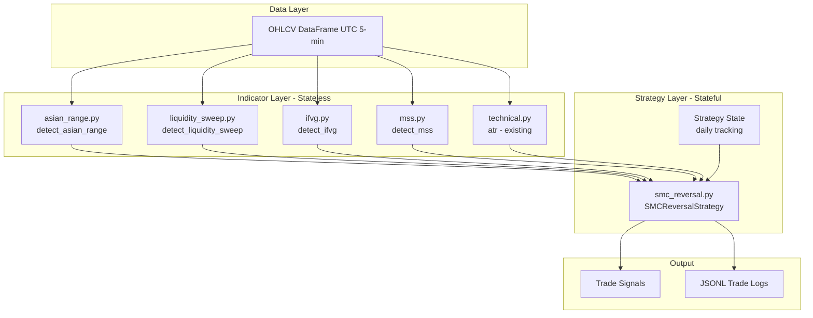

# SMC/ICT Strategy Implementation Plan

> **Document Version**: 2026-03-06  
> **Status**: Planning Phase  
> **Architecture**: Hybrid (Standalone Strategy + Reusable Indicators)

---

## 1. Executive Summary

This plan outlines the implementation of the SMC/ICT reversal strategy as specified in the brief. The approach uses a **hybrid architecture** where:

- **Reusable indicators** are built as stateless functions in `src/indicators/`
- **Stateful strategy logic** is implemented in `src/strategies/smc_reversal.py`
- **Optional pattern wrapper** can be added later for confluence integration

---

## 2. Architecture Overview



---

## 3. File Structure

```
src/
├── indicators/
│   ├── __init__.py              # Update exports
│   ├── technical.py             # EXISTING - add EMA-based ATR
│   ├── pivots.py                # EXISTING - leverage for MSS
│   ├── regime.py                # EXISTING - HTF bias
│   ├── asian_range.py           # NEW
│   ├── liquidity_sweep.py       # NEW
│   ├── ifvg.py                  # NEW
│   └── mss.py                   # NEW
│
├── strategies/
│   ├── __init__.py              # Update exports
│   ├── confluence.py            # EXISTING
│   └── smc_reversal.py          # NEW - Main strategy
│
├── risk/
│   ├── __init__.py              # NEW
│   ├── position_sizing.py       # NEW - Enhanced with slippage
│   └── daily_limits.py          # NEW - Circuit breaker
│
├── utils/
│   ├── logging_config.py        # NEW - loguru JSON setup
│   └── backtest_helpers.py      # NEW - Walk-forward utilities
│
├── data/
│   ├── fetcher.py               # NEW - Enhanced yfinance wrapper
│   └── validator.py             # NEW - Data quality checks
│
├── config/
│   ├── parameters.yaml          # NEW - Strategy parameters
│   └── assets.yaml              # NEW - Tradable symbols
│
scripts/
├── test_setup.py                # NEW - Environment verification
├── run_backtest.py              # NEW - CLI entry point
└── generate_report.py           # NEW - Performance summary

notebooks/
├── 01_data_exploration.ipynb    # NEW
├── 02_strategy_prototype.ipynb  # NEW
└── 03_walk_forward_validation.ipynb  # NEW

tests/
├── test_asian_range.py          # NEW
├── test_sweep_logic.py          # NEW
├── test_position_size.py        # NEW
└── test_smc_strategy.py         # NEW
```

---

## 4. Module Specifications

### 4.1 Indicator: `src/indicators/asian_range.py`

```python
"""
Asian Session Range Detection

Detects the Asian trading session range for SMC/ICT liquidity analysis.
"""

from typing import TypedDict, Optional
import pandas as pd
from loguru import logger


class AsianRange(TypedDict):
    """Asian session range result."""
    asia_high: float
    asia_low: float
    range_size: float
    bar_count: int
    is_low_vol: bool  # True if range < 0.3 * ATR(14)
    session_start: str
    session_end: str


def detect_asian_range(
    df: pd.DataFrame,
    session_start: str = "00:00",
    session_end: str = "08:00",
    atr_period: int = 14,
    low_vol_threshold: float = 0.3
) -> AsianRange:
    """
    Detect Asian session high/low for liquidity range analysis.
    
    Args:
        df: OHLCV DataFrame with UTC datetime index (5-minute bars)
        session_start: UTC time string for session start (default "00:00")
        session_end: UTC time string for session end (default "08:00")
        atr_period: ATR period for low volatility detection
        low_vol_threshold: ATR multiplier threshold for low vol (default 0.3)
    
    Returns:
        AsianRange dict with:
        - asia_high: Session high price
        - asia_low: Session low price
        - range_size: High - Low
        - bar_count: Number of bars in session (expected: 96)
        - is_low_vol: Whether session is low volatility
        - session_start/end: Time strings used
    
    Raises:
        ValueError: If df is empty or missing required columns
    
    Example:
        >>> df = pd.DataFrame(...)  # 5-min OHLCV with UTC index
        >>> range_info = detect_asian_range(df)
        >>> print(f"Asian High: {range_info['asia_high']}")
    """
    pass


def get_session_bars(
    df: pd.DataFrame,
    session_start: str,
    session_end: str
) -> pd.DataFrame:
    """
    Filter DataFrame to only include bars within session times.
    
    Uses df.between_time() for vectorized filtering.
    Handles overnight sessions where end < start.
    """
    pass


def validate_session_data(
    df: pd.DataFrame,
    expected_bars: int = 96
) -> tuple[bool, list[str]]:
    """
    Validate session data quality.
    
    Checks:
    - Bar count matches expected (96 for 5-min bars in 8-hour session)
    - No missing bars (gaps in timestamp)
    - No duplicate timestamps
    
    Returns:
        Tuple of (is_valid, list of warnings)
    """
    pass
```

---

### 4.2 Indicator: `src/indicators/liquidity_sweep.py`

```python
"""
Liquidity Sweep Detection

Detects when price sweeps beyond Asian session range to target stop losses.
"""

from typing import TypedDict, Optional, Literal
import pandas as pd
import numpy as np
from loguru import logger


class SweepResult(TypedDict):
    """Liquidity sweep detection result."""
    sweep_detected: bool
    sweep_direction: Optional[Literal['bullish', 'bearish']]
    sweep_price: Optional[float]
    sweep_bar_index: Optional[int]
    sweep_timestamp: Optional[pd.Timestamp]
    volume_confirmed: bool  # sweep bar volume > 20-period median
    buffer_used: float  # ATR buffer applied


def detect_liquidity_sweep(
    df: pd.DataFrame,
    asia_high: float,
    asia_low: float,
    atr: float,
    buffer_mult: float = 0.5,
    volume_threshold_mult: float = 1.0,
    lookback_bars: int = 20
) -> SweepResult:
    """
    Detect liquidity sweep beyond Asian range with ATR buffer.
    
    A sweep occurs when price breaks above asia_high + buffer OR
    below asia_low - buffer.
    
    Args:
        df: Post-session OHLCV DataFrame (after 08:00 UTC)
        asia_high: Pre-computed Asian session high
        asia_low: Pre-computed Asian session low
        atr: Current ATR(14) value
        buffer_mult: Buffer multiplier (default 0.5 = half ATR)
        volume_threshold_mult: Volume threshold multiplier (default 1.0)
        lookback_bars: Bars to calculate median volume (default 20)
    
    Returns:
        SweepResult dict with sweep details
    
    Edge Cases:
    - Sweep exactly at session boundary: uses >= for break detection
    - Multiple sweeps: only FIRST valid sweep triggers setup
    - Low-volume filter: skip if Asian range < 0.3 * ATR
    
    Example:
        >>> result = detect_liquidity_sweep(df, asia_high=182.50, asia_low=180.00, atr=1.20)
        >>> if result['sweep_detected']:
        ...     print(f"Sweep direction: {result['sweep_direction']}")
    """
    pass


def calculate_volume_threshold(
    df: pd.DataFrame,
    lookback: int = 20
) -> float:
    """
    Calculate median volume over lookback period.
    
    Returns:
        Median volume value
    """
    pass


def is_valid_sweep_time(
    timestamp: pd.Timestamp,
    valid_start: str = "08:00",
    valid_end: str = "23:59"
) -> bool:
    """
    Check if sweep occurs within valid trading hours.
    
    Sweeps before session end are not valid.
    """
    pass
```

---

### 4.3 Indicator: `src/indicators/ifvg.py`

```python
"""
Inverse Fair Value Gap (IFVG) Detection

Detects imbalance zones where price is likely to return.
"""

from typing import TypedDict, Optional, List
import pandas as pd
import numpy as np
from loguru import logger


class IFVG(TypedDict):
    """Fair Value Gap / Imbalance zone."""
    start_index: int
    end_index: int
    high: float  # Top of gap
    low: float   # Bottom of gap
    direction: str  # 'bullish' or 'bearish'
    filled: bool  # Whether price has revisited
    age: int  # Bars since creation


class IFVGResult(TypedDict):
    """IFVG detection result."""
    ifvgs: List[IFVG]
    nearest_bullish: Optional[IFVG]
    nearest_bearish: Optional[IFVG]


def detect_ifvg(
    df: pd.DataFrame,
    atr: float,
    min_gap_mult: float = 1.2,
    max_age: int = 50
) -> IFVGResult:
    """
    Detect Inverse Fair Value Gaps (imbalances).
    
    An IFVG exists when:
    - abs(close[t] - open[t+1]) > min_gap_mult * ATR
    - Price hasn't revisited the gap zone within 3 bars
    
    Args:
        df: OHLCV DataFrame
        atr: Current ATR value
        min_gap_mult: Minimum gap size as ATR multiplier (default 1.2)
        max_age: Maximum bars to track unfilled IFVGs (default 50)
    
    Returns:
        IFVGResult with list of IFVGs and nearest by direction
    
    Example:
        >>> result = detect_ifvg(df, atr=1.5)
        >>> if result['nearest_bullish']:
        ...     print(f"Nearest bullish IFVG: {result['nearest_bullish']['low']} - {result['nearest_bullish']['high']}")
    """
    pass


def find_nearest_ifvg(
    df: pd.DataFrame,
    current_price: float,
    ifvgs: List[IFVG],
    direction: str,
    proximity_mult: float = 1.5,
    atr: float = None
) -> Optional[IFVG]:
    """
    Find nearest unfilled IFVG within proximity.
    
    Args:
        current_price: Current price
        ifvgs: List of IFVGs to search
        direction: 'bullish' or 'bearish'
        proximity_mult: Max distance as ATR multiplier (default 1.5)
        atr: ATR value for proximity calculation
    
    Returns:
        Nearest IFVG within proximity, or None
    """
    pass


def check_ifvg_fill(
    df: pd.DataFrame,
    ifvg: IFVG,
    current_index: int
) -> bool:
    """
    Check if price has filled (revisited) the IFVG zone.
    
    An IFVG is filled when price trades through the gap zone.
    """
    pass
```

---

### 4.4 Indicator: `src/indicators/mss.py`

```python
"""
Market Structure Shift (MSS) Detection

Detects break of structure indicating potential trend reversal.
"""

from typing import TypedDict, Optional, Literal, List
import pandas as pd
import numpy as np
from loguru import logger


class Pivot(TypedDict):
    """Pivot point (swing high/low)."""
    index: int
    timestamp: pd.Timestamp
    price: float
    type: Literal['high', 'low']


class MSSResult(TypedDict):
    """Market Structure Shift detection result."""
    mss_detected: bool
    mss_direction: Optional[Literal['bullish', 'bearish']]
    broken_pivot: Optional[Pivot]
    break_price: Optional[float]
    break_index: Optional[int]
    confirmation_bars: int  # Bars since break
    is_confirmed: bool  # 3-bar confirmation


def detect_mss(
    df: pd.DataFrame,
    lookback: int = 3,
    confirmation_bars: int = 3
) -> MSSResult:
    """
    Detect Market Structure Shift (break of structure).
    
    MSS occurs when:
    - Bullish: Price breaks above recent swing high
    - Bearish: Price breaks below recent swing low
    
    Confirmation requires price to close beyond the pivot.
    
    Args:
        df: OHLCV DataFrame
        lookback: Bars on each side for pivot detection (default 3)
        confirmation_bars: Bars to wait for confirmation (default 3)
    
    Returns:
        MSSResult with MSS details
    
    Example:
        >>> result = detect_mss(df)
        >>> if result['mss_detected'] and result['is_confirmed']:
        ...     print(f"MSS confirmed: {result['mss_direction']}")
    """
    pass


def find_recent_pivots(
    df: pd.DataFrame,
    lookback: int = 3,
    max_pivots: int = 5
) -> dict[str, List[Pivot]]:
    """
    Find recent swing highs and lows.
    
    Returns:
        Dict with 'highs' and 'lows' lists of Pivot objects
    """
    pass


def check_pivot_break(
    df: pd.DataFrame,
    pivot: Pivot,
    current_index: int
) -> tuple[bool, float]:
    """
    Check if price has broken a pivot.
    
    Returns:
        Tuple of (is_broken, break_price)
    """
    pass
```

---

### 4.5 Strategy: `src/strategies/smc_reversal.py`

```python
"""
SMC/ICT Reversal Strategy

Implements the Smart Money Concepts / ICT reversal protocol:
1. Track Asian session range (00:00-08:00 UTC)
2. Detect liquidity sweep beyond Asian range
3. Confirm Market Structure Shift (MSS)
4. Enter on IFVG retest with HTF bias alignment
5. Manage trade with BE@1R, scale@2R, target@2.5R
"""

from typing import Optional, Literal, List, Dict, Any
from dataclasses import dataclass, field
from enum import Enum
import pandas as pd
import numpy as np
from loguru import logger

from ..indicators.asian_range import detect_asian_range, AsianRange
from ..indicators.liquidity_sweep import detect_liquidity_sweep, SweepResult
from ..indicators.ifvg import detect_ifvg, find_nearest_ifvg, IFVGResult
from ..indicators.mss import detect_mss, MSSResult
from ..indicators.technical import atr


class StrategyState(Enum):
    """Strategy state machine states."""
    WAITING_ASIAN = "waiting_asian"
    TRACKING_ASIAN = "tracking_asian"
    WAITING_SWEEP = "waiting_sweep"
    SWEEP_DETECTED = "sweep_detected"
    MSS_CONFIRMED = "mss_confirmed"
    IN_TRADE = "in_trade"
    DAILY_COMPLETE = "daily_complete"


@dataclass
class TradeSetup:
    """Active trade setup information."""
    direction: Literal['long', 'short']
    entry_zone: tuple[float, float]  # (limit_price, tolerance)
    stop_price: float
    target_1: float  # 2.5R
    target_2: float  # 2R (scale out)
    breakeven_price: float  # 1R level
    sweep_price: float
    ifvg_distance: float
    setup_time: pd.Timestamp
    order_placed: bool = False
    order_type: str = 'limit'  # 'limit' or 'market'


@dataclass
class TradeResult:
    """Completed trade result."""
    direction: Literal['long', 'short']
    entry_price: float
    exit_price: float
    entry_time: pd.Timestamp
    exit_time: pd.Timestamp
    pnl: float
    pnl_pct: float
    r_multiple: float
    exit_reason: str  # 'target', 'stop', 'breakeven', 'end_of_day'
    setup_details: Dict[str, Any] = field(default_factory=dict)


class SMCReversalStrategy:
    """
    SMC/ICT Reversal Strategy Implementation.
    
    Stateful strategy that tracks daily cycles and manages positions
    according to SMC/ICT methodology.
    
    Example:
        >>> strategy = SMCReversalStrategy(
        ...     session_start="00:00",
        ...     session_end="08:00",
        ...     risk_pct=0.01
        ... )
        >>> signals = strategy.run(df)
    """
    
    def __init__(
        self,
        session_start: str = "00:00",
        session_end: str = "08:00",
        atr_period: int = 14,
        buffer_mult: float = 0.5,
        risk_pct: float = 0.01,
        slippage_buffer: float = 0.1,
        target_r: float = 2.5,
        scale_r: float = 2.0,
        breakeven_r: float = 1.0,
        max_daily_loss_pct: float = 0.03,
        htf_bias_source: Optional[str] = None,
        log_level: str = "INFO"
    ):
        """
        Initialize SMC Reversal Strategy.
        
        Args:
            session_start: Asian session start time UTC
            session_end: Asian session end time UTC
            atr_period: ATR lookback period
            buffer_mult: ATR buffer for sweep detection
            risk_pct: Risk per trade as fraction of equity
            slippage_buffer: Additional buffer for execution (ATR multiplier)
            target_r: Target profit in R multiples
            scale_r: Scale-out level in R multiples
            breakeven_r: Move to breakeven at R level
            max_daily_loss_pct: Daily loss circuit breaker
            htf_bias_source: Higher timeframe bias source ('4h', 'daily')
            log_level: Logging level
        """
        self.session_start = session_start
        self.session_end = session_end
        self.atr_period = atr_period
        self.buffer_mult = buffer_mult
        self.risk_pct = risk_pct
        self.slippage_buffer = slippage_buffer
        self.target_r = target_r
        self.scale_r = scale_r
        self.breakeven_r = breakeven_r
        self.max_daily_loss_pct = max_daily_loss_pct
        self.htf_bias_source = htf_bias_source
        self.log_level = log_level
        
        # State
        self.state = StrategyState.WAITING_ASIAN
        self.current_date = None
        self.asian_range: Optional[AsianRange] = None
        self.sweep_result: Optional[SweepResult] = None
        self.mss_result: Optional[MSSResult] = None
        self.active_setup: Optional[TradeSetup] = None
        self.daily_pnl = 0.0
        self.trades: List[TradeResult] = []
    
    def run(
        self,
        df: pd.DataFrame,
