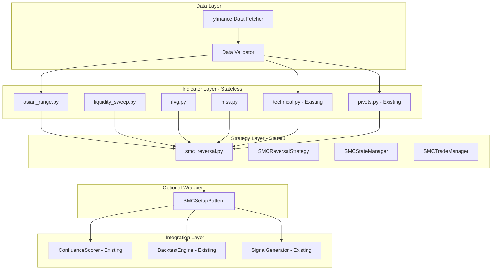
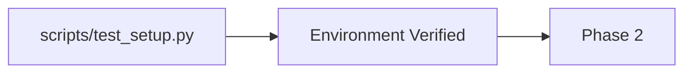
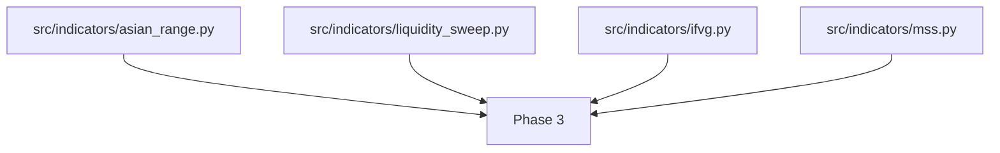
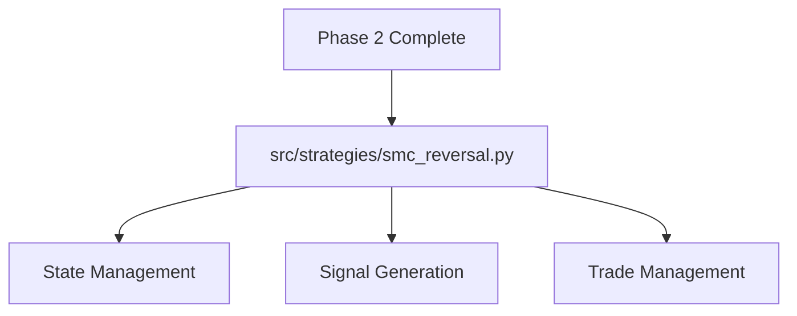
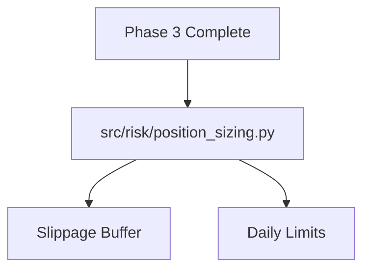
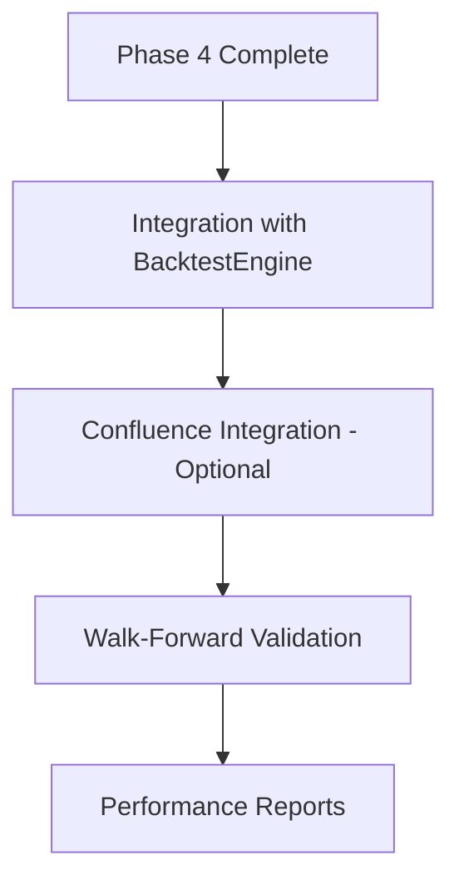
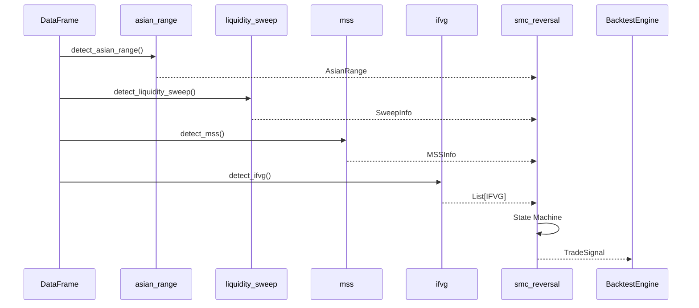

# SMC/ICT Strategy Implementation Plan

> **Version**: 1.0  
> **Date**: 2026-03-06  
> **Status**: Planning  
> **Based on**: SMC-ICT-ML-Hybrid-Backtester Brief

---

## 📋 Executive Summary

This plan outlines the implementation of the SMC/ICT (Smart Money Concepts / Inner Circle Trader) reversal strategy as a standalone module that integrates with the existing pattern detection framework. The strategy uses a **stateful, multi-phase approach** that differs from the bar-by-bar pattern detection model.

### Key Design Decision
**SMC will be implemented as a standalone strategy module** (`src/strategies/smc_reversal.py`) with reusable indicator components, rather than forcing it into the existing `BasePattern` class hierarchy. This preserves the stateful nature of SMC logic while allowing optional confluence integration later.

---

## 🏗️ Architecture Overview



---

## 📁 File Structure

```
src/
├── indicators/
│   ├── __init__.py              # UPDATE: Export new indicators
│   ├── technical.py             # EXISTING: ATR, RSI, ADX, etc.
│   ├── pivots.py                # EXISTING: Swing detection
│   ├── regime.py                # EXISTING: Market regime
│   ├── fibonacci.py             # EXISTING: Fib levels
│   ├── asian_range.py           # NEW: Session range detection
│   ├── liquidity_sweep.py       # NEW: Sweep detection
│   ├── ifvg.py                  # NEW: Imbalance/FVG detection
│   └── mss.py                   # NEW: Market Structure Shift
│
├── strategies/
│   ├── __init__.py              # UPDATE: Export SMC strategy
│   ├── confluence.py            # EXISTING: Confluence scoring
│   └── smc_reversal.py          # NEW: Full SMC strategy
│
├── patterns/
│   └── smc/                     # NEW: Optional wrapper
│       ├── __init__.py
│       └── smc_setup.py         # Wraps strategy for confluence
│
├── risk/
│   ├── __init__.py              # NEW
│   ├── position_sizing.py       # NEW: Enhanced with slippage buffer
│   └── daily_limits.py          # NEW: Circuit breaker logic
│
├── utils/
│   ├── __init__.py              # EXISTING
│   ├── helpers.py               # EXISTING
│   ├── validators.py            # EXISTING
│   └── logging_config.py        # NEW: loguru JSON setup
│
├── data/
│   ├── __init__.py              # NEW
│   ├── fetcher.py               # NEW: Enhanced yfinance wrapper
│   └── validator.py             # NEW: Data quality checks
│
├── config.py                    # UPDATE: Add SMC parameters
└── main.py                      # EXISTING

scripts/
└── test_setup.py                # NEW: Environment verification

config/
├── parameters.yaml              # NEW: Strategy parameters
└── assets.yaml                  # NEW: Tradable symbols

tests/
├── test_asian_range.py          # NEW
├── test_sweep_logic.py          # NEW
├── test_position_size.py        # NEW
└── test_smc_strategy.py         # NEW

notebooks/
├── 01_data_exploration.ipynb    # NEW
├── 02_strategy_prototype.ipynb  # NEW
└── 03_walk_forward_validation.ipynb # NEW
```

---

## 🔧 Module Specifications

### 1. `src/indicators/asian_range.py`

**Purpose**: Detect and track Asian session liquidity range

```python
"""
Asian Session Range Detection

Detects the Asian session range (00:00-08:00 UTC) for liquidity mapping.
Used by SMC/ICT strategies to identify sweep targets.
"""

import pandas as pd
import numpy as np
from typing import Dict, Optional, Tuple
from dataclasses import dataclass
from loguru import logger


@dataclass
class AsianRange:
    """
    Asian session range data container.
    
    Attributes:
        high: Session high price
        low: Session low price
        range_size: High - Low
        bar_count: Number of bars in session
        is_low_vol: True if range < 0.3 * ATR
        session_start: Session start timestamp
        session_end: Session end timestamp
        atr_value: ATR at session end
    """
    high: float
    low: float
    range_size: float
    bar_count: int
    is_low_vol: bool
    session_start: pd.Timestamp
    session_end: pd.Timestamp
    atr_value: float


def detect_asian_range(
    df: pd.DataFrame,
    session_start: str = "00:00",
    session_end: str = "08:00",
    atr_period: int = 14,
    low_vol_threshold: float = 0.3
) -> Optional[AsianRange]:
    """
    Detect Asian session range for liquidity mapping.
    
    Args:
        df: OHLCV DataFrame with UTC datetime index (5-minute bars)
        session_start: UTC time string for session start (default: "00:00")
        session_end: UTC time string for session end (default: "08:00")
        atr_period: ATR period for volatility comparison
        low_vol_threshold: Range/ATR ratio threshold for low volatility flag
    
    Returns:
        AsianRange object if session data exists, None otherwise
    
    Raises:
        ValueError: If DataFrame lacks required columns or datetime index
    
    Example:
        >>> df = pd.read_csv('data.csv', parse_dates=True, index_col=0)
        >>> range_info = detect_asian_range(df, atr_period=14)
        >>> print(f"Asian High: {range_info.high}, Low: {range_info.low}")
    
    Note:
        - Expects 96 bars for a complete 8-hour session (5-min bars)
        - Logs warning if bar_count != 96 (missing data)
        - Uses df.between_time() for session filtering
    """
    pass


def get_asian_range_for_day(
    df: pd.DataFrame,
    date: pd.Timestamp,
    session_start: str = "00:00",
    session_end: str = "08:00"
) -> Optional[pd.DataFrame]:
    """
    Extract Asian session data for a specific day.
    
    Args:
        df: OHLCV DataFrame with UTC datetime index
        date: Target date
        session_start: UTC time string for session start
        session_end: UTC time string for session end
    
    Returns:
        DataFrame filtered to session bars, or None if no data
    """
    pass


def calculate_session_statistics(
    df: pd.DataFrame,
    session_start: str = "00:00",
    session_end: str = "08:00"
) -> pd.DataFrame:
    """
    Calculate daily session statistics over historical data.
    
    Args:
        df: OHLCV DataFrame with UTC datetime index
        session_start: UTC time string for session start
        session_end: UTC time string for session end
    
    Returns:
        DataFrame with daily session high, low, range, bar_count
    """
    pass
```

---

### 2. `src/indicators/liquidity_sweep.py`

**Purpose**: Detect liquidity sweeps beyond session range

```python
"""
Liquidity Sweep Detection

Identifies when price sweeps beyond session highs/lows to trigger
stop losses before reversing. Core SMC/ICT concept.
"""

import pandas as pd
import numpy as np
from typing import Dict, Optional, Literal
from dataclasses import dataclass
from loguru import logger


@dataclass
class SweepInfo:
    """
    Liquidity sweep information container.
    
    Attributes:
        detected: Whether a sweep was detected
        direction: Sweep direction - bullish or bearish
        sweep_price: Price at which sweep occurred
        sweep_bar_index: Bar index of sweep
        sweep_time: Timestamp of sweep
        volume_confirmed: True if sweep bar volume > 20-period median
        asia_level: The Asia high/low that was swept
        buffer_used: ATR buffer applied to the level
    """
    detected: bool
    direction: Optional[Literal['bullish', 'bearish']]
    sweep_price: Optional[float]
    sweep_bar_index: Optional[int]
    sweep_time: Optional[pd.Timestamp]
    volume_confirmed: bool
    asia_level: Optional[float]
    buffer_used: float


def detect_liquidity_sweep(
    df: pd.DataFrame,
    asia_high: float,
    asia_low: float,
    atr: float,
    buffer_mult: float = 0.5,
    volume_threshold_mult: float = 1.0,
    lookback_bars: int = 20
) -> SweepInfo:
    """
    Detect liquidity sweep beyond Asian range with ATR buffer.
    
    A sweep occurs when price breaks beyond the Asian session high/low
    by at least buffer_mult * ATR, indicating stop loss hunting.
    
    Args:
        df: Post-session OHLCV DataFrame (must have Asia session completed)
        asia_high: Pre-computed Asian session high
        asia_low: Pre-computed Asian session low
        atr: Current ATR(14) value
        buffer_mult: Buffer multiplier for sweep detection (default: 0.5)
        volume_threshold_mult: Volume threshold multiplier (default: 1.0)
        lookback_bars: Bars to look back for median volume (default: 20)
    
    Returns:
        SweepInfo with sweep details
    
    Example:
        >>> sweep = detect_liquidity_sweep(df, asia_high=100.5, asia_low=99.0, atr=0.5)
        >>> if sweep.detected:
        ...     print(f"Sweep at {sweep.sweep_price}, direction: {sweep.direction}")
    
    Edge Cases:
        - Sweep exactly at session boundary: Uses >= for break detection
        - Multiple sweeps: Only first valid sweep triggers setup
        - Low-volume filter: Skip if Asian range < 0.3 * ATR
    """
    pass


def find_sweep_candle(
    df: pd.DataFrame,
    level: float,
    direction: Literal['above', 'below'],
    buffer: float
) -> Optional[pd.Series]:
    """
    Find the first candle that sweeps a level.
    
    Args:
        df: OHLCV DataFrame
        level: Price level to check
        direction: Direction to check - above or below
        buffer: Buffer beyond level for confirmation
    
    Returns:
        First bar that sweeps the level, or None
    """
    pass


def validate_sweep_volume(
    df: pd.DataFrame,
    sweep_bar_index: int,
    lookback_bars: int = 20,
    threshold_mult: float = 1.0
) -> bool:
    """
    Validate that sweep bar has sufficient volume.
    
    Args:
        df: OHLCV DataFrame with Volume column
        sweep_bar_index: Index of the sweep bar
        lookback_bars: Bars to calculate median volume
        threshold_mult: Multiplier for median volume threshold
    
    Returns:
        True if volume > threshold_mult * median_volume
    """
    pass
```

---

### 3. `src/indicators/ifvg.py`

**Purpose**: Detect Inverse Fair Value Gaps (imbalance zones)

```python
"""
Inverse Fair Value Gap (IFVG) Detection

Identifies imbalance zones where price moved quickly, leaving gaps
that act as support/resistance zones for entries.
"""

import pandas as pd
import numpy as np
from typing import List, Optional, Tuple
from dataclasses import dataclass
from loguru import logger


@dataclass
class IFVG:
    """
    Inverse Fair Value Gap container.
    
    Attributes:
        high: Upper boundary of the gap
        low: Lower boundary of the gap
        direction: Gap direction - bullish or bearish
        start_bar: Bar index where gap started
        end_bar: Bar index where gap ended
        filled: Whether the gap has been filled
        fill_bar: Bar index where gap was filled (if filled)
        atr_at_creation: ATR value when gap formed
    """
    high: float
    low: float
    direction: str  # 'bullish' or 'bearish'
    start_bar: int
    end_bar: int
    filled: bool = False
    fill_bar: Optional[int] = None
    atr_at_creation: float = 0.0


@dataclass
class IFVGProximity:
    """
    IFVG proximity information for entry decisions.
    
    Attributes:
        nearest_ifvg: The nearest unfilled IFVG
        distance: Distance from current price to IFVG edge
        distance_atr_ratio: Distance normalized by ATR
        edge_price: The IFVG edge price closest to current price
        is_bullish: Whether the IFVG is bullish
    """
    nearest_ifvg: Optional[IFVG]
    distance: float
    distance_atr_ratio: float
    edge_price: float
    is_bullish: bool


def detect_ifvg(
    df: pd.DataFrame,
    atr: pd.Series,
    atr_mult: float = 1.2,
    min_gap_bars: int = 3
) -> List[IFVG]:
    """
    Detect Inverse Fair Value Gaps in price data.
    
    An IFVG forms when there's an imbalance where:
    abs(close[t] - open[t+1]) > atr_mult * ATR
    
    The gap is considered unfilled if price hasn't revisited
    the gap zone within min_gap_bars.
    
    Args:
        df: OHLCV DataFrame
        atr: ATR series aligned with df
        atr_mult: Minimum gap size as ATR multiplier (default: 1.2)
        min_gap_bars: Bars to wait before considering gap unfilled
    
    Returns:
        List of IFVG objects
    
    Example:
        >>> ifvgs = detect_ifvg(df, atr, atr_mult=1.2)
        >>> for ifvg in ifvgs:
        ...     print(f"IFVG: {ifvg.low} - {ifvg.high}, filled: {ifvg.filled}")
    """
    pass


def find_nearest_unfilled_ifvg(
    df: pd.DataFrame,
    ifvgs: List[IFVG],
    current_bar: int,
    atr: float,
    proximity_threshold: float = 1.5
) -> IFVGProximity:
    """
    Find the nearest unfilled IFVG for entry decisions.
    
    Args:
        df: OHLCV DataFrame
        ifvgs: List of detected IFVGs
        current_bar: Current bar index
        atr: Current ATR value
        proximity_threshold: Maximum distance/ATR ratio to consider
    
    Returns:
        IFVGProximity with nearest IFVG details
    """
    pass


def update_ifvg_status(
    ifvgs: List[IFVG],
    df: pd.DataFrame,
    current_bar: int
) -> List[IFVG]:
    """
    Update IFVG fill status based on price action.
    
    Args:
        ifvgs: List of IFVGs to update
        df: OHLCV DataFrame
        current_bar: Current bar index
    
    Returns:
        Updated list of IFVGs
    """
    pass
```

---

### 4. `src/indicators/mss.py`

**Purpose**: Detect Market Structure Shift (MSS) - 3-bar pivot breaks

```python
"""
Market Structure Shift (MSS) Detection

Identifies when market structure changes direction through
3-bar pivot breaks. Core SMC/ICT concept for entry confirmation.
"""

import pandas as pd
import numpy as np
from typing import Optional, Literal, Tuple
from dataclasses import dataclass
from loguru import logger


@dataclass
class MSSInfo:
    """
    Market Structure Shift information.
    
    Attributes:
        detected: Whether MSS was detected
        direction: MSS direction - bullish or bearish
        pivot_high: The pivot high that was broken (for bearish MSS)
        pivot_low: The pivot low that was broken (for bullish MSS)
        break_bar: Bar index where the break occurred
        break_price: Price at which structure broke
        confirmation_bar: Bar index where MSS was confirmed
        is_valid: Whether MSS meets all validation criteria
    """
    detected: bool
    direction: Optional[Literal['bullish', 'bearish']]
    pivot_high: Optional[float]
    pivot_low: Optional[float]
    break_bar: Optional[int]
    break_price: Optional[float]
    confirmation_bar: Optional[int]
    is_valid: bool


def detect_mss(
    df: pd.DataFrame,
    lookback: int = 3,
    require_close: bool = True
) -> MSSInfo:
    """
    Detect Market Structure Shift using 3-bar pivot breaks.
    
    A bullish MSS occurs when price breaks above a pivot high.
    A bearish MSS occurs when price breaks below a pivot low.
    
    Args:
        df: OHLCV DataFrame
        lookback: Number of bars for pivot detection (default: 3)
        require_close: If True, require close beyond pivot; if False, wick is OK
    
    Returns:
        MSSInfo with MSS details
    
    Example:
        >>> mss = detect_mss(df, lookback=3, require_close=True)
        >>> if mss.detected:
        ...     print(f"MSS direction: {mss.direction}, break at {mss.break_price}")
    """
    pass


def find_pivot_high(
    df: pd.DataFrame,
    bar_index: int,
    lookback: int = 3
) -> Optional[Tuple[int, float]]:
    """
    Find the most recent pivot high.
    
    Args:
        df: OHLCV DataFrame
        bar_index: Current bar index
        lookback: Bars on each side for pivot confirmation
    
    Returns:
        Tuple of (bar_index, price) of pivot high, or None
    """
    pass


def find_pivot_low(
    df: pd.DataFrame,
    bar_index: int,
    lookback: int = 3
) -> Optional[Tuple[int, float]]:
    """
    Find the most recent pivot low.
    
    Args:
        df: OHLCV DataFrame
        bar_index: Current bar index
        lookback: Bars on each side for pivot confirmation
    
    Returns:
        Tuple of (bar_index, price) of pivot low, or None
    """
    pass


def validate_mss_with_htf(
    df: pd.DataFrame,
    mss_info: MSSInfo,
    htf_bias: Literal['bullish', 'bearish', 'neutral']
) -> bool:
    """
    Validate MSS alignment with Higher Timeframe bias.
    
    Args:
        df: OHLCV DataFrame
        mss_info: MSS information
        htf_bias: Higher timeframe bias direction
    
    Returns:
        True if MSS aligns with HTF bias
    """
    pass
```

---

### 5. `src/strategies/smc_reversal.py`

**Purpose**: Main SMC reversal strategy with state management

```python
"""
SMC/ICT Reversal Strategy

Implements a stateful, multi-phase reversal strategy based on
Smart Money Concepts / ICT methodology.

Strategy Flow:
1. Daily Reset at 00:00 UTC
2. Track Asian Session Range (00:00-08:00 UTC)
3. Detect Liquidity Sweep post-08:00 UTC
4. Confirm Market Structure Shift (MSS)
5. Validate with HTF bias and IFVG proximity
6. Place limit order at IFVG edge
7. Trade management: BE@1R, scale@2R, target@2.5R
"""

import pandas as pd
import numpy as np
from typing import Dict, List, Optional, Literal, Tuple
from dataclasses import dataclass, field
from enum import Enum
from datetime import time, datetime
from loguru import logger

from ..indicators.asian_range import detect_asian_range, AsianRange
from ..indicators.liquidity_sweep import detect_liquidity_sweep, SweepInfo
from ..indicators.ifvg import detect_ifvg, find_nearest_unfilled_ifvg, IFVG, IFVGProximity
from ..indicators.mss import detect_mss, MSSInfo
from ..indicators.technical import atr


class StrategyState(Enum):
    """Strategy state machine states."""
    WAITING_ASIA = "waiting_asia"
    TRACKING_ASIA = "tracking_asia"
    ASIA_COMPLETE = "asia_complete"
    SWEEP_DETECTED = "sweep_detected"
    MSS_CONFIRMED = "mss_confirmed"
    ENTRY_PENDING = "entry_pending"
    IN_TRADE = "in_trade"
    DAILY_RESET = "daily_reset"


@dataclass
class SMCConfig:
    """
    SMC Strategy Configuration.
    
    Attributes:
        session_start: Asian session start time (UTC)
        session_end: Asian session end time (UTC)
        atr_period: ATR calculation period
        atr_buffer_mult: ATR buffer for sweep detection
        ifvg_atr_mult: ATR multiplier for IFVG detection
        ifvg_proximity_mult: ATR multiplier for IFVG proximity
        risk_per_trade: Risk per trade as fraction of equity
        slippage_buffer: Slippage buffer as fraction of ATR
        target_1r: First target at 1R (breakeven)
        target_2r: Second target at 2R (scale out)
        target_final: Final target at 2.5R
        daily_loss_limit: Daily loss limit as fraction of equity
    """
    session_start: str = "00:00"
    session_end: str = "08:00"
    atr_period: int = 14
    atr_buffer_mult: float = 0.5
    ifvg_atr_mult: float = 1.2
    ifvg_proximity_mult: float = 1.5
    risk_per_trade: float = 0.01
    slippage_buffer: float = 0.1
    target_1r: float = 1.0
    target_2r: float = 2.0
    target_final: float = 2.5
    daily_loss_limit: float = 0.03


@dataclass
class TradeSignal:
    """
    SMC Trade Signal.
    
    Attributes:
        timestamp: Signal timestamp
        direction: Trade direction
        entry_price: Entry price
        stop_loss: Stop loss price
        target_1: First target (breakeven)
        target_2: Second target (scale out)
        target_final: Final target
        position_size: Position size in shares/contracts
        risk_amount: Risk amount in currency
        asia_high: Asian session high
        asia_low: Asian session low
        sweep_price: Sweep price
        ifvg_zone: IFVG zone (low, high)
        confidence: Signal confidence (0.0 to 1.0)
        metadata: Additional information
    """
    timestamp: pd.Timestamp
    direction: Literal['long', 'short']
    entry_price: float
    stop_loss: float
    target_1: float
    target_2: float
    target_final: float
    position_size: float
    risk_amount: float
    asia_high: float
    asia_low: float
    sweep_price: float
    ifvg_zone: Tuple[float, float]
    confidence: float = 0.5
    metadata: Dict = field(default_factory=dict)


@dataclass
class DailyState:
    """
    Daily strategy state container.
    
    Attributes:
        date: Trading date
        state: Current strategy state
        asia_range: Asian session range data
        sweep_info: Sweep detection data
        mss_info: MSS confirmation data
        ifvgs: List of detected IFVGs
        active_signal: Current active signal (if any)
        daily_pnl: Daily profit/loss
        trades_today: Number of trades today
    """
    date: pd.Timestamp
    state: StrategyState
    asia_range: Optional[AsianRange] = None
    sweep_info: Optional[SweepInfo] = None
    mss_info: Optional[MSSInfo] = None
    ifvgs: List[IFVG] = field(default_factory=list)
    active_signal: Optional[TradeSignal] = None
    daily_pnl: float = 0.0
    trades_today: int = 0


class SMCReversalStrategy:
    """
    SMC/ICT Reversal Strategy Implementation.
    
    A stateful strategy that tracks daily sessions, detects liquidity
    sweeps, confirms market structure shifts, and enters on IFVG zones.
    
    Example:
        >>> config = SMCConfig(risk_per_trade=0.01)
        >>> strategy = SMCReversalStrategy(config)
        >>> signals = strategy.run(df)
        >>> for signal in signals:
        ...     print(f"{signal.direction} @ {signal.entry_price}")
    """
    
    def __init__(self, config: Optional[SMCConfig] = None):
        """
        Initialize SMC Strategy.
        
        Args:
            config: Strategy configuration (uses defaults if None)
        """
        self.config = config or SMCConfig()
        self.state: Optional[DailyState] = None
        self.signals: List[TradeSignal] = []
        self._atr_series: Optional[pd.Series] = None
        
    def run(self, df: pd.DataFrame) -> List[TradeSignal]:
        """
        Run strategy on historical data.
        
        Args:
            df: OHLCV DataFrame with UTC datetime index (5-minute bars)
        
        Returns:
            List of trade signals
        
        Raises:
            ValueError: If DataFrame lacks required columns or datetime index
        """
        pass
    
    def process_bar(self, df: pd.DataFrame, i: int) -> Optional[TradeSignal]:
        """
        Process a single bar through the state machine.
        
        Args:
            df: OHLCV DataFrame
            i: Current bar index
        
        Returns:
            TradeSignal if entry triggered, None otherwise
        """
        pass
    
    def _check_daily_reset(self, current_time: pd.Timestamp) -> bool:
        """Check if we need to reset for a new trading day."""
        pass
    
    def _reset_daily_state(self, date: pd.Timestamp) -> None:
        """Reset state for a new trading day."""
        pass
    
    def _track_asia_session(self, df: pd.DataFrame, i: int) -> None:
        """Track Asian session range."""
        pass
    
    def _detect_sweep(self, df: pd.DataFrame, i: int) -> Optional[SweepInfo]:
        """Detect liquidity sweep after Asia session."""
        pass
    
    def _confirm_mss(self, df: pd.DataFrame, i: int, sweep_info: SweepInfo) -> Optional[MSSInfo]:
        """Confirm Market Structure Shift."""
        pass
    
    def _validate_setup(
        self,
        df: pd.DataFrame,
        i: int,
        sweep_info: SweepInfo,
        mss_info: MSSInfo
    ) -> Optional[Tuple[float, float]]:
        """
        Validate entry setup.
        
        Returns:
            Tuple of (entry_zone_low, entry_zone_high) if valid, None otherwise
        """
        pass
    
    def _calculate_position_size(
        self,
        account_equity: float,
        entry_price: float,
        stop_price: float,
        atr: float
    ) -> float:
        """
        Calculate position size with slippage buffer.
        
        Formula:
            stop_distance = |entry - stop| + (slippage_buffer * atr)
            position_size = (account_equity * risk_per_trade) / stop_distance
        """
        pass
    
    def _generate_signal(
        self,
        df: pd.DataFrame,
        i: int,
        sweep_info: SweepInfo,
        mss_info: MSSInfo,
        ifvg_proximity: IFVGProximity
    ) -> TradeSignal:
        """Generate trade signal."""
        pass
    
    def get_state_summary(self) -> Dict:
        """Get current strategy state summary for logging."""
        pass
```

---

### 6. `src/risk/position_sizing.py`

**Purpose**: Enhanced position sizing with slippage buffer

```python
"""
Position Sizing Module

Enhanced position sizing with slippage buffer for realistic backtesting.
"""

from typing import Literal
from dataclasses import dataclass


@dataclass
class PositionSizeResult:
    """
    Position sizing result.
    
    Attributes:
        size: Position size in shares/contracts
        risk_amount: Risk amount in currency
        stop_distance: Stop distance in price
        effective_stop: Stop price including slippage buffer
        warning: Warning message if any
    """
    size: float
    risk_amount: float
    stop_distance: float
    effective_stop: float
    warning: Optional[str] = None


def calculate_position_size(
    account_equity: float,
    entry_price: float,
    stop_price: float,
    atr: float,
    risk_pct: float = 0.01,
    slippage_buffer: float = 0.1,
    min_size: float = 1.0,
    max_size: Optional[float] = None,
    sizing_method: Literal['fixed_fractional', 'atr_based'] = 'fixed_fractional'
) -> PositionSizeResult:
    """
    Calculate position size with slippage-aware risk control.
    
    Args:
        account_equity: Current account equity
        entry_price: Entry price
        stop_price: Stop loss price
        atr: Current ATR value
        risk_pct: Risk per trade as fraction of equity (default: 0.01 = 1%)
        slippage_buffer: Slippage buffer as fraction of ATR (default: 0.1)
        min_size: Minimum position size
        max_size: Maximum position size (optional)
        sizing_method: Position sizing method
    
    Returns:
        PositionSizeResult with size and risk details
    
    Formula:
        stop_distance = |entry - stop| + (slippage_buffer * atr)
        position_size = (account_equity * risk_pct) / stop_distance
    
    Example:
        >>> result = calculate_position_size(
        ...     account_equity=100000,
        ...     entry_price=100,
        ...     stop_price=95,
        ...     atr=2,
        ...     risk_pct=0.01,
        ...     slippage_buffer=0.1
        ... )
        >>> print(f"Size: {result.size}, Risk: ${result.risk_amount}")
    
    Note:
        - Rounds down to nearest whole share (equities)
        - Logs warning if position_size < minimum lot size
    """
    pass
```

---

### 7. `scripts/test_setup.py`

**Purpose**: Environment verification script

```python
"""
Environment Verification Script

Validates the development environment setup for SMC strategy development.
"""

import sys
import json
from pathlib import Path
from datetime import datetime, timedelta


def verify_python_version() -> dict:
    """Verify Python version is 3.13.12 or compatible."""
    pass


def verify_packages() -> dict:
    """Verify required packages are installed."""
    pass


def verify_yfinance_connection() -> dict:
    """Verify yfinance can fetch data."""
    pass


def verify_atr_calculation() -> dict:
    """
    Verify ATR calculation matches manual formula.
    
    Cross-checks first 20 values against manual TR formula:
        TR = max(high-low, abs(high-prev_close), abs(low-prev_close))
        ATR = EMA(TR, period)
    
    Logs warning if deviation > 0.1%
    """
    pass


def verify_data_quality() -> dict:
    """Verify data quality checks work."""
    pass


def run_all_checks() -> dict:
    """Run all verification checks."""
    pass


if __name__ == "__main__":
    results = run_all_checks()
    print(json.dumps(results, indent=2))
    sys.exit(0 if results['all_passed'] else 1)
```

---

## 📊 Implementation Phases

### Phase 1: Foundation (Prerequisites)



**Deliverables:**
- [ ] `scripts/test_setup.py` - Environment verification
- [ ] Verify Python 3.13.12 compatibility
- [ ] Verify yfinance data fetching
- [ ] Verify ATR calculation accuracy
- [ ] JSON report generation

**Dependencies:** None

---

### Phase 2: Indicator Layer



**Deliverables:**
- [ ] `src/indicators/asian_range.py` - Session detection
- [ ] `src/indicators/liquidity_sweep.py` - Sweep detection
- [ ] `src/indicators/ifvg.py` - Imbalance zones
- [ ] `src/indicators/mss.py` - Market structure shift
- [ ] Unit tests for each indicator

**Dependencies:** Phase 1 complete

---

### Phase 3: Strategy Layer



**Deliverables:**
- [ ] `src/strategies/smc_reversal.py` - Core strategy
- [ ] State machine implementation
- [ ] Signal generation logic
- [ ] Trade management (BE@1R, scale@2R)
- [ ] Integration tests

**Dependencies:** Phase 2 complete

---

### Phase 4: Risk Management



**Deliverables:**
- [ ] `src/risk/position_sizing.py` - Enhanced sizing
- [ ] `src/risk/daily_limits.py` - Circuit breaker
- [ ] Risk management tests

**Dependencies:** Phase 3 complete

---

### Phase 5: Integration & Testing



**Deliverables:**
- [ ] Integration with existing `BacktestEngine`
- [ ] Optional `src/patterns/smc/smc_setup.py` wrapper
- [ ] Walk-forward validation notebook
- [ ] Performance metrics validation

**Dependencies:** Phase 4 complete

---

## 🔗 Integration Points

### With Existing Code

| New Module | Existing Module | Integration Type |
|------------|-----------------|------------------|
| `asian_range.py` | `technical.py` | Uses ATR function |
| `mss.py` | `pivots.py` | Extends swing detection |
| `smc_reversal.py` | `regime.py` | Uses HTF bias |
| `smc_reversal.py` | `BacktestEngine` | Signal output compatible |
| `smc_setup.py` | `BasePattern` | Optional wrapper |
| `position_sizing.py` | `position_manager.py` | Enhances existing |

### Data Flow



---

## ✅ Testing Requirements

### Unit Tests

| Test File | Coverage |
|-----------|----------|
| `tests/test_asian_range.py` | Session detection edge cases |
| `tests/test_sweep_logic.py` | Sweep detection with mock scenarios |
| `tests/test_position_size.py` | Sizing formula with extreme stops |
| `tests/test_ifvg.py` | IFVG detection and fill status |
| `tests/test_mss.py` | MSS confirmation logic |
| `tests/test_smc_strategy.py` | Full strategy state machine |

### Backtest Validation Checklist

Before accepting any strategy performance:

- [ ] Data completeness: <1% missing bars in test period
- [ ] Transaction costs: 0.1% commission + 0.5×spread slippage applied
- [ ] Out-of-sample test: Last 30% of data never used in parameter tuning
- [ ] Regime analysis: Performance reported separately for VIX <20 / 20-30 / >30
- [ ] Monte Carlo shuffle: Randomize trade sequence 1000×; original P/L > 95th percentile

---

## 📝 Risk Disclaimer

```python
"""
RESEARCH PROTOTYPE DISCLAIMER:
This code is for educational and research purposes only. It does not constitute:
- Financial advice or a recommendation to trade
- A guarantee of future performance or profitability
- A substitute for professional risk management or regulatory compliance

MARKET RISKS:
- Past patterns may not repeat; markets are adversarial and adaptive
- Free data sources (yfinance) may contain gaps, delays, or survivorship bias
- Parameter optimization can create strategies that fail out-of-sample
- Transaction costs (slippage, commissions) can erase theoretical profits
- Concentrated sector exposure (e.g., tech) amplifies correlation risk

USER RESPONSIBILITY:
By using this code, you acknowledge that you:
- Understand the risks of algorithmic trading
- Will conduct independent validation before any capital deployment
- Are responsible for compliance with applicable regulations (e.g., HK SFC)
"""
```

---

## 📅 Next Steps

1. **Review this plan** - Confirm architecture and approach
2. **Switch to Code mode** - Begin implementation with Phase 1
3. **Iterative development** - Complete each phase before proceeding
4. **Continuous testing** - Run tests after each module completion

---

*Document version: 1.0 | Created: 2026-03-06*
