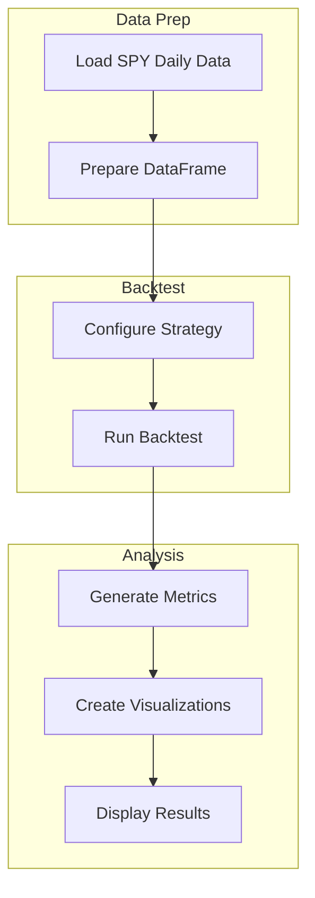

# SPY Long-Term Multi-Pattern Strategy Backtest Plan

## Overview
Backtest the Multi-Pattern Strategy on SPY daily data (2015-2024) and display results in a Jupyter Notebook.

## Data Source
- **File**: `data/raw/SPY_daily.csv`
- **Date Range**: 2015-01-02 to 2024-12-31 (~10 years)
- **Columns**: Date, Open, High, Low, Close, Volume

## Strategy: Multi-Pattern Confluence
The strategy uses 20 pattern detectors across 4 categories:

### Pattern Categories
1. **Basic Patterns** (5)
   - Market Structure Low (MSL)
   - Matching Lows
   - NR7 Inside Day
   - N-Bar Decline
   - Floor Pivot Breakout

2. **Harmonic Patterns** (5)
   - Gartley Pattern
   - ABC Pattern
   - Symmetric Triangle
   - Donchian Channel
   - Bollinger Bands

3. **Complex Patterns** (5)
   - Cup and Handle
   - Head and Shoulders
   - Spike and Ledge
   - Three Hills
   - Parabolic Arc

4. **Classic Patterns** (5)
   - Double Top
   - Double Bottom
   - Trader Vic 2B
   - Triple Top
   - Dead Cat Bounce

### Strategy Parameters (Default)
- `min_confidence`: 0.60 (minimum confidence threshold)
- `min_confluence_count`: 2 (minimum patterns that must agree)
- `risk_per_trade`: 0.02 (2% risk per trade)
- `max_open_positions`: 5
- `use_regime_filter`: True
- `stop_loss_atr_mult`: 2.0
- `take_profit_1_ratio`: 1.0

## Notebook Structure

### 1. Setup and Imports
```python
- Import required libraries
- Set up project path
- Import Multi-Pattern Strategy components
```

### 2. Data Loading and Preparation
```python
- Load SPY_daily.csv
- Parse dates and set index
- Validate data structure
- Display data summary statistics
```

### 3. Data Visualization
```python
- Price chart overview (10-year period)
- Volume analysis
- Annual returns distribution
```

### 4. Strategy Configuration
```python
- Configure strategy parameters for daily timeframe
- Set initial capital ($100,000)
- Set commission (0.1%)
```

### 5. Run Backtest
```python
- Execute backtest using BacktestPyRunner
- Capture results and statistics
```

### 6. Results Analysis
```python
- Performance metrics (Return, Sharpe, Max DD, etc.)
- Equity curve visualization
- Trade analysis (win rate, profit factor, etc.)
- Pattern detection statistics
```

### 7. Detailed Visualizations
```python
- Equity curve with drawdown
- Monthly/Annual returns heatmap
- Trade distribution analysis
```

## Expected Outputs

### Performance Metrics
- Total Return
- Buy & Hold Return (comparison)
- Sharpe Ratio
- Sortino Ratio
- Max Drawdown
- Win Rate
- Profit Factor
- Average Trade Duration

### Visualizations
1. Price chart with pattern markers
2. Equity curve vs Buy & Hold
3. Drawdown chart
4. Monthly returns heatmap
5. Trade distribution by pattern type

## Implementation Files

| File | Purpose |
|------|---------|
| `notebooks/05_spy_longterm_backtest.ipynb` | New Jupyter notebook for SPY backtest |
| `src/strategies/backtest_py/multi_pattern_strategy.py` | Existing strategy (no changes) |
| `src/strategies/backtest_py/runner.py` | Existing runner (no changes) |
| `data/raw/SPY_daily.csv` | Existing data (no changes) |

## Workflow Diagram



## Notes
- The Multi-Pattern Strategy is designed to work with daily bars
- Strategy uses confluence scoring - requires multiple patterns to agree before signaling
- Regime filter helps adapt to market conditions (bull/bear/sideways)
- Results will include comparison vs Buy & Hold benchmark
