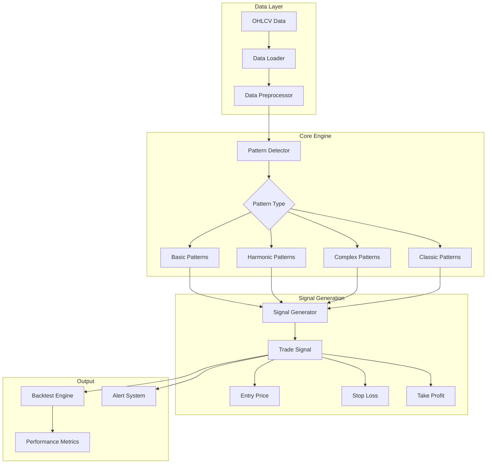
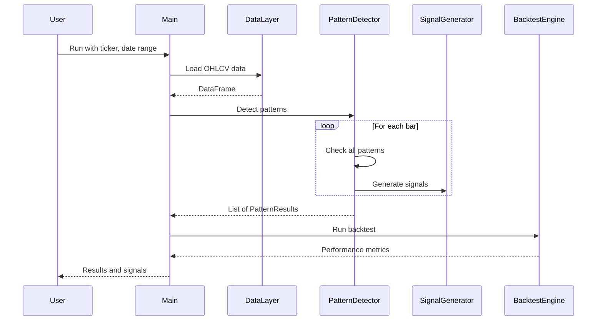

# Trading Pattern Detection System - Implementation Plan

## Overview

This document outlines the architecture and implementation plan for a comprehensive trading pattern detection system. The system will detect 20 chart patterns across 4 categories and generate trading signals with entry, stop-loss, and take-profit levels.

## System Architecture



## Directory Structure

```
src/
├── data_ingestion/
│   └── fetch_data.py          # Existing - data fetching
├── patterns/
│   ├── __init__.py
│   ├── base.py                 # Abstract base class for all patterns
│   ├── basic/                  # Group 1: Basic Patterns
│   │   ├── __init__.py
│   │   ├── msl.py              # Market Structure Low
│   │   ├── matching_lows.py
│   │   ├── nr7id.py            # NR7 Inside Day
│   │   ├── n_bar_decline.py
│   │   └── floor_pivot.py
│   ├── harmonic/               # Group 2: Harmonic/Advanced Patterns
│   │   ├── __init__.py
│   │   ├── gartley.py
│   │   ├── abc.py
│   │   ├── symmetric_triangle.py
│   │   ├── donchian.py
│   │   └── bollinger.py
│   ├── complex/                # Group 3: Complex Patterns
│   │   ├── __init__.py
│   │   ├── cup_handle.py
│   │   ├── head_shoulders.py
│   │   ├── spike_ledge.py
│   │   ├── three_hills.py
│   │   └── parabolic_arc.py
│   └── classic/                # Group 4: Classic Chart Patterns
│       ├── __init__.py
│       ├── double_top.py
│       ├── double_bottom.py
│       ├── trader_vic_2b.py
│       ├── triple_top.py
│       └── dead_cat_bounce.py
├── indicators/
│   ├── __init__.py
│   ├── technical.py            # SMA, ATR, RSI, etc.
│   ├── pivots.py               # Pivot point detection
│   └── fibonacci.py            # Fibonacci calculations
├── signals/
│   ├── __init__.py
│   ├── signal_generator.py     # Generate trade signals
│   └── position_manager.py     # Position sizing, risk management
├── backtest/
│   ├── __init__.py
│   ├── engine.py               # Backtesting engine
│   └── metrics.py              # Performance metrics
├── utils/
│   ├── __init__.py
│   ├── helpers.py              # Utility functions
│   └── validators.py           # Data validation
└── main.py                     # Main entry point
```

## Core Components

### 1. Base Pattern Class

All patterns will inherit from an abstract base class:

```python
from abc import ABC, abstractmethod
from dataclasses import dataclass
from typing import Optional, List, Tuple
from enum import Enum
import pandas as pd

class PatternType(Enum):
    REVERSAL = "Reversal"
    CONTINUATION = "Continuation"
    BREAKOUT = "Breakout"
    COUNTER_TREND = "Counter-Trend Reversal"

class SignalDirection(Enum):
    LONG = "Long"
    SHORT = "Short"

@dataclass
class TradeSignal:
    pattern_name: str
    direction: SignalDirection
    entry_price: float
    stop_loss: float
    take_profit_1: float
    take_profit_2: Optional[float]
    take_profit_3: Optional[float]
    confidence: float  # 0.0 to 1.0
    timestamp: pd.Timestamp
    metadata: dict

@dataclass
class PatternResult:
    detected: bool
    pattern_name: str
    pattern_type: PatternType
    signal: Optional[TradeSignal]
    pivot_points: Optional[dict]
    bars_since_detection: int

class BasePattern(ABC):
    def __init__(self, name: str, pattern_type: PatternType):
        self.name = name
        self.pattern_type = pattern_type
    
    @abstractmethod
    def detect(self, df: pd.DataFrame, i: int) -> PatternResult:
        """Detect pattern at bar index i"""
        pass
    
    @abstractmethod
    def generate_signal(self, df: pd.DataFrame, i: int) -> Optional[TradeSignal]:
        """Generate trade signal if pattern detected"""
        pass
```

### 2. Indicator Utilities

```python
# indicators/technical.py
def sma(data: pd.Series, period: int) -> pd.Series
def atr(df: pd.DataFrame, period: int = 14) -> pd.Series
def rsi(close: pd.Series, period: int = 14) -> pd.Series
def adx(df: pd.DataFrame, period: int = 14) -> pd.Series

# indicators/pivots.py
def find_local_extrema(df: pd.DataFrame, lookback: int = 5) -> pd.DataFrame
def find_swing_highs(df: pd.DataFrame, lookback: int = 5) -> pd.Series
def find_swing_lows(df: pd.DataFrame, lookback: int = 5) -> pd.Series
def calculate_pivot_points(df: pd.DataFrame, i: int) -> dict

# indicators/fibonacci.py
def fibonacci_retracement(high: float, low: float) -> dict
def fibonacci_extension(high: float, low: float, direction: str) -> dict
```

### 3. Pattern Detection Logic

Each pattern will implement detection logic based on the specifications:

#### Example: Market Structure Low (MSL)

```python
class MarketStructureLow(BasePattern):
    def __init__(self):
        super().__init__("Market Structure Low", PatternType.REVERSAL)
    
    def detect(self, df: pd.DataFrame, i: int) -> PatternResult:
        # C[-2], C[-1], C[0] where 0 is current bar
        c_minus_2 = df.iloc[i-2]['Close']
        c_minus_1 = df.iloc[i-1]['Close']
        c_0 = df.iloc[i]['Close']
        
        # Condition 1: Down Move
        condition_1 = c_minus_1 < c_minus_2
        
        # Condition 2: Higher Low of Close
        condition_2 = c_0 > c_minus_1 and c_0 < c_minus_2
        
        # Condition 3: Confirmation (next bar)
        if i + 1 < len(df):
            c_plus_1 = df.iloc[i+1]['Close']
            max_close = max(c_minus_2, c_minus_1, c_0)
            condition_3 = c_plus_1 > max_close
        else:
            condition_3 = False
        
        detected = condition_1 and condition_2 and condition_3
        
        return PatternResult(
            detected=detected,
            pattern_name=self.name,
            pattern_type=self.pattern_type,
            signal=self.generate_signal(df, i) if detected else None,
            pivot_points={'high_close': max(c_minus_2, c_minus_1, c_0)},
            bars_since_detection=0
        )
```

## Pattern Implementation Details

### Group 1: Basic Patterns

| Pattern | Type | Key Detection Criteria | Entry | Stop Loss | Target |
|---------|------|----------------------|-------|-----------|--------|
| MSL | Reversal | 3-bar close sequence, higher low | Buy Stop at Max(Close) + 0.01 | Low[0] - 0.01 | MSH formation |
| Matching Lows | Reversal | 3+ bars testing same support | Buy Stop at High[0] + 0.01 | Min(Low) - 0.01 | 1x-2x breakout bar |
| NR7ID | Breakout | Narrowest 7-day range + Inside Day | Buy/Stop at High/Low ± 0.01 | Opposite side ± 0.01 | Prior swing |
| n-Bar Decline | Counter-Trend | 3+ successive new lows, reversal bar | Buy Stop at High[0] + 0.01 | Low[0] - 0.01 | 0.62x-1.0x decline |
| Floor Pivot | Breakout | Price breaks R1/S1 | Buy/Stop at R1/S1 ± 0.01 | PP level | R2/S2 |

### Group 2: Harmonic/Advanced Patterns

| Pattern | Type | Key Detection Criteria | Entry | Stop Loss | Target |
|---------|------|----------------------|-------|-----------|--------|
| Gartley | Reversal | XABCD with Fib ratios | Confirmation bar | PRZ level | A, 1.27x, 1.62x AD |
| ABC | Reversal | 3-pivot with 38.2-61.8% retracement | Previous bar H/L | C pivot level | 1.0x AB, 1.27x BC |
| Symmetric Triangle | Continuation | Converging trendlines | Breakout bar | Triangle extreme | 50-100% depth |
| Donchian Channel | Breakout | 20-day high/low breakout | Channel breakout | Mid channel | 1.5-2.0x ATR |
| Bollinger Bands | Volatility | Squeeze + breakout | Band breakout | Middle band | 2x band width |

### Group 3: Complex Patterns

| Pattern | Type | Key Detection Criteria | Entry | Stop Loss | Target |
|---------|------|----------------------|-------|-----------|--------|
| Cup and Handle | Continuation | Rounded cup + handle retracement | Right rim breakout | Handle low | 0.62x-1.0x cup depth |
| Head and Shoulders | Reversal | 3 peaks with head highest | Neckline breakdown | Right shoulder | 0.62x-1.0x pattern depth |
| Spike and Ledge | Reversal | Climax spike + tight consolidation | Ledge breakout | Opposite ledge | Prior swing |
| Three Hills | Reversal | 3 hills with Fib retracements | Trendline break | Hill high | 0.62x AB range |
| Parabolic Arc | Reversal | Vertical move + failed test | Failed peak test | Peak + 0.01 | 0.62x parabolic range |

### Group 4: Classic Chart Patterns

| Pattern | Type | Key Detection Criteria | Entry | Stop Loss | Target |
|---------|------|----------------------|-------|-----------|--------|
| Double Top | Reversal | 2 peaks within 5%, volume divergence | Neckline breakdown | Pattern midpoint | 100% pattern depth |
| Double Bottom | Reversal | 2 troughs within 5%, volume divergence | Neckline breakout | Pattern midpoint | 100-162% pattern depth |
| 2B | Reversal | New high/low + failed test | Failed test bar | Recent extreme | 100% prior swing |
| Triple Top | Reversal | 3 peaks within 3%, diminishing volume | Neckline breakdown | Highest peak | 100% pattern depth |
| Dead Cat Bounce | Reversal | 15% event move + 50-62% retracement | 50-62% retracement | Event day extreme | 100% gap range |

## Data Flow



## Implementation Priority

### Phase 1: Foundation
1. Create base pattern class and interfaces
2. Implement indicator utilities (SMA, ATR, RSI, pivots, Fibonacci)
3. Create helper functions for pattern detection

### Phase 2: Basic Patterns
4. Implement MSL pattern
5. Implement Matching Lows pattern
6. Implement NR7ID pattern
7. Implement n-Bar Decline pattern
8. Implement Floor Pivot Breakout pattern

### Phase 3: Harmonic Patterns
9. Implement Gartley pattern
10. Implement ABC pattern
11. Implement Symmetric Triangle pattern
12. Implement Donchian Channel pattern
13. Implement Bollinger Bands pattern

### Phase 4: Complex Patterns
14. Implement Cup and Handle pattern
15. Implement Head and Shoulders pattern
16. Implement Spike and Ledge pattern
17. Implement Three Hills and Mountain pattern
18. Implement Parabolic Arc pattern

### Phase 5: Classic Patterns
19. Implement Double Top pattern
20. Implement Double Bottom pattern
21. Implement Trader Vic's 2B pattern
22. Implement Triple Top pattern
23. Implement Dead Cat Bounce pattern

### Phase 6: Integration
24. Create signal generator module
25. Build backtesting engine
26. Create main orchestrator
27. Write unit tests
28. Create documentation

## Configuration Management

```python
# config.py
PATTERN_CONFIG = {
    'msl': {
        'confirmation_bars': 3,
        'entry_offset': 0.01,
    },
    'matching_lows': {
        'epsilon_atr_multiplier': 0.05,
        'min_test_bars': 3,
    },
    'nr7id': {
        'lookback_bars': 7,
        'entry_offset': 0.01,
    },
    # ... additional pattern configs
}

RISK_CONFIG = {
    'default_stop_offset': 0.01,
    'position_sizing': 'fixed_fractional',
    'risk_per_trade': 0.02,  # 2% of equity
}
```

## Testing Strategy

1. **Unit Tests**: Each pattern detector tested with synthetic data
2. **Integration Tests**: Pattern detection on historical data with known patterns
3. **Backtesting**: Walk-forward optimization on multiple timeframes
4. **Validation**: Compare detected patterns with manual chart analysis

## Output Format

```python
# Example output
{
    'timestamp': '2023-06-15 14:30:00',
    'pattern': 'Market Structure Low',
    'type': 'Reversal',
    'direction': 'Long',
    'entry_price': 152.45,
    'stop_loss': 151.80,
    'take_profit_1': 154.20,
    'take_profit_2': 156.00,
    'confidence': 0.75,
    'metadata': {
        'msl_high_close': 152.44,
        'bars_since_msl': 2,
        'volume_confirmation': True
    }
}
```

## Next Steps

1. Review and approve this plan
2. Switch to Code mode for implementation
3. Start with Phase 1: Foundation components
4. Iteratively implement each pattern group
5. Build integration and testing framework
