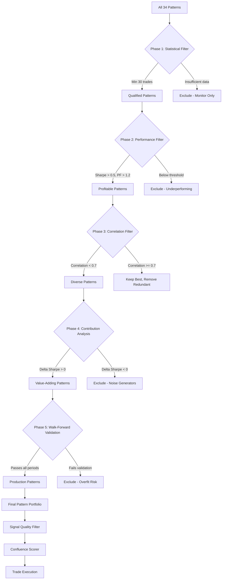
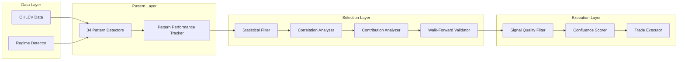

# Pattern Selection Improvement Plan

## Executive Summary

The current multi-pattern trading system is unprofitable primarily because:

1. **Most patterns have insufficient trades** (< 5 trades) for statistical significance
2. **Floor Pivot Breakout** is the only pattern with enough data (134 trades) but has 29% win rate and -224% return
3. **Ablation results show NaN** because the baseline portfolio is so unprofitable that removing patterns doesn't meaningfully change results
4. **No walk-forward validation** - patterns are selected based on in-sample performance only
5. **No signal quality filtering** - garbage signals reach the confluence scorer

This plan defines a comprehensive pattern selection framework to identify what actually works and build a profitable pattern portfolio.

---

## Root Cause Analysis

### Current Pattern Performance

| Pattern | Trades | Win Rate | Sharpe | Return | Max DD | Status |
|---------|--------|----------|--------|--------|--------|--------|
| n-Bar Decline | 1 | 0% | 1.68 | +1037% | -2.3% | ❌ Insufficient trades |
| Market Structure Low | 3 | 0% | 0.94 | +413% | -1.9% | ❌ Insufficient trades |
| Floor Pivot Breakout | 134 | 29.1% | -0.50 | -224% | -3.7% | ⚠️ Only valid data, unprofitable |
| Matching Lows | 1 | 0% | -0.78 | -47% | -0.5% | ❌ Insufficient trades |
| NR7ID | 12 | 0% | -1.32 | -160% | -1.7% | ❌ Low Sharpe |

### Key Findings

- **4 of 5 patterns have fewer than 30 trades** - results are noise, not signal
- **Floor Pivot Breakout** has 134 trades but loses money consistently
- **0% win rate on 4 patterns** suggests systematic entry/exit logic issues
- **Ablation delta is NaN** because baseline Sharpe is undefined

---

## Architecture Overview

### Pattern Selection Pipeline



### Component Diagram



---

## Phase 1: Statistical Significance Filter

### Minimum Requirements

```python
STATISTICAL_FILTER_CONFIG = {
    "min_trades": 30,                    # Minimum trades for 95% confidence
    "min_sample_period_days": 365,       # Minimum data coverage
    "confidence_level": 0.95,            # Statistical confidence
    "min_win_rate_ci_width": 0.20,       # Max CI width for win rate
}
```

### Statistical Significance Testing

For each pattern, calculate:

1. **Win Rate Confidence Interval** (Wilson Score Interval):
   ```
   CI = p_hat +/- z * sqrt(p_hat * (1 - p_hat) / n)
   ```
   Where z = 1.96 for 95% confidence

2. **Sharpe Ratio Standard Error**:
   ```
   SE_Sharp = sqrt((1 + 0.5 * Sharpe^2) / n)
   ```

3. **Minimum Sample Size Check**:
   ```
   n_min = (z / margin_of_error)^2 * p * (1 - p)
   ```

### Implementation

New file: `src/analysis/statistical_filter.py`

```python
@dataclass
class StatisticalFilterResult:
    pattern_name: str
    total_trades: int
    win_rate: float
    win_rate_ci_95: tuple  # (lower, upper)
    sharpe_ratio: float
    sharpe_se: float
    is_significant: bool   # Passes all statistical tests
    failure_reasons: List[str]
```

---

## Phase 2: Performance Filter

### Thresholds

```python
PERFORMANCE_FILTER_CONFIG = {
    "min_sharpe_ratio": 0.5,             # Risk-adjusted return
    "min_profit_factor": 1.2,            # Gross wins / gross losses
    "min_win_rate": 0.35,                # Minimum 35% win rate
    "min_expectancy_r": 0.1,             # Minimum 0.1R per trade
    "max_drawdown_pct": 25.0,            # Maximum drawdown
    "min_annualized_return": 0.05,       # Minimum 5% annual return
}
```

### Performance Dashboard

Output format for each pattern:

| Metric | Value | Threshold | Pass? |
|--------|-------|-----------|-------|
| Sharpe Ratio | 0.85 | > 0.5 | ✅ |
| Profit Factor | 1.45 | > 1.2 | ✅ |
| Win Rate | 52.3% | > 35% | ✅ |
| Expectancy | 0.25R | > 0.1R | ✅ |
| Max Drawdown | 12.5% | < 25% | ✅ |
| Annualized Return | 8.5% | > 5% | ✅ |

---

## Phase 3: Correlation Filter

### Documented Correlation Groups

From the trading strategy document:

| Group | Patterns | Max Active |
|-------|----------|------------|
| Double Patterns | Double Top, Double Bottom, Triple Top, Triple Bottom | 1 |
| Harmonic | Gartley, ABC | 1 |
| Breakout | NR7, Donchian, Bollinger | 2 |
| Reversal Tops | Head & Shoulders, Double Top, 2B | 1 |
| Reversal Bottoms | Double Bottom, MSL, Matching Lows | 1 |

### Empirical Correlation Measurement

Build signal matrix (patterns × bars) and calculate pairwise Pearson correlation:

```python
# Signal Matrix Example
# Row = bar, Column = pattern, Value = 1 if detected, 0 if not

            Double Top  Head&Shoulders  Triple Top  NR7ID
Bar 100         0           0              0          1
Bar 101         1           1              1          0
Bar 102         0           0              0          0
```

Correlation threshold: 0.7

When two patterns are correlated, keep the one with better performance.

### Implementation

New file: `src/analysis/correlation_analyzer.py`

Output: Correlation heatmap + deduplicated pattern list

---

## Phase 4: Contribution Analysis

### Leave-One-Out Ablation

```python
class ContributionAnalyzer:
    """
    Measures each pattern's marginal contribution.

    Methodology:
    1. Baseline: Run with ALL patterns
    2. For each pattern: Run with that pattern removed
    3. Delta = Ablated Sharpe - Baseline Sharpe

    Interpretation:
    - Delta > 0: Pattern was HARMFUL (removing improved results)
    - Delta < 0: Pattern was HELPFUL (removing hurt results)
    """
```

### Pattern Role Classification

| Role | Criteria | Action |
|------|----------|--------|
| **Primary Signal** | Solo Sharpe > 0.5, Delta Sharpe < -0.1 | Always include |
| **Confirmation Filter** | Solo Sharpe < 0.5, Delta Sharpe < -0.05 | Include for confluence |
| **Neutral** | |Delta Sharpe| < 0.05 | Optional |
| **Noise Generator** | Delta Sharpe > 0.1 | Exclude |

### Expected Output

| Pattern | Baseline Sharpe | Ablated Sharpe | Delta | Role | Keep? |
|---------|-----------------|----------------|-------|------|-------|
| Double Bottom | -0.50 | -0.72 | -0.22 | Primary Signal | ✅ |
| Cup & Handle | -0.50 | -0.35 | +0.15 | Noise Generator | ❌ |
| NR7ID | -0.50 | -0.48 | +0.02 | Neutral | ⚠️ |

---

## Phase 5: Walk-Forward Validation

### Data Split

| Period | Percentage | Purpose |
|--------|------------|---------|
| In-Sample (IS) | 60% | Pattern selection and parameter optimization |
| Out-of-Sample (OOS) | 20% | Validation of selected patterns |
| Forward Validation (FV) | 20% | Final check on unseen data |

### Validation Criteria

```python
WALK_FORWARD_CONFIG = {
    "min_is_sharpe": 0.5,              # In-sample must be profitable
    "min_oos_sharpe": 0.3,             # OOS can degrade but stay positive
    "min_fv_sharpe": 0.0,              # Forward must still be positive
    "min_degradation_ratio": 0.5,      # OOS can be at most 50% worse than IS
    "min_trades_per_period": 10,       # Minimum trades in each period
}
```

### Overfitting Detection

```python
def detect_overfitting(is_sharpe, oos_sharpe):
    degradation = is_sharpe - oos_sharpe
    degradation_pct = degradation / is_sharpe if is_sharpe > 0 else float('inf')

    if degradation_pct > 0.7:
        return "HIGH_OVERFIT"
    elif degradation_pct > 0.5:
        return "MEDIUM_OVERFIT"
    elif oos_sharpe < 0:
        return "OOS_UNPROFITABLE"
    else:
        return "PASS"
```

---

## Signal Quality Filter

### Problem

Current confluence system uses pattern confidence scores (e.g., "50% confident pattern detected") but doesn't validate signal quality (e.g., "will this trade make money?").

### Solution

Add quality gate between pattern detection and confluence scoring:

```
Pattern Detection → Quality Filter → Confluence Scorer → Trade Execution
                        ↓
                  [Reject if fails thresholds]
```

### Quality Thresholds

```python
SIGNAL_QUALITY_CONFIG = {
    "min_pattern_confidence": 0.60,        # Pattern must be clearly detected
    "min_risk_reward_ratio": 1.5,          # Minimum 1.5:1 R:R
    "max_stop_distance_pct": 5.0,          # Stop can't be too far
    "min_historical_win_rate": 0.35,       # Pattern's historical win rate
    "min_historical_profit_factor": 1.1,   # Pattern's historical PF
    "require_regime_alignment": False,     # Optional: must align with regime
}
```

### Quality Score Formula

```
Quality Score = (Pattern Confidence × 25%) +
                (Risk/Reward Score × 30%) +
                (Historical Performance × 25%) +
                (Regime Alignment × 20%)

Where:
- Pattern Confidence = signal.confidence (0-1)
- Risk/Reward Score = min(RR / 3.0, 1.0)  (3:1 RR = perfect)
- Historical Performance = (win_rate × 0.5) + (min(PF / 2.0, 1.0) × 0.5)
- Regime Alignment = 1.0 if aligned, 0.5 if neutral, 0.0 if opposed
```

### Implementation

New file: `src/analysis/signal_quality_filter.py`

Modify: `src/strategies/confluence.py` to add quality filter before confluence scoring

---

## Regime-Aware Pattern Selection

### Pattern-Regime Mapping

| Regime | Preferred Patterns | Avoid |
|--------|-------------------|-------|
| Strong Uptrend | Cup & Handle, Flag, Donchian, Ascending Triangle | Double Top, H&S, Dead Cat Bounce |
| Strong Downtrend | H&S, Double Top, Dead Cat Bounce, Descending Triangle | Cup & Handle, Flag, Ascending Triangle |
| Ranging | Double Top/Bottom, Rectangle, Wedge, Gartley | Donchian, Flag, Gap Pattern |
| High Volatility | NR7ID, Bollinger, Gap Pattern, Spike & Ledge | Parabolic Arc, Three Hills |
| Low Volatility | Gartley, ABC, Symmetric Triangle, Matching Lows | Gap Pattern, NR7ID |

### Implementation

Modify: `src/strategies/confluence.py` to add regime-based pattern weighting

---

## Asset-Class Specific Adjustments

| Asset | Best Patterns | Worst Patterns |
|-------|---------------|----------------|
| SPY/QQQ | Cup & Handle, Double Bottom, Flag | Dead Cat Bounce, Parabolic Arc |
| BTC | NR7ID, Bollinger, Gap Pattern | H&S, Wedge |
| EUR/USD | Gartley, ABC, Double Top/Bottom | NR7ID, Gap Pattern |
| Gold | Double Top/Bottom, Triangle, Rectangle | MSL, N-Bar Decline |
| TLT | H&S, Triple Top/Bottom | Flag, Pennant |

---

## File Changes Summary

### New Files to Create

| File | Purpose |
|------|---------|
| `src/analysis/statistical_filter.py` | Statistical significance testing |
| `src/analysis/correlation_analyzer.py` | Pattern correlation and deduplication |
| `src/analysis/contribution_analyzer.py` | Leave-one-out ablation engine |
| `src/analysis/walk_forward_validator.py` | Walk-forward validation |
| `src/analysis/signal_quality_filter.py` | Signal quality gate |
| `src/analysis/pattern_selector.py` | Orchestrates all filters (replaces current) |
| `src/analysis/pattern_performance_tracker.py` | Rolling metrics dashboard |

### Files to Modify

| File | Changes |
|------|---------|
| `src/strategies/confluence.py` | Add regime-aware weighting, quality filter integration |
| `src/strategies/backtest_py/multi_pattern_strategy_optimized.py` | Add pattern selection pre-filter |
| `src/analysis/pattern_selector.py` | Complete rewrite with new pipeline |
| `reports/pattern_selection_quick/config.json` | Update configuration |

---

## Implementation Order

1. **Statistical Filter** - Filter out patterns with insufficient data
2. **Performance Filter** - Filter out unprofitable patterns
3. **Correlation Analyzer** - Remove redundant patterns
4. **Contribution Analyzer** - Measure marginal value of each pattern
5. **Walk-Forward Validator** - Validate patterns out-of-sample
6. **Signal Quality Filter** - Add quality gate before confluence
7. **Pattern Selector Orchestrator** - Wire everything together
8. **Integration** - Update confluence scorer and strategy to use new selector
9. **Testing & Validation** - Run backtest on SPY daily data
10. **Documentation** - Update trading strategy document

---

## Expected Outcomes

### Before (Current State)

- 5 patterns tested, 0 selected for production
- Floor Pivot: 134 trades, 29% win rate, -224% return
- All other patterns: insufficient trades

### After (Target State)

- 34 patterns evaluated through 5-phase pipeline
- 5-10 high-quality patterns selected for production
- Portfolio Sharpe > 1.0
- Portfolio Profit Factor > 1.5
- Win rate > 40%
- Max drawdown < 15%

---

## Configuration Reference

```json
{
    "statistical_filter": {
        "min_trades": 30,
        "min_sample_period_days": 365,
        "confidence_level": 0.95
    },
    "performance_filter": {
        "min_sharpe_ratio": 0.5,
        "min_profit_factor": 1.2,
        "min_win_rate": 0.35,
        "min_expectancy_r": 0.1,
        "max_drawdown_pct": 25.0
    },
    "correlation_filter": {
        "max_correlation": 0.7,
        "documented_groups": true
    },
    "contribution_analysis": {
        "min_delta_sharpe": 0.0,
        "noise_threshold": -0.05,
        "primary_signal_threshold": 0.1
    },
    "walk_forward": {
        "in_sample_pct": 0.60,
        "out_of_sample_pct": 0.20,
        "forward_pct": 0.20,
        "min_is_sharpe": 0.5,
        "min_oos_sharpe": 0.3,
        "min_fv_sharpe": 0.0,
        "min_degradation_ratio": 0.5
    },
    "signal_quality": {
        "min_pattern_confidence": 0.60,
        "min_risk_reward_ratio": 1.5,
        "max_stop_distance_pct": 5.0,
        "min_historical_win_rate": 0.35,
        "min_historical_profit_factor": 1.1
    }
}
```

---

## Risk & Mitigation

| Risk | Mitigation |
|------|------------|
| Not enough patterns pass filters | Start with relaxed thresholds, tighten gradually |
| Overfitting during parameter optimization | Strict OOS validation, limit parameter search space |
| Insufficient data for 34 patterns | Use all available data, consider lower timeframes |
| Performance degradation in live trading | Walk-forward validation, rolling re-optimization |
| Correlation structure changes over time | Recalculate correlations periodically |

---

## Next Steps

1. Review and approve this plan
2. Switch to Code mode to implement
3. Start with statistical filter (easiest, highest impact)
4. Validate each component independently before integration
5. Run full pipeline on SPY daily data
6. Compare results with current baseline
