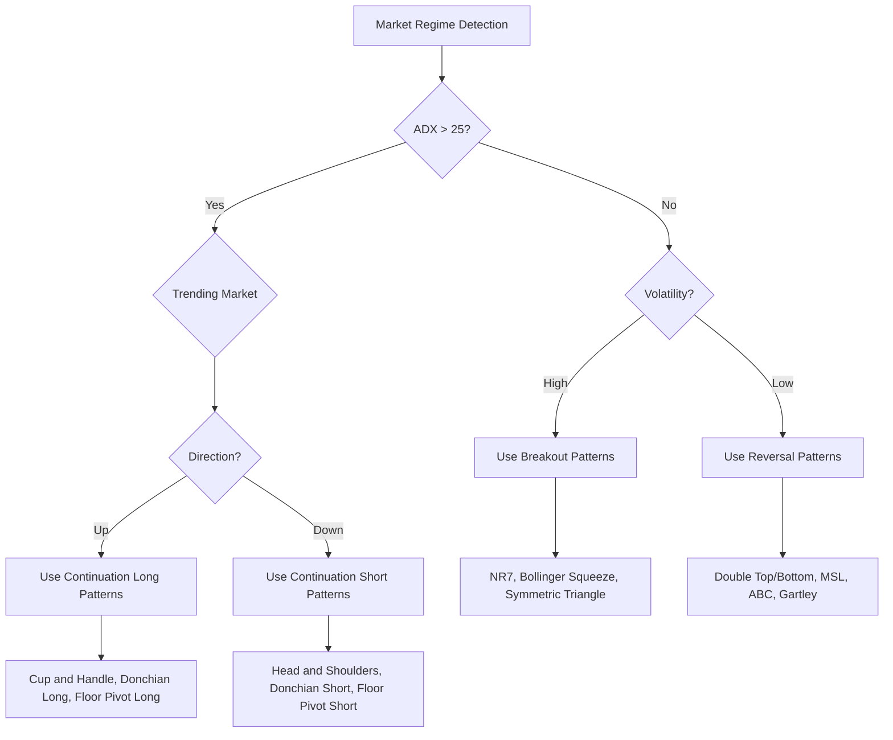

# Comprehensive Trading Strategy Document

## Multi-Pattern Integration System

**Version:** 1.0
**Last Updated:** 2026-03-06
**Status:** Active Development

---

## Table of Contents

1. [Strategy Framework and Philosophy](#1-strategy-framework-and-philosophy)
2. [Pattern Classification and Selection](#2-pattern-classification-and-selection)
3. [Signal Integration Rules](#3-signal-integration-rules)
4. [Risk Management Framework](#4-risk-management-framework)
5. [Portfolio Rules and Correlation Management](#5-portfolio-rules-and-correlation-management)
6. [Timeframe Guidelines](#6-timeframe-guidelines)
7. [Market Regime Adaptation](#7-market-regime-adaptation)
8. [Implementation Guidelines](#8-implementation-guidelines)

---

## 1. Strategy Framework and Philosophy

### 1.1 Core Philosophy

This trading system is built on the principle of **Multi-Pattern Confluence** - the idea that trading signals are more reliable when multiple independent pattern recognition methods align. The system integrates 20 distinct chart patterns across 4 categories, each designed to identify specific market conditions.

### 1.2 Design Principles

| Principle | Description |
|-----------|-------------|
| **Pattern Independence** | Patterns should measure different aspects of market behavior |
| **Confluence Weighting** | Higher confidence when multiple patterns agree |
| **Risk-First Approach** | Every signal has defined risk before entry |
| **Regime Awareness** | Pattern effectiveness varies by market condition |
| **Timeframe Hierarchy** | Higher timeframes provide context for lower timeframe signals |

### 1.3 System Architecture

```
┌─────────────────────────────────────────────────────────────────┐
│                     MARKET DATA INPUT                           │
│                  (OHLCV + Indicators)                           │
└─────────────────────────────────────────────────────────────────┘
                              │
                              ▼
┌─────────────────────────────────────────────────────────────────┐
│                   MARKET REGIME DETECTOR                        │
│         (Trend, Volatility, Momentum Assessment)                │
└─────────────────────────────────────────────────────────────────┘
                              │
                              ▼
┌─────────────────────────────────────────────────────────────────┐
│                    PATTERN DETECTION LAYER                      │
├──────────────┬──────────────┬──────────────┬───────────────────┤
│   BASIC      │  HARMONIC    │   COMPLEX    │     CLASSIC       │
│  (5 patterns)│ (5 patterns) │ (5 patterns) │   (5 patterns)    │
└──────────────┴──────────────┴──────────────┴───────────────────┘
                              │
                              ▼
┌─────────────────────────────────────────────────────────────────┐
│                   SIGNAL INTEGRATION ENGINE                     │
│    (Confluence Scoring, Conflict Resolution, Filtering)        │
└─────────────────────────────────────────────────────────────────┘
                              │
                              ▼
┌─────────────────────────────────────────────────────────────────┐
│                    RISK MANAGEMENT LAYER                        │
│   (Position Sizing, Stop Placement, Exposure Limits)           │
└─────────────────────────────────────────────────────────────────┘
                              │
                              ▼
┌─────────────────────────────────────────────────────────────────┐
│                      TRADE EXECUTION                            │
│              (Entry, Exit, Position Management)                 │
└─────────────────────────────────────────────────────────────────┘
```

---

## 2. Pattern Classification and Selection

### 2.1 Pattern Categories

#### Category 1: Basic Patterns (Entry-Focused)

| Pattern | Type | Primary Use | Confidence Base |
|---------|------|-------------|-----------------|
| Market Structure Low (MSL) | Reversal | Bottom identification | 55% |
| Matching Lows | Reversal | Support tests | 50% |
| NR7 Inside Day | Breakout | Volatility contraction | 45% |
| N-Bar Decline | Counter-Trend | Exhaustion reversal | 50% |
| Floor Pivot Breakout | Breakout | Intraday levels | 45% |

**Characteristics:**
- Quick signal generation
- Short holding periods (1-5 bars)
- Higher frequency, lower individual reliability
- Best for entry timing in conjunction with other patterns

#### Category 2: Harmonic Patterns (Fibonacci-Based)

| Pattern | Type | Primary Use | Confidence Base |
|---------|------|-------------|-----------------|
| Gartley | Reversal | PRZ reversals | 60% |
| ABC Correction | Reversal | Pullback entries | 55% |
| Symmetric Triangle | Continuation | Volatility squeeze | 50% |
| Donchian Channel | Breakout | Trend following | 50% |
| Bollinger Bands | Volatility | Squeeze/breakout | 45% |

**Characteristics:**
- Precise entry points via Fibonacci levels
- Defined risk/reward ratios
- Medium holding periods (5-20 bars)
- Require confluence with other indicators

#### Category 3: Complex Patterns (Multi-Component)

| Pattern | Type | Primary Use | Confidence Base |
|---------|------|-------------|-----------------|
| Cup and Handle | Continuation | Bullish continuation | 65% |
| Head and Shoulders | Reversal | Major top/bottom | 65% |
| Spike and Ledge | Reversal | Climax reversals | 55% |
| Three Hills | Reversal | Complex tops | 60% |
| Parabolic Arc | Reversal | Bubble tops | 55% |

**Characteristics:**
- Longer formation periods (20-100 bars)
- Higher individual reliability
- Larger price targets
- Best for swing/position trading

#### Category 4: Classic Chart Patterns

| Pattern | Type | Primary Use | Confidence Base |
|---------|------|-------------|-----------------|
| Double Top | Reversal | Major tops | 60% |
| Double Bottom | Reversal | Major bottoms | 60% |
| Trader Vic's 2B | Reversal | Failed breakouts | 55% |
| Triple Top | Reversal | Extended tops | 65% |
| Dead Cat Bounce | Reversal | Event-driven | 50% |

**Characteristics:**
- Well-documented reliability
- Clear breakout/breakdown levels
- Volume confirmation important
- Effective across all timeframes

### 2.2 Pattern Prioritization Matrix

When multiple patterns fire simultaneously, use this priority ranking:

```
Priority Score = Base_Confidence × Pattern_Weight × Regime_Multiplier × Timeframe_Score
```

#### Pattern Weights by Market Condition

| Pattern | Trending | Ranging | Volatile | Quiet |
|---------|----------|---------|----------|-------|
| **Basic Patterns** | 0.8 | 1.0 | 0.7 | 1.0 |
| **Harmonic Patterns** | 1.0 | 0.8 | 0.6 | 1.2 |
| **Complex Patterns** | 1.2 | 0.6 | 0.8 | 0.7 |
| **Classic Patterns** | 1.0 | 1.0 | 1.0 | 1.0 |

#### Regime Multipliers

| Market Regime | Reversal Patterns | Continuation Patterns | Breakout Patterns |
|---------------|-------------------|----------------------|-------------------|
| Strong Uptrend | 0.7 | 1.3 | 1.1 |
| Strong Downtrend | 0.7 | 1.3 | 1.1 |
| Sideways/Ranging | 1.2 | 0.6 | 0.8 |
| High Volatility | 0.8 | 0.7 | 1.2 |
| Low Volatility | 1.1 | 1.0 | 0.7 |

### 2.3 Pattern Compatibility Matrix

Some patterns should NOT be traded together due to conflicting logic:

| Pattern A | Pattern B | Compatibility | Reason |
|-----------|-----------|---------------|--------|
| Double Top | Double Bottom | ❌ Conflicting | Opposite directions |
| Head & Shoulders (Top) | Cup & Handle | ❌ Conflicting | Opposite bias |
| NR7 Inside Day | Bollinger Squeeze | ✅ Compatible | Similar logic |
| MSL | Double Bottom | ✅ Compatible | Similar direction |
| Gartley (Bullish) | ABC (Bearish) | ❌ Conflicting | Opposite directions |
| Triple Top | 2B (Bullish) | ❌ Conflicting | Opposite directions |

---

## 3. Signal Integration Rules

### 3.1 Signal Generation Hierarchy

```
Level 1: Single Pattern Signal
    └── Confidence: Pattern base confidence
    └── Action: Monitor only

Level 2: Confluence Signal (2+ patterns, same direction)
    └── Confidence: Weighted average + 10% bonus
    └── Action: Consider entry

Level 3: Strong Confluence Signal (3+ patterns, same direction)
    └── Confidence: Weighted average + 20% bonus
    └── Action: Active entry

Level 4: Maximum Confluence (4+ patterns, same direction + trend alignment)
    └── Confidence: Weighted average + 30% bonus (max 95%)
    └── Action: Full position size
```

### 3.2 Confluence Scoring System

```python
def calculate_confluence_score(signals, market_regime, trend_direction):
    """
    Calculate confluence score for multiple signals.

    Returns:
        score: 0.0 to 1.0
        direction: 'long' or 'short'
        confidence_level: 1-4
    """
    if not signals:
        return 0.0, None, 0

    # Group by direction
    long_signals = [s for s in signals if s.direction == 'LONG']
    short_signals = [s for s in signals if s.direction == 'SHORT']

    # Determine dominant direction
    if len(long_signals) >= len(short_signals):
        direction = 'long'
        active_signals = long_signals
    else:
        direction = 'short'
        active_signals = short_signals

    # Calculate weighted confidence
    total_weight = 0
    weighted_sum = 0

    for signal in active_signals:
        pattern_weight = get_pattern_weight(signal.pattern, market_regime)
        regime_mult = get_regime_multiplier(signal.type, market_regime)

        effective_weight = pattern_weight * regime_mult
        weighted_sum += signal.confidence * effective_weight
        total_weight += effective_weight

    base_score = weighted_sum / total_weight if total_weight > 0 else 0

    # Apply confluence bonus
    num_patterns = len(active_signals)
    if num_patterns >= 4:
        confluence_bonus = 0.30
    elif num_patterns >= 3:
        confluence_bonus = 0.20
    elif num_patterns >= 2:
        confluence_bonus = 0.10
    else:
        confluence_bonus = 0.0

    # Trend alignment bonus
    if direction == trend_direction:
        confluence_bonus += 0.05

    final_score = min(0.95, base_score + confluence_bonus)
    confidence_level = min(4, num_patterns)

    return final_score, direction, confidence_level
```

### 3.3 Conflict Resolution Rules

When patterns fire in opposite directions:

| Scenario | Rule | Action |
|----------|------|--------|
| 1 Long vs 1 Short | Highest confidence wins | Trade winning direction |
| 2 Long vs 1 Short | Majority wins | Trade long direction |
| 2 Long vs 2 Short | No trade | Wait for resolution |
| Equal confidence | No trade | Wait for confirmation |
| Complex vs Basic | Complex wins | Higher reliability pattern |

### 3.4 Signal Filtering

#### Minimum Requirements for Trade Entry

| Filter | Requirement |
|--------|-------------|
| Minimum Confidence | 50% (Level 2+) |
| Minimum Patterns | 1 (Level 1 = monitor only) |
| Risk/Reward Ratio | Minimum 1.5:1 |
| Volume Confirmation | Optional but recommended |
| Trend Alignment | Bonus only, not required |

#### Signal Decay Rules

```
Signal Validity Period:
- Basic Patterns: 3-5 bars after detection
- Harmonic Patterns: 5-10 bars after detection
- Complex Patterns: 10-20 bars after detection
- Classic Patterns: 5-15 bars after detection

Confidence Decay:
- Decay Rate: 5% per bar after valid period
- Minimum Confidence: 40% (below this, signal invalid)
```

---

## 4. Risk Management Framework

### 4.1 Position Sizing

#### Fixed Fractional Method (Default)

```
Position Size = (Account Equity × Risk Per Trade) / (Entry - Stop Loss)
```

| Account Size | Risk Per Trade | Max Position Size |
|--------------|----------------|-------------------|
| < $25,000 | 1% | 10% of equity |
| $25,000 - $100,000 | 1.5% | 15% of equity |
| $100,000 - $500,000 | 2% | 20% of equity |
| > $500,000 | 2% | 25% of equity |

#### Volatility-Adjusted Sizing

For patterns with ATR-based stops:

```
Position Size = (Account Equity × Risk Per Trade) / (ATR × ATR_Multiplier)
```

| Pattern Category | ATR Multiplier |
|------------------|----------------|
| Basic Patterns | 1.5x ATR |
| Harmonic Patterns | 2.0x ATR |
| Complex Patterns | 2.5x ATR |
| Classic Patterns | 2.0x ATR |

### 4.2 Stop Loss Placement

#### Pattern-Specific Stops

| Pattern Type | Stop Placement Rule |
|--------------|---------------------|
| Reversal (Top) | Above pattern high + offset |
| Reversal (Bottom) | Below pattern low - offset |
| Breakout | Opposite side of pattern |
| Continuation | Below/above pattern extreme |

#### Stop Loss Offsets

| Asset Class | Offset Type | Value |
|-------------|-------------|-------|
| Equities | Fixed | $0.01 |
| Forex | Pip-based | 2-5 pips |
| Crypto | Percentage | 0.1% |
| Futures | Tick-based | 1-2 ticks |

#### Trailing Stop Rules

```
Activation: After price moves 1R in profit
Trail Method: ATR-based or percentage-based

ATR Trail: Stop = Price - (ATR × Trail_Multiplier)
Percentage Trail: Stop = Price × (1 - Trail_Percent)

Trail Multipliers by Pattern:
- Basic: 1.5x ATR
- Harmonic: 2.0x ATR
- Complex: 2.5x ATR
- Classic: 2.0x ATR
```

### 4.3 Take Profit Strategy

#### Multi-Target System

| Target | Exit % | Description |
|--------|--------|-------------|
| TP1 | 50% position | 1R profit (minimum risk/reward) |
| TP2 | 25% position | Pattern-specific target |
| TP3 | 25% position | Extended target (1.62x or higher) |

#### Pattern-Specific Targets

| Pattern | TP1 | TP2 | TP3 |
|---------|-----|-----|-----|
| Double Top/Bottom | Pattern depth | 1.27x depth | 1.62x depth |
| Head & Shoulders | Pattern depth | 1.27x depth | 1.62x depth |
| Cup & Handle | 0.62x cup depth | 1.0x cup depth | - |
| Gartley | Point A | 1.27x AD | 1.62x AD |
| ABC | 1.0x AB | 1.27x BC | - |
| NR7 | Prior swing | 1.5x ATR | 2.0x ATR |
| MSL | MSH formation | 1.5x range | - |

### 4.4 Risk Limits

#### Daily Limits

| Limit | Value | Action if Exceeded |
|-------|-------|-------------------|
| Max Daily Loss | 3% of equity | Stop trading for day |
| Max Daily Trades | 10 | Stop trading for day |
| Max Daily Drawdown | 5% from peak | Reduce position sizes 50% |

#### Weekly Limits

| Limit | Value | Action if Exceeded |
|-------|-------|-------------------|
| Max Weekly Loss | 6% of equity | Stop trading for week |
| Max Consecutive Losses | 5 | Review strategy parameters |
| Max Weekly Drawdown | 10% from peak | Reduce position sizes 50% |

#### Monthly Limits

| Limit | Value | Action if Exceeded |
|-------|-------|-------------------|
| Max Monthly Loss | 10% of equity | Stop trading for month |
| Max Monthly Drawdown | 15% from peak | Strategy review required |

---

## 5. Portfolio Rules and Correlation Management

### 5.1 Maximum Position Limits

| Portfolio Size | Max Open Positions | Max Same Direction | Max Same Sector |
|----------------|-------------------|-------------------|-----------------|
| < $25,000 | 3 | 2 | 1 |
| $25,000 - $100,000 | 5 | 3 | 2 |
| $100,000 - $500,000 | 8 | 5 | 3 |
| > $500,000 | 10 | 6 | 4 |

### 5.2 Correlation Rules

#### Asset Correlation Limits

```
If correlation > 0.7 between two positions:
    - Do not add new position
    - Reduce existing position size by 50%

If correlation > 0.9:
    - Treat as same position
    - Combine for position sizing
```

#### Pattern Correlation

Some patterns are highly correlated due to similar detection logic:

| Pattern Group | Correlated Patterns | Max Active |
|---------------|---------------------|------------|
| Double Patterns | Double Top, Double Bottom, Triple Top | 1 |
| Harmonic | Gartley, ABC | 1 |
| Breakout | NR7, Donchian, Bollinger | 2 |
| Reversal Tops | Head & Shoulders, Double Top, 2B | 1 |
| Reversal Bottoms | Double Bottom, MSL, Matching Lows | 1 |

### 5.3 Sector Exposure Limits

| Sector | Max Exposure | Notes |
|--------|--------------|-------|
| Technology | 30% | High volatility |
| Financials | 25% | Interest rate sensitive |
| Healthcare | 20% | Regulatory risk |
| Energy | 15% | Commodity exposure |
| Others | 10% each | Diversification |

### 5.4 Portfolio Heat Map

Track total risk across all positions:

```
Portfolio Heat = Sum of (Position Risk / Account Equity)

Maximum Portfolio Heat: 6%
Warning Level: 4%
Comfortable Level: 2-3%

If Portfolio Heat > 6%:
    - Do not add new positions
    - Consider reducing existing positions
```

---

## 6. Timeframe Guidelines

### 6.1 Pattern Effectiveness by Timeframe

| Pattern | Tick | 1-min | 5-min | 15-min | Hourly | Daily | Weekly |
|---------|------|-------|-------|--------|--------|-------|--------|
| MSL | ⚪ | 🟡 | 🟢 | 🟢 | 🟢 | 🟢 | 🟡 |
| Matching Lows | ⚪ | ⚪ | 🟡 | 🟢 | 🟢 | 🟢 | 🟢 |
| NR7 Inside Day | ⚪ | ⚪ | 🟡 | 🟢 | 🟢 | 🟢 | 🟡 |
| N-Bar Decline | ⚪ | ⚪ | 🟡 | 🟢 | 🟢 | 🟢 | 🟢 |
| Floor Pivot | 🟡 | 🟢 | 🟢 | 🟢 | 🟡 | ⚪ | ⚪ |
| Gartley | ⚪ | 🟡 | 🟡 | 🟢 | 🟢 | 🟢 | 🟢 |
| ABC | ⚪ | 🟡 | 🟡 | 🟢 | 🟢 | 🟢 | 🟢 |
| Symmetric Triangle | ⚪ | ⚪ | 🟡 | 🟢 | 🟢 | 🟢 | 🟢 |
| Donchian | 🟡 | 🟡 | 🟢 | 🟢 | 🟢 | 🟢 | 🟢 |
| Bollinger | 🟡 | 🟡 | 🟢 | 🟢 | 🟢 | 🟢 | 🟢 |
| Cup & Handle | ⚪ | ⚪ | ⚪ | 🟡 | 🟢 | 🟢 | 🟢 |
| Head & Shoulders | ⚪ | ⚪ | 🟡 | 🟡 | 🟢 | 🟢 | 🟢 |
| Spike & Ledge | 🟡 | 🟢 | 🟢 | 🟢 | 🟡 | 🟡 | ⚪ |
| Three Hills | ⚪ | ⚪ | ⚪ | 🟡 | 🟢 | 🟢 | 🟢 |
| Parabolic Arc | ⚪ | ⚪ | ⚪ | ⚪ | 🟡 | 🟢 | 🟢 |
| Double Top/Bottom | ⚪ | ⚪ | 🟡 | 🟢 | 🟢 | 🟢 | 🟢 |
| 2B | 🟡 | 🟡 | 🟢 | 🟢 | 🟢 | 🟢 | 🟡 |
| Triple Top | ⚪ | ⚪ | ⚪ | 🟡 | 🟢 | 🟢 | 🟢 |
| Dead Cat Bounce | ⚪ | ⚪ | 🟡 | 🟢 | 🟢 | 🟢 | 🟢 |

**Legend:** 🟢 Highly Effective | 🟡 Moderately Effective | ⚪ Not Recommended

### 6.2 Multi-Timeframe Analysis

#### Timeframe Hierarchy

```
Higher Timeframe (HTF) → Context
Current Timeframe (CTF) → Signal
Lower Timeframe (LTF) → Entry refinement

Recommended Ratios:
- HTF:CTF:LTF = 4:1:0.25 (e.g., Daily:Hourly:15-min)
- Or: Weekly:Daily:Hourly
- Or: Hourly:15-min:5-min
```

#### HTF Context Rules

| HTF Condition | CTF Signal Bias |
|---------------|-----------------|
| Strong Uptrend | Prefer long continuation patterns |
| Strong Downtrend | Prefer short continuation patterns |
| Ranging | Prefer reversal patterns |
| High Volatility | Reduce position size 25% |
| Low Volatility | Increase position size 10% |

### 6.3 Holding Period Guidelines

| Pattern Category | Typical Hold | Min Hold | Max Hold |
|------------------|--------------|----------|----------|
| Basic | 1-5 bars | 1 bar | 10 bars |
| Harmonic | 5-20 bars | 3 bars | 30 bars |
| Complex | 20-60 bars | 10 bars | 100 bars |
| Classic | 10-30 bars | 5 bars | 50 bars |

---

## 7. Market Regime Adaptation

### 7.1 Regime Detection

#### Trend Strength (ADX-Based)

```
Strong Trend: ADX > 30
Weak Trend: 20 < ADX < 30
No Trend: ADX < 20

Direction:
- Uptrend: +DI > -DI and price above SMA(50)
- Downtrend: -DI > +DI and price below SMA(50)
```

#### Volatility Regime (ATR-Based)

```
High Volatility: ATR > 1.5 × SMA(ATR, 50)
Normal Volatility: 0.75 × SMA(ATR, 50) < ATR < 1.5 × SMA(ATR, 50)
Low Volatility: ATR < 0.75 × SMA(ATR, 50)
```

#### Market Phase Classification

| Phase | ADX | Volatility | Price vs SMA | Preferred Patterns |
|-------|-----|------------|--------------|-------------------|
| Strong Bull | > 30 | Any | Above | Continuation, Breakout |
| Strong Bear | > 30 | Any | Below | Continuation, Breakout |
| Weak Bull | 20-30 | Low | Above | Harmonic, Classic |
| Weak Bear | 20-30 | Low | Below | Harmonic, Classic |
| Ranging | < 20 | Low | Crossing | Reversal, Mean-Reversion |
| Choppy | < 20 | High | Crossing | Reduce trading, NR7 |
| Volatile Trend | > 25 | High | Directional | Reduce size, wider stops |

### 7.2 Pattern Selection by Regime



### 7.3 Adaptive Parameters

| Regime | Risk Per Trade | Stop Multiplier | Target Multiplier |
|--------|----------------|-----------------|-------------------|
| Strong Trend | 2.5% | 1.0x | 1.5x |
| Weak Trend | 1.5% | 1.25x | 1.0x |
| Ranging | 1.0% | 0.75x | 0.75x |
| High Volatility | 1.0% | 1.5x | 1.25x |
| Low Volatility | 2.0% | 0.75x | 1.0x |

### 7.4 Regime Change Handling

When regime changes are detected:

```
1. Reduce new position sizes by 50%
2. Tighten stops on existing positions
3. Wait for 3 bars to confirm new regime
4. Gradually adjust to new regime parameters
5. Close positions that don't fit new regime
```

---

## 8. Implementation Guidelines

### 8.1 System Configuration

```python
# config/trading_config.py

TRADING_CONFIG = {
    # Account Settings
    'initial_equity': 100000,
    'risk_per_trade': 0.02,
    'max_open_positions': 5,
    'max_portfolio_heat': 0.06,

    # Pattern Settings
    'min_confidence': 0.50,
    'min_confluence_patterns': 2,
    'signal_decay_rate': 0.05,
    'signal_validity_bars': {
        'basic': 5,
        'harmonic': 10,
        'complex': 20,
        'classic': 15
    },

    # Risk Management
    'stop_offset': 0.01,
    'trail_atr_multiplier': 2.0,
    'max_daily_loss': 0.03,
    'max_weekly_loss': 0.06,
    'max_monthly_loss': 0.10,

    # Position Sizing
    'position_sizing_method': 'fixed_fractional',
    'atr_sizing_multiplier': 2.0,
    'max_position_size': 0.20,

    # Timeframe
    'default_timeframe': 'daily',
    'htf_timeframe': 'weekly',
    'ltf_timeframe': 'hourly',

    # Regime Detection
    'adx_trend_threshold': 25,
    'adx_strong_threshold': 30,
    'volatility_lookback': 50,
    'volatility_high_mult': 1.5,
    'volatility_low_mult': 0.75
}
```

### 8.2 Daily Workflow

```
Pre-Market:
1. Check overnight price action
2. Update market regime assessment
3. Review existing positions
4. Identify potential pattern setups
5. Set alerts for key levels

During Trading:
1. Monitor pattern detection signals
2. Calculate confluence scores
3. Apply regime filters
4. Execute trades meeting criteria
5. Manage existing positions (stops, targets)

Post-Market:
1. Review all trades taken
2. Update performance metrics
3. Note any pattern failures
4. Adjust parameters if needed
5. Plan for next session
```

### 8.3 Performance Monitoring

#### Key Metrics to Track

| Metric | Target | Warning Level |
|--------|--------|---------------|
| Win Rate | > 50% | < 40% |
| Profit Factor | > 1.5 | < 1.2 |
| Average R:R | > 1.5 | < 1.0 |
| Max Drawdown | < 15% | > 25% |
| Sharpe Ratio | > 1.0 | < 0.5 |
| Expectancy | > 0.5R | < 0.2R |

#### Pattern-Specific Tracking

Track performance for each pattern:

```
- Total signals generated
- Win rate per pattern
- Average R:R per pattern
- Average holding period
- Performance by regime
- Performance by timeframe
```

### 8.4 Continuous Improvement

#### Weekly Review

1. Analyze all trades from the week
2. Identify pattern failures and successes
3. Review regime detection accuracy
4. Adjust pattern weights if needed

#### Monthly Review

1. Calculate comprehensive performance metrics
2. Compare to benchmark (buy and hold)
3. Analyze drawdown periods
4. Review and update strategy parameters

#### Quarterly Review

1. Full strategy backtest
2. Compare to previous quarters
3. Market condition analysis
4. Major strategy adjustments if needed

---

## Appendix A: Pattern Quick Reference

### Signal Priority Cheat Sheet

| Priority | Pattern Combination | Direction | Min Confidence |
|----------|---------------------|-----------|----------------|
| 1 (Highest) | H&S + Double Top + 2B (Bearish) | Short | 85% |
| 2 | Cup & Handle + Donchian Breakout | Long | 80% |
| 3 | Double Bottom + MSL + Matching Lows | Long | 75% |
| 4 | Gartley + ABC (same direction) | Direction | 70% |
| 5 | Triple Top/Bottom + Volume | Direction | 70% |
| 6 | Single Complex Pattern | Direction | 65% |
| 7 | Two Basic Patterns (same direction) | Direction | 60% |
| 8 | Single Classic Pattern | Direction | 55% |
| 9 | Single Harmonic Pattern | Direction | 55% |
| 10 (Lowest) | Single Basic Pattern | Direction | 50% |

---

## Appendix B: Risk Calculator

```python
def calculate_trade_risk(account_equity, entry_price, stop_loss, risk_pct=0.02):
    """
    Calculate position size and risk metrics.

    Returns:
        dict with position_size, risk_amount, risk_per_share, shares
    """
    risk_per_share = abs(entry_price - stop_loss)
    risk_amount = account_equity * risk_pct
    shares = risk_amount / risk_per_share if risk_per_share > 0 else 0
    position_value = shares * entry_price
    position_pct = position_value / account_equity

    return {
        'shares': int(shares),
        'position_value': position_value,
        'position_pct': position_pct,
        'risk_amount': risk_amount,
        'risk_per_share': risk_per_share,
        'risk_reward_ratio': None  # Add target for R:R
    }
```

---

## Appendix C: Emergency Procedures

### Circuit Breakers

```
Level 1: Daily loss > 2%
    - Reduce new position sizes by 50%
    - Require 2-pattern confluence minimum

Level 2: Daily loss > 3%
    - Stop trading for the day
    - Review all trades

Level 3: Weekly loss > 5%
    - Stop trading for the week
    - Full strategy review

Level 4: Monthly loss > 8%
    - Stop trading for the month
    - Comprehensive strategy audit
    - Consider parameter adjustment
```

### Pattern Failure Protocol

When a pattern fails (stop hit):

1. Document the failure
2. Check for regime mismatch
3. Verify pattern detection accuracy
4. Wait 3 bars before new entry in same direction
5. If 3 consecutive failures: reduce pattern weight by 20%

---

## Document History

| Version | Date | Changes |
|---------|------|---------|
| 1.0 | 2026-03-06 | Initial comprehensive strategy document |

---

*This document should be reviewed and updated quarterly based on backtesting results and market conditions.*
