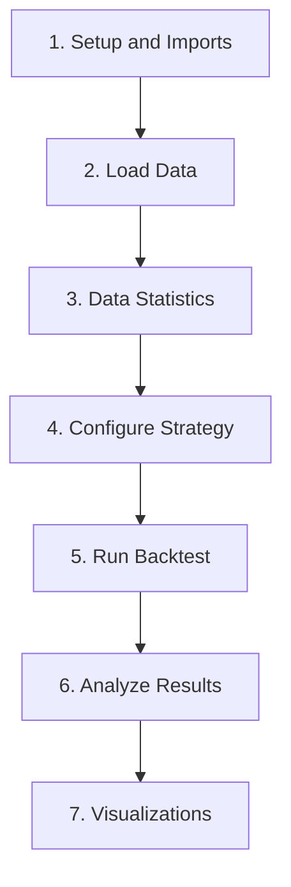

# Using Jupyter Notebooks in VSCode

This guide will teach you how to use Jupyter notebooks in VSCode, with specific examples from your investment project.

## Prerequisites

### 1. Install the Jupyter Extension

In VSCode, install the following extensions:
- **Jupyter** (ms-toolsai.jupyter) - Required for notebook support
- **Python** (ms-python.python) - Required for Python kernel support
- **Pylance** (ms-python.vscode-pylance) - Optional but recommended for better IntelliSense

To install:
1. Press `Ctrl+Shift+X` to open Extensions
2. Search for "Jupyter" and click Install
3. Search for "Python" and click Install

### 2. Select Your Python Environment

Your project uses `uv` for package management with a virtual environment at `.venv/`:

1. Open Command Palette: `Ctrl+Shift+P`
2. Type "Python: Select Interpreter"
3. Choose the interpreter at `.venv/Scripts/python.exe`

## Opening and Running Notebooks

### Opening a Notebook

1. **From File Explorer**: Click on any `.ipynb` file in the Explorer panel
2. **From Command Palette**: `Ctrl+Shift+P` → "File: Open File" → select `.ipynb` file
3. **From Terminal**: `code notebooks/05_spy_longterm_backtest.ipynb`

### Notebook Interface

When you open a notebook, you'll see:

```
┌─────────────────────────────────────────────────────────┐
│  Toolbar: [Run All] [Run] [Stop] [Restart] [Kernel]     │
├─────────────────────────────────────────────────────────┤
│  Cell 1 - Markdown Cell                                 │
│  # SPY Long-Term Multi-Pattern Strategy Backtest        │
├─────────────────────────────────────────────────────────┤
│  Cell 2 - Code Cell                                     │
│  import pandas as pd                                    │
│  df = pd.read_csv(...)                                  │
│  [▶ Run]                                                │
├─────────────────────────────────────────────────────────┤
│  Cell 3 - Output                                        │
│  Imports successful!                                    │
│  Project root: c:\Dev\projects\investment_trying        │
└─────────────────────────────────────────────────────────┘
```

### Running Cells

| Action | Shortcut | Description |
|--------|----------|-------------|
| Run current cell | `Shift+Enter` | Runs cell and moves to next |
| Run and stay | `Ctrl+Enter` | Runs cell, keeps selection |
| Run and insert below | `Alt+Enter` | Runs cell and inserts new below |
| Run all cells | `Shift+Alt+Enter` | Runs all cells in notebook |
| Run above | `Ctrl+Shift+Enter` | Runs all cells above current |

### Cell Types

1. **Code Cells** - Execute Python code
   - Press `Enter` to edit
   - Press `Escape` to exit edit mode
   - Press `Y` to convert to code cell

2. **Markdown Cells** - Display formatted text
   - Press `M` to convert to markdown
   - Supports headers, lists, code blocks, tables

## Working with Your SPY Backtest Notebook

### Step-by-Step Execution

1. **Open the notebook**:
   ```
   notebooks/05_spy_longterm_backtest.ipynb
   ```

2. **Select Kernel** (if prompted):
   - Click "Select Kernel" in the top-right
   - Choose Python Environments
   - Select `.venv` (your project's virtual environment)

3. **Run cells sequentially**:
   - Start from the top with `Shift+Enter`
   - Each cell builds on the previous one
   - Watch for errors in output

### Understanding the Notebook Structure

Your notebook has this structure:



### Common Operations

#### Adding a New Cell

1. Click on a cell to select it
2. Press `A` to add above, or `B` to add below
3. Start typing your code

#### Deleting a Cell

1. Select the cell
2. Press `DD` (press D twice)

#### Moving Cells

1. Select the cell
2. Press `Alt+Up` or `Alt+Down` to move

#### Clearing Output

1. Click "Clear All Outputs" in toolbar, or
2. Right-click cell → "Clear Output"

## Troubleshooting

### Kernel Issues - .venv Not Appearing in VSCode

If your `.venv` doesn't appear in the kernel selection list, you need to register it manually:

**Step 1: Open a terminal in VSCode**
- Press `` Ctrl+` `` (backtick) to open the integrated terminal

**Step 2: Activate your virtual environment**
```bash
# On Windows (cmd.exe)
.venv\Scripts\activate

# You should see (.venv) appear in your prompt
```

**Step 3: Install ipykernel (if not already installed)**
```bash
uv pip install ipykernel
```

**Step 4: Register the kernel**
```bash
python -m ipykernel install --user --name=investment-trying --display-name "Python (investment-trying)"
```

**Step 5: Reload VSCode window**
- Press `Ctrl+Shift+P` to open Command Palette
- Type "Developer: Reload Window" and press Enter

**Step 6: Select the new kernel**
- Open your notebook
- Click "Select Kernel" in the top-right
- Choose "Python Environments"
- Select "Python (investment-trying)"

### Kernel Registration Failed

If the kernel registration fails, try these steps:

```bash
# Make sure you're in the project root
cd c:\Dev\projects\investment_trying

# Activate the venv
.venv\Scripts\activate

# Verify Python is from venv
where python
# Should show: c:\Dev\projects\investment_trying\.venv\Scripts\python.exe

# List existing kernels
jupyter kernelspec list

# Remove old/failed kernels if needed
jupyter kernelspec uninstall investment-trying

# Re-register
python -m ipykernel install --user --name=investment-trying --display-name "Python (investment-trying)"
```

### trading-lab Kernel Failing

The `trading-lab` kernel is likely from an old pixi/conda environment. You can remove it:

```bash
# List all kernels
jupyter kernelspec list

# Remove the failing kernel
jupyter kernelspec uninstall trading-lab

# Also remove base-env if you don't need it
jupyter kernelspec uninstall base-env
```

### Cleaning Up Old Anaconda/Pixi Kernels

To remove all old kernels and start fresh:

```bash
# List all kernels
jupyter kernelspec list

# Remove each unwanted kernel
jupyter kernelspec remove trading-lab
jupyter kernelspec remove base-env

# Or remove all user kernels
# (WARNING: This removes ALL user-installed kernels)
# rmdir /s %APPDATA%\jupyter\kernels
```

### Import Errors

If you see `ModuleNotFoundError`:

```python
# Add this to the first cell
import sys
from pathlib import Path
project_root = Path('..').resolve()
if str(project_root) not in sys.path:
    sys.path.insert(0, str(project_root))
```

### Data Path Issues

Use relative paths from the notebook location:

```python
# notebooks/05_spy_longterm_backtest.ipynb is in notebooks/
# So use relative path to data
data_path = Path('..') / 'data' / 'raw' / 'SPY_daily.csv'
```

## Keyboard Shortcuts Reference

### Command Mode (press Escape to enter)

| Shortcut | Action |
|----------|--------|
| `Enter` | Enter edit mode |
| `Shift+Enter` | Run cell, select below |
| `Ctrl+Enter` | Run cell |
| `Alt+Enter` | Run cell, insert below |
| `Y` | Convert to code cell |
| `M` | Convert to markdown cell |
| `A` | Insert cell above |
| `B` | Insert cell below |
| `DD` | Delete cell |
| `Z` | Undo cell deletion |
| `X` | Cut cell |
| `C` | Copy cell |
| `V` | Paste below |
| `Shift+V` | Paste above |

### Edit Mode (press Enter to enter)

| Shortcut | Action |
|----------|--------|
| `Escape` | Enter command mode |
| `Tab` | Code completion |
| `Shift+Tab` | Show tooltip |
| `Ctrl+Space` | Trigger IntelliSense |
| `Ctrl+/` | Toggle comment |

## Tips for Your Investment Project

### 1. Interactive Data Exploration

Use the notebook to interactively explore your trading data:

```python
# Quick data overview
df.describe()
df.info()

# Plot with matplotlib
import matplotlib.pyplot as plt
df['Close'].plot(figsize=(12, 6))
plt.title('SPY Price History')
plt.show()
```

### 2. Debugging Strategy Logic

Add print statements and visualizations to debug:

```python
# Debug pattern detection
patterns = strategy.detect_patterns(df)
print(f"Found {len(patterns)} patterns")
print(patterns.head())
```

### 3. Variable Inspector

Click on "Variables" in the notebook toolbar to see all defined variables:
- View dataframes
- Check variable types
- Inspect values

### 4. Rich Output

Notebooks support rich output types:

```python
# Display dataframe with formatting
from IPython.display import display
display(df.head().style.background_gradient())

# Display multiple outputs
from IPython.display import HTML
HTML('<h2>Backtest Complete!</h2>')
```

## Next Steps

1. Open `notebooks/05_spy_longterm_backtest.ipynb`
2. Run the first cell to test your setup
3. Progress through each cell with `Shift+Enter`
4. Experiment by adding new cells to explore the data

## Additional Resources

- [VSCode Jupyter Documentation](https://code.visualstudio.com/docs/datascience/jupyter-notebooks)
- [Jupyter Keyboard Shortcuts](https://code.visualstudio.com/docs/datascience/jupyter-notebooks#_jupyter-notebook-editor-shortcuts)
- [Data Science in VSCode](https://code.visualstudio.com/docs/datascience/overview)

---

## Setup Status (from setup-jupyter-vscode.md — 2026-04-19) ✅ Complete

**Changes:**
- VS Code Python interpreter pointed to uv environment
- Jupyter kernel configured to use project Python
- Notebook execution verified for all 15+ notebooks
- Notebook helpers created in `src/utils/notebook_helpers.py`

**Notebook Inventory:** 01-04 (Pattern backtests), 05 (SPY long-term), 06-08 (Pattern selection/contribution), 09 (Multi-timeframe), 10 (Pair trading, pending), 11 (Parameter robustness, pending), 12 (Regime-aware), 13 (ML validation), 14 (Regime detector comparison), 15 (Phase 2 validation), ML_Training_Colab.
